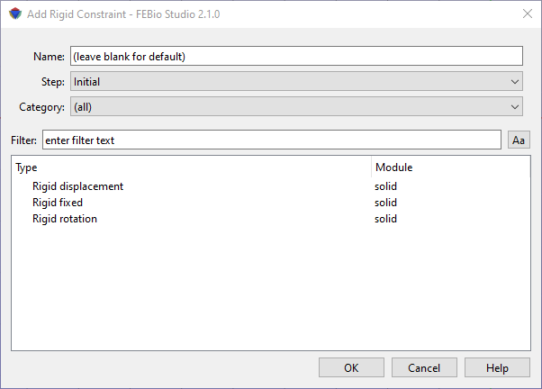

# 10.1 Rigid Body Constraints {: #subsec:rigid-1 }

Rigid bodies are bodies that are assumed to be undeformable. They can only move and rotate and therefore are described by 6 degrees of freedom, 3 for translation and 3 for rotation. Rigid bodies are useful for modeling very stiff objects In FEBio (and FEBio Studio). Rigid bodies have their own set of constraints, initial conditions, and loads. They can also be connected via special model components called rigid connectors.

Rigid bodies are implicitly created when a _rigid body_ material is added to the model. This implies that in principle rigid bodies do not need any geometry. They are defined completely via the corresponding rigid material definition. The only exception is that if the rigid body interacts with other, deformable, parts of the model via contact, then the rigid body needs to have geometry. Since the rigid body is defined via its material, you can easily make a part of the model rigid by assigning it a rigid material.

The degrees of freedom of rigid bodies can be constrained in the same way as any other degree of freedom in the model. Before you can apply a constraint to a rigid body, you need to define a rigid body. In FEBioStudio, rigid bodies are implicitly defined when you create a rigid body material. A rigid body constraint can now be applied using the **Physics** → **Add Rigid Constraint** menu. It is important to note that when a rigid body is created none of its degrees of freedom are initially constrained.

/// figure-caption

The Add Rigid Constraint dialog box allows users to constrain the degrees of freedom of a rigid body.

///

In the _Add Rigid Constraint_ dialog box first select the step in which this constraint will be active (or the _Initial_ step if the constraint is to be active in all steps). Next, select a constraint from the list of available rigid constraints. Then click OK. The constraint will be added to the _Rigid_ item in the model tree.

Please consult the FEBio User's Manual for more information on each rigid constraint. The easiest way to access it is to click the Help button on the dialog box. This will open the FEBio User Manual in a separate browser window.
