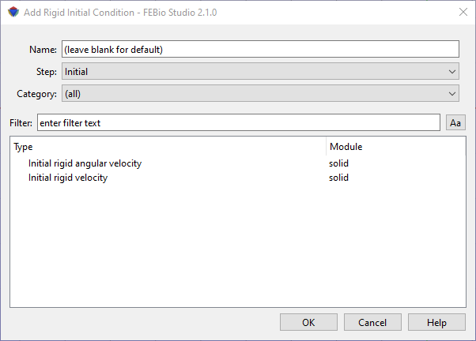

# 10.2 Rigid Body Initial Conditions {: #subsec:rigid-2 }

Rigid bodies can also be used in dynamic simulations. Therefore it might be useful to set the initial conditions of the rigid body's kinematic variables. This can be accomplished by adding a rigid initial condition.

A rigid body initial condition can be added using the **Physics** → **Add Rigid Initial Condition** menu.

/// figure-caption

The Add Rigid Initial Condition dialog box allows users to set initial values for rigid body kinematic variables.

///

In the dialog box that appears first select the step in which this constraint will be active (or the _Initial_ step if the initial condition is to be active in all steps). Next, select an initial condition from the list of available options. Then click OK. The initial condition will be added to the _Rigid_ item in the model tree.

Please consult the FEBio User's Manual for more information on each rigid initial condition. The easiest way to access it is to click the Help button on the dialog box. This will open the FEBio User Manual in a separate browser window.
