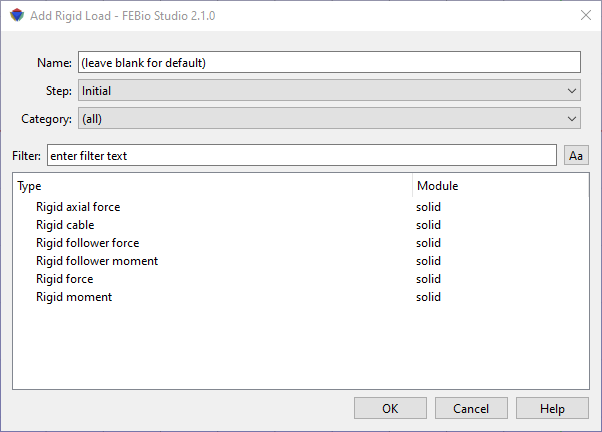

# 10.3 Rigid Body Loads {: #subsec:rigid-3 }

A rigid body load can be added using the **Physics** → **Add Rigid Load** menu.

/// figure-caption

The Add Rigid Load dialog box allows users to apply various types of loads to a rigid body.

///

In the dialog box that appears first select the step in which this rigid load will be active (or the _Initial_ step if the initial condition is to be active in all steps). Next, select a rigid load from the list of available options. Then click OK. The rigid load will be added to the _Rigid_ item in the model tree.

Please consult the FEBio User's Manual for more information on each rigid load. The easiest way to access it is to click the Help button on the dialog box. This will open the FEBio User Manual in a separate browser window.
