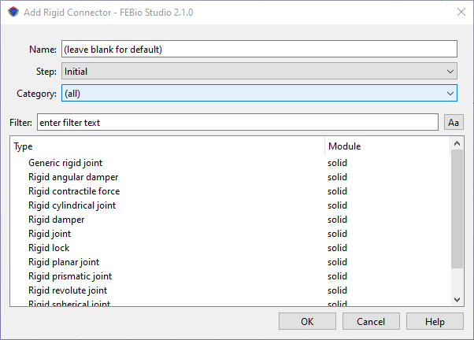

# 10.4 Rigid Connectors {: #subsec:rigid-4 }

Rigid bodies can be connected to each other via _rigid connectors_. These connectors either constrain the motion (e.g. joints), or apply forces to the participating rigid bodies (e.g. springs).

Rigid connectors can be added to the model using the **Physics** → **Add Rigid Connector** menu.

/// figure-caption

The Add Rigid Connector dialog box allows users to connect rigid bodies in various ways.

///

In the dialog box that appears first select the step in which this rigid connector will be active (or the _Initial_ step if the initial condition is to be active in all steps). Next, select a rigid connector from the list of available options. Then click OK. The rigid connector will be added to the _Rigid_ item in the model tree.

Please consult the FEBio User's Manual for more information on each rigid connector. The easiest way to access it is to click the Help button on the dialog box. This will open the FEBio User Manual in a separate browser window.
