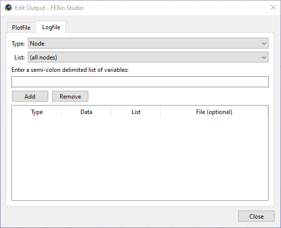

# 12.1 FEBio Logfile

FEBio generates several output files. The two most important ones are:

- logfile: This file contains the screen output of FEBio, but can also output data requested by the user.

- plotfile: This file contains the results of the FEBio analysis.

To some extent, the contents of these output files can be customized by the user, as described in the following sections.

The primary purpose of the FEBio logfile is to provide a copy of the screen output generated by FEBio. However, users can also request to write additional output data to this file (or a separate output file).

To add data to the logfile, expand the output section in the model tree, right-click on the _logfile_ item, and then select “Edit Output” from the context menu. This brings up the Edit Output Dialog box (with the logfile tab selected).

/// figure-caption

The Edit Output dialog, with the Logfile tab selected. This tab allows users to add data variables to the log file (or a separate data output file).

///

To add a data output variable, select the Type and List, and enter a semi-colon (;) delimited list of variables.

- The _Type_ selects the category of output variables and users can select _Node, Element, Rigid Body,_ or _Rigid Connector_.

- The _List_ option selects the named selection for which the data will be exported.

- The variables must be a list of semi-colon separated values. For a list of allowed variable names, please consult the FEBio user manual.

After the type, list, and variables are selected, click the Add button to add the data variable to the table.

Items in the table can be removed by first selecting them and then clicking the _Remove_ button.

If the data should be written to a separate file instead of the logfile, a filename can be provided in the File column. This field can be edited by double-clicking on the corresponding table item.
