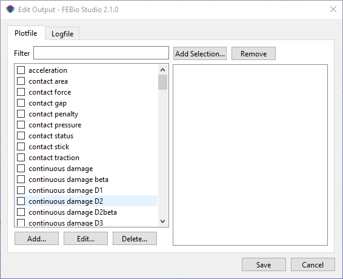
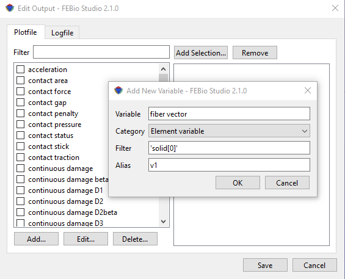

# 12.2 FEBio Plotfile

The FEBio plotfile contains the results of the analysis. It is a binary format and it is highly customizable. The contents of this file is entirely defined by the user.

**Although FEBio Studio tries to select some default, commonly used variables based on the analysis type, it is highly recommended to always check the list of selected plot variables to ensure that the desired data will be written. Failure to do so, may result in loss of data and the need to re-run the analysis!**

To edit the contents of the plot file, expand the Output section of the model tree, right-click the plotfile item, and select “Edit Output” from the context menu. The Edit Output dialog box will be shown, with the plotfile tab selected.

<a id="fig116-2"></a>



/// figure-caption

The Edit Output dialog, with the Plotfile tab selected. This tab allows users to add data variables to the plot file.

///

Output variables that will be written to the plot file can be selected by checking the box next to the corresponding variable name.

To find a particular variable, you can enter the first letter(s) in the Filter field. This will limit the list of displayed variable names to those that match the filter.

If the plot variable requires a selection (e.g. surface, or part) to extract the data from, click the “Add Selection” button, and then choose from the list.

Custom plot variables can be added as well, by clicking the “Add...” button. A dialog box shows up that allows users to enter the name of the plot variable. This can be useful for adding plot variables that are not directly supported by FEBio Studio. In addition, this feature is currently the only way to define plot variables using the extended syntax supported by FEBio that allows adding a filter and an alias to the plot variable. For example, if the user wants to output the fiber vector of a particular component of a solid mixture, the user can add a custom plot variable that uses the full syntax:

```
fiber vector['solid[0]']=v1
```

<a id="fig116-3"></a>



/// figure-caption

Users can add custom plot variables to the FEBio plotfile.

///
