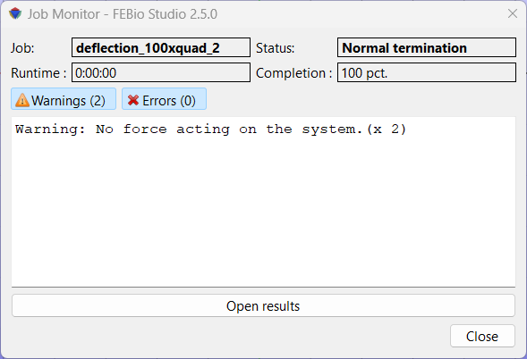

# 13.1 Running FEBio

FEBio can be called from within FEBioStudio by selecting the **FEBio** → **Run FEBio** menu, or from the main toolbar by clicking the corresponding tool button . The Run FEBio dialog box shows up (Figure [2](#fig116)) where users can set the following fields.

- **Job name:** The name of the job. This is used to generate the febio input and output file names. The job name will also appear in the model tree.

- **Working directory:** Specify the location where FEBioStudio will store the FEBio input and output files.

- **Launch Configuration:** The launch configuration defines how FEBio Studio will launch FEBio. As of FEBio Studio 2.0, the default launch configuration will use the version of FEBio that FEBio Studio was build with. Other launch configurations can be created that start FEBio as a separate process on either the local machine or even a remote server.

- **Save document before running FEBio:** Check this to save the model file automatically before running FEBio.

- **FEBio file format:** Select the format for the FEBio input file.

- **Write Notes:** Check this option for writing the notes associated with the model components.

By pressing OK, FEBioStudio will first export the current model to the file and location as specified, then call FEBio. The FEBio output will be shown in the log panel. If this panel is not visible, you can activate it from the **View** → **Log** menu.

/// figure-caption

The Run FEBio dialog box lets you start FEBio from within FEBioStudio.

///

Clicking the _Advanced_ button will show additional options for controlling FEBio.

- **Debug Mode:** Check this option to run FEBio in debug mode. In debug mode, FEBio will write additional information to the log and plot files that can help in debugging a model.

- **Config File**: The configuration file contains information to configure FEBio before running the model, including linear solver parameters and plugins.

- **Task name:** The name of the FEBio task that needs to be executed.

- **Task control file**: An optional file that provides information to the FEBio task.

- **override command**: Check this option to override the FEBio command line that FEBio Studio will use, and specify the command line options directly.

To run the model in FEBio press the Run button. The model will first be written to an FEBio input file and then FEBio will be called on the input file. After FEBio returns a dialog box appears with some information on how the job ran.

/// figure-caption

The Job Monitor is displayed after the FEBio job completes.

///

The information shown in the Job Monitor dialog box includes:

**Job** The name of the job that just completed

**Status** The final status. This will be _Normal Termination_ if the FEBio was able to complete the job successfully, or _Error Termination_ when the job failed.

**Runtime** The total time it took for the job to run

**Completion** A percentage indicating how far the analysis was completed.

The text field below the status information shows a list of all the warning and error messages that were generated by FEBio. (This currently only works with the Default launch configuration.) The two buttons labeled _Warnings_ and _Errors_ are used to toggle the corresponding messages from the text field.

The **Open Results** button can be used to open the results of the completed run in FEBio Studio. If the run was not successful, the user might still be able to load the partial results.
