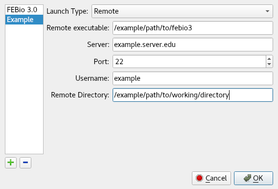

# 13.2 FEBio Launch Configurations

Launch configurations contain the information needed to run FEBio on your local machine or on a remote server. For local configurations, you just need define a path to the FEBio executable. For remote configurations, you'll have to provide additional information on the server that you wish to run on.

To edit launch configurations, click the _Edit_ button next to the _Launch Configuration_ field in the _Run FEBio_ dialog. This will launch a new dialog which will allow you to edit launch configurations (Figure [1](#fig:launch-config-edit)).

{: style="width:50%" }

/// figure-caption

The launch configuration editor, shown editing a remote configuration.

///

The left side of the dialog shows your existing configurations. To add a new configuration click the plus icon below the list of configurations. To remove a configuration, select it in the list, and then click the minus icon. To rename a configuration, double-click on the configuration name. To reorder the configurations, drag and drop them in the list.

There are several types of launch configurations, each with a different set of fields to edit. With the exception of the _Local_ launch configuration type, all types run your jobs on a remote server.

- The _Local_ launch configuration type will launch the specified FEBio executable to run your job. This will be run on your current machine. The only field required is:

- _FEBio Executable_: The path to the local FEBio executable that you wish to run with this configuration

- The _Remote_ launch configuration type will copy your job files to a remote server via SFTP into the specified directory, and then run the job via SSH with the specified remote FEBio executable. To use a remote configuration, fill out the following fields:

- _Remote Executable_: The remote path to the FEBio executable that you wish to run with this configuration.

- _Server_: The domain name or IP address of the server that you wish to connect to via SSH/SFTP.

- _Port_: The port on your server on which the SSH service is being hosted. By default, this is set to 22, which is the standard port for the SSH protocol.

- _Username_: Your username on the remote machine. Your user account must have permissions to connect to the server via SSH.

- _Remote Directory_: The remote directory to which your FEBio input file will be copied, and which will act as the working directory for your FEBio run. Unless otherwise specified in your input file, your log and plot files will be created here. This directory need not exist, and will be created automatically if it does not.

- The _PBS Queue_ and _SLURM Queue_ launch configuration types will copy your job files to a remote server via SFTP into the specified directory, and then add a new job to a PBS or SLURM queuing system. These launch configuration types each have all of the same fields as the _Remote_ type, along with a text box in which a PBS or SLURM script may be edited. At launch, the contents of this text box are put into a file, transferred via SFTP to the remote server, and run with either the _qsub_ (for PBS) or the _sbatch_ (for SLURM) command. By default, the text box contains a valid PBS or SLURM script with some common options set. For convenience, several macros have been defined, which you may use in your script. Before being written to a file and being copied to the server, these macros are replaced with a string unique to either the launch configuration, or the current job. These macros are:

- _${JOB_NAME}_: This macro will be replaced with the name of the current job as defined in the_ Run FEBio_ dialog.

- _${REMOTE_DIR}_: This macro will be replaced with the contents of the_ Remote Directory_ field in the launch configuration.

- _${FEBIO_PATH}_: This macro will be replaced with the contents of the_ Remote Executable_ field in the launch configuration.

- The _Custom Remote_ launch configuration type will copy your job files to a remote server via SFTP into the specified directory, and then run a set of specified commands in series on the remote server via SSH. This launch configuration type has all of the same fields as the _Remote_ type, except for the _Remote Executable_ field. It also has a text box in which a custom series of commands may be written, one on each line. There are a few things to keep in mind when creating a custom script:

- The same macros available in the _PBS Queue_ and _SLURM Queue_ launch configuration types are available for use in this script, with the exception of the _${FEBIO_PATH}_ macro.

- Lines starting with the '#' symbol are comments and will be ignored.

- Empty lines are ignored.

- The full string of each line will be run as a separate command on the remote system.

- The script written in this field is not a bash script, but rather a set of discrete commands which will be executed in series. It is of course possible to run a bash script with this launch configuration type, by placing the desired script on the remote server, and then running the script by calling it in one of the lines of the text box.

- This launch configuration type allows for great flexibility. Using it, you can do pre and post processing of your FEBio jobs on a remote server with the click of a single button. Use this launch configuration type with caution, as it does not have any safety nets; anything you tell the remote server to do, it will do, as long as your user account has permissions to do it.

When an FEBio job is started using any of the remote launch configuration types, an SSH connection is made to the remote server. This requires authentication. If you have set up private key authentication for the specified server and username, the authentication will happen automatically. Otherwise, you will be prompted for your user account password during the first attempt to connect to the server. This password will be encrypted and stored in RAM for the duration of your FEBio Studio session, and will automatically used for subsequent server interactions until you close FEBio Studio.

In order to retrieve the log and plot files from any of the remote launch configuration types, click the _Get Remote Files_ button under the _Job_ properties in the _Model Tree_. The status of the PBS or SLURM queue may be checked by clicking the _Get Queue Status_ button under the _Job_ properties in the _Model Tree_. The queue status will be printed to the _Output_ panel.
