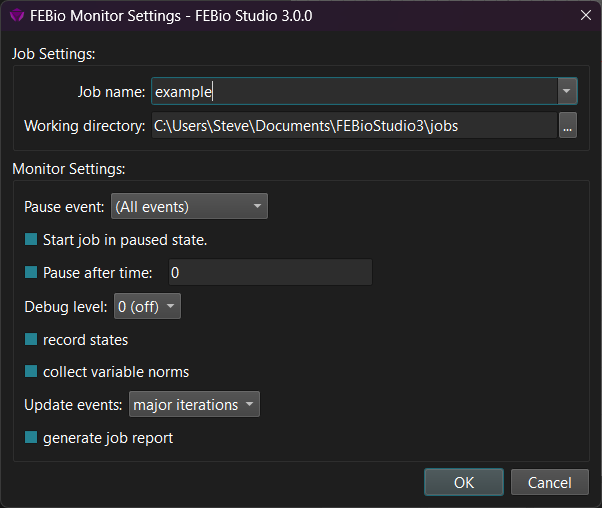
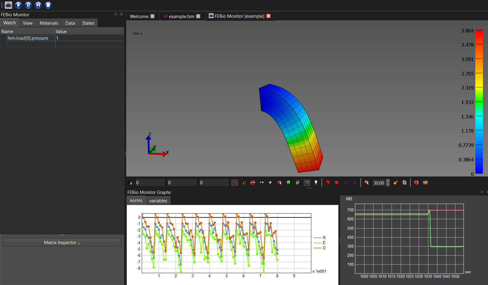
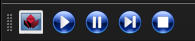

# 13.3 The FEBio Monitor

The FEBio Monitor offers an alternative way to run FEBio models from FEBio Studio. Using the FEBio Monitor, users can have a live graphical view of the model's solution progress, as well as monitor the convergence norms using graphs. The solution progress can be paused at which point users can inspect the detailed model's state, including the current stiffness matrix.

The FEBio Monitor can be a helpful tool for debugging a model as it offers a direct visual way to inspect the solution progress, something that is otherwise difficult to obtain. Problems can be identified as soon as they occur, without the need to take any further post-processing steps.

The FEBio Monitor can be invoked from the menu **FEBio** → **Run FEBio Monitor**. A dialog box appears that is similar to the usual run dialog, but offers additional controls.

/// figure-caption

The FEBio Monitor dialog allows users the configure the FEBio Monitor session and run the FEBio model.

///

The _Job Settings_ pane allows users to enter the job's name and its working directory, similar to a standard FEBio job. The working directory is the place where the output files will be stored. It is important to note that the FEBio Monitor will run a standard FEBio job that will produce the usual output files.

The _Monitor Settings_ pane allows users to configure the control parameters of the session. Most of these parameters can also be modified once the job is started, as discussed below.

**Pause event** This is the event that will be used when a pause is requested. After the job is started, the user can pause the run. The job will then be paused at the next occurrence of the selected event.

**Start job** in** paused state** This option will pause the job at the first occurrence of the selected event.

**Pause after time** This will pause the job once it passes the entered time value. Note that this time refers to the simulation time, not the actual runtime of the job.

**Debug level** Run the job in debug mode or not.

**Record states** By default, the FEBio Monitor will only display the current state of the model. When this option is checked, all the states will be recorded and can be inspected when the job is paused.

**Collect variable norms** Check this option if you want to display the norms of the model's individual solution variables. (By default, only the residual, energy, and total solution norms are shown.)

**Update events** Select when the model's state will be updated in the monitor. This only affects how often and when the monitor will query the solution's state.

**Generate job report** Collect additional data while running the FEBio job and create a report once the job is completed.

Once the settings have been chosen, click the OK button to start the monitor session. The FEBio Monitor will load and start the FEBio job. Note that the job is run using the default launch configuration. The FEBio Monitor currently does not support any other launch configurations.

{: style="width:30%" }

/// figure-caption

The FEBio Monitor shows a graphical view of the current state of the FEBio model's solution.

///

In many ways, an FEBio Monitor session resembles a post session and offers many of the same features. However, there are a few noteworthy differences (see [2](#fig:The-FEBio-Monitor)). The FEBio Monitor panel on the left has a _Watch_ tab that by default displays all the model parameters that are load-controlled and shows the current value. (Note that this panel is only updated when the model is paused.) Users can also add additional entries in the table by double-clicking the empty slot below the last entry and entering the model parameter's name. In addition, on the bottom of the Watch panel, the _Matrix Inspector_ can be accessed. The Matrix Inspector gives users a visualization of the current stiffness matrix as well as some tools to inspect and diagnose the matrix.

As part of an FEBio Monitor session, a new toolbar is visible in the toolbar area near the top of the window.

From the left to right, the buttons allow the user to take the following actions.

- Open the FEBio Monitor Settings dialog. This dialog is similar to the FEBio Monitor dialog mentioned above, but only shows the parameters that can be edited in an active session.

- The 'play' button will continue a paused model. The model will not be automatically paused on the next pause event.

- The 'pause' button will pause the model. Note that FEBio will only pause on the pause event selected in the FEBio Monitor dialog.

- The 'next' button will continue a paused model. The model will be paused automatically on the next pause event.

- The 'stop' button will stop a running model and terminate the monitor session.

In addition to the Watch panel, additional graphs are shown below the Graphics View that show various metrics of the active model. The graphs display the convergence norms of the model, typically the residual (R), energy (E), and overall solution norm (D), as well as additionally selected norms. The _memory monitor_ shows the current and maximum allocated memory. (Note that this is the memory consumption of FEBio Studio, not of FEBio.)
