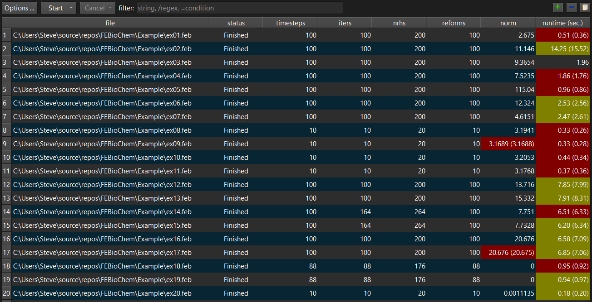

# 13.4 Running Batch Jobs

FEBio Studio has the option to manage and run several FEBio jobs at the same time. These are referred to as batch jobs. In addition to running multiple jobs simultaneously, the batch feature also offers the ability to compare the results between different batch runs.

## Create a new batch job

To create a new batch job, use the menu **File** → **Batch Run** → **New Batch...**. A dialog box appears where users can add files from different sources.

- _Add files from the current project_: this will add all the feb files from the current project file.

- _Add files from folder_: this will prompt the user to select a folder on their system. All feb files from the folder will be added.

- _Add files_: this will give users the option to select individual files from the file system.

After adding files, the files are displayed in the dialog box. Additional files can be added or files can be selected and removed using the corresponding buttons at the top of the dialog box. Finally, click OK to create the batch job. The batch job will be displayed in the batch job view, as described below.

## Open or Save a batch file

An existing batch file can be loaded directly from the file system using the menu **File** → **Batch Run** → **Open Batch File**.

A standard file open dialog will be presented where the user can select a batch job file (extension **.fsbatch**). Click OK to load the batch file. The batch job will be displayed in the batch job view, as described below.

To save a batch job, simply use the menu **File** → **Save** or **File** → **Save as**.

## The Batch Job View

After a new batch job is created or a batch file was loaded, the contents of the batch job is displayed in a special window called the **batch job view**.

The view shows a table that lists all the FEBio files in the batch job, as well as several columns with metrics that were collected the last time the batch job was run. (For a new batch job, the columns will be empty.)

{: style="width:40%" }

/// figure-caption

The Batch Job View shows the list of files that are part of the batch, as well various metrics that can be used to compare runs.

///

At the top of the view, a toolbar shows several buttons that allow you to manage various aspects of the batch job. From left to right:

**Options** The options button opens a dialog box where you can set several settings for running the batch job, such as the number of concurrent processes, the number of threads per process, and the path to the FEBio executable.

**Start** The start button is used to start the batch job. You can either choose to run all the files or just the selected ones.

**Cancel** Once the batch runs, this button can be used to cancel either all pending jobs or all running and pending jobs.

**filter** The filter option allows users to limit the files that are shown based on certain criteria. The criteria can be either a string or regex expression to filter the file list, or a condition to filter based on the metrics. To enter a regex start the filter text with a slash ('/'). To define a condition, start with an equal sign ('='). The condition is formed as follows: _metric operator value_. The _metric_ can be any of the names listed on the column headers. The operator is any of <, <=, >, >=, =, ==, != ('=' and '==' are both for _equal than_ and '!=' means _not equal_). The _value_ is any valid numeric value for the corresponding metric. For example, to list only jobs that ran for more than a minute, set the filter to '=runtime>60' (don't include quote symbols).

**add** This button can be used to add additional files to the batch job.

**remove** This button can be used to remove the currently selected files.

**copy** This button can be used to copy the batch jobs and metric to the clipboard as a tab-separated list.

Right-clicking on any batch file prompts a popup menu from which additional actions can be selected. These actions allow you to open the feb file or the corresponding log or plot file in FEBio Studio.

## Running the batch job

To run the batch job, click the Start button in the toolbar at the top of the batch view window. Two options are listed:

- **Run all**: select this option to run all the currently visible files in the batch view. If no filter criteria are active, this will run all the files in the batch.

- **Run selected**: only run the files that are currently selected

Before a batch job is run, several options can be set that will affect the batch job. To change these settings, click the **Options** button on the batch view's toolbar. A dialog opens where you can edit the following settings:

- **Nr. of processes**: This is the max number of concurrent processes that will be started when you run the batch job.

- **Nr. threads/process**: This is the number of threads that will be used for each process.

- **FEBio executable**: sets the path of the FEBio executable that you want to use.

Before starting a batch job, it's important to choose these settings wisely. This means that you must know the system resources that you have available. There is often nothing to gain by starting up more processes or choosing more threads than you have processors on your computer. For instance, if you only have 4 cpus, then the product of the number of processes and threads per process should not exceed 4. The default value is 1 for the number of processes, and (default) for the number of threads per process. This usually means that the number of threads is determined by the OS and the applicable environment variables (e.g. OMP_NUM_THREADS).

When the batch job is started, all files that will be run change their status to PENDING (shown in the first column next to the file name). When a job is picked up by a process, it changes its status to RUNNING. Files that complete normally will have their status changed to FINISHED. If the file failed to start or error terminated, the status is set to FAILED. Running and pending jobs can be canceled from the toolbar. Pending jobs that were canceled will set their status to CANCELED. Jobs that were already running when canceled will be set to FAILED.

As the individual jobs are run, the columns containing various metrics will be populated. If the batch job was loaded from an existing file, and if the new metrics are different, both the new and the old values are shown, using the format “new value (old value)”. The background color will also change. It will be red if the new value is higher than the old value, and it will be yellow if the new value is less than the old value. This makes it easy to compare different runs. Keep in mind that the runtimes will often be different, and some metrics may also show small differences when the jobs were run with multiple threads per process. These are often expected changes and not an indication of a problem. However, if there are more significant changes or the changes occurred when running on a single thread, then that could be a sign of a deeper problem.
