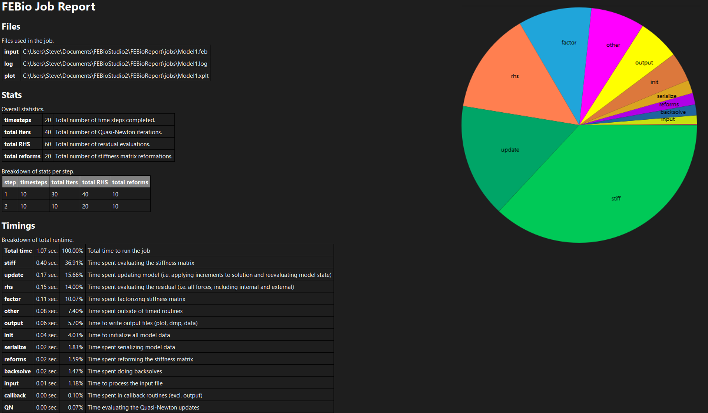

# 13.5 FEBio Job Reports

FEBio Job Reports provide additional details about an FEBio job that was completed. This report can provide insights into how well (or how poorly as the case may be) FEBio ran and help with tracking down possible problems.

By default, FEBio Studio does not generate job reports. To generate a job report after FEBio finishes, make sure to check the corresponding option in the Run FEBio dialog box before running the job (under the Advanced settings). Job reports can also be generated from FEBio log files. Simply drag-and-drop the log file onto the FEBio Studio window and a job report will be created. Job reports generated from log files may not be as detailed as the ones generated directly from an FEBio job.

{: style="width:50%" }

/// figure-caption

The FEBio Job Report provides additional information on a completed FEBio job.

///

The job report shows the following information:

- The files that were used and created during the job.

- Some stats about the job as well as a breakdown of the stats per analysis step.

- A color-coded bar chart showing the number of iterations/rhs/refs per time step. (red means the time step failed, green means the time step completed.)

- Detailed timings of specific FEBio operations.

- A pie chart of these timings.

- A list of all the warnings and errors that were generated during the FEBio job.
