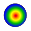
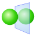
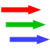
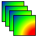
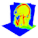
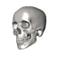
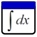

# 14.3 The Post Toolbar {: #subsec:mylabel5 }

The _Post_ toolbar offers various shortcuts to the Post menu items.

Return to the first time step

Step back by one step

Start (and stop) the animation

Step forward by one step

Go to the last time step

Open the time dialog box

Activate the contour plot

Adds a plane cut plot to the model

Adds a mirror plane to the model

Adds a vector plot to the model

Adds a tensor plot to the model

Adds a isosurface plot to the model

Adds a slice plot to the model

Adds a stream line plot to the model

Adds a particle flow plot to the model

Adds an image slicer to the model

Adds a 3D volume renderer to the model

Adds an isosurface rendering of a 3D image stack.

Opens a new graph window

Opens the Integrate window
