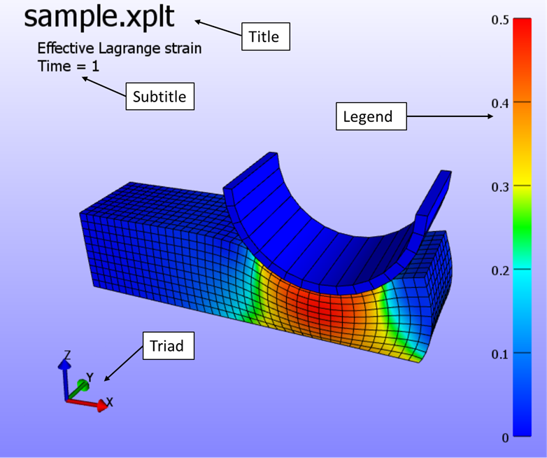
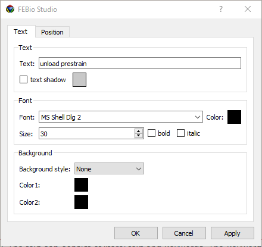

# 14.4 The Graphics View {: #sec:mylabel3-1 }

The Graphics View (GV) is the area of the screen where the model is displayed.

## Elements of the GV {: #subsec:elements }

Aside from a 3D rendering of the model, the GV has several other components to it. These components are referred to as widgets. The image below displays the GV and all of its default widgets.

/// figure-caption

The Graphics View components.

///

The _Title_ widget displays the title of the model. The _Subtitle_ displays additional information, such as selected field and current time value. The _Triad_ indicates the current orientation of the scene. Finally, the _Legend_ displays a colored bar and the range of the selected field.

## Customizing the GV {: #subsec:customizing }

The user can customize the GV by selecting and moving the different widgets around, and by adding new widgets. This section describes how the user can customize the GV. The following GV widgets are currently available:

- _Text box_ - displays a user-defined text.

- _Triad_ - displays the orientation of the current view.

- _Legend_ - displays a colored legend bar.

### Selecting and moving widgets

You can select a GV widget by clicking on it with any mouse button. A selection box appears over the widget. The widget can be moved by dragging the box, while holding the mouse button down. If you click and drag the small triangular shaped area in the lower right corner of the selection box, you can resize the widget. Double-clicking on a widget brings up a properties dialog box, where you can modify the widget's properties.

### Setting the GV widget's properties

After selecting a widget, you can alter its properties by clicking the Properties button from the Widget toolbar. A dialog box appears. You can also bring up this dialog box by double-clicking the widget. Below is an example of the properties dialog box for a text widget.

/// figure-caption

Text properties dialog box.

///

The font type, font size, font color and attributes can be set in this dialog box. You can also set the text to be displayed in the box. The text can consist of literal text and keywords. The keywords, which start with a percentage sign (title_ | Title of the problem. The title is set in the **File** → **Model Info** dialog box. |
| _time_ | The time value of the current state. |
| _filename_ | The name of the file. |
| _filepath_ | The path of the file. |

/// table-caption

Text box keywords.

///

You can also use escape sequences, which start with a backslash ($\backslash)$.

- $\backslash$n - start a new line.

- $\backslash$t - start the following text at the next tab position.

### Adding GV Widgets

FEBio Studio starts with a predefined set of GV widgets. You can add new widgets by clicking one of the GV buttons in the toolbar. Currently, FEBio Studio only supports the addition of a new text widget by clicking on the “Add text box” button, located on the main toolbar.

### Deleting GV Widgets

GV widgets can be removed by first selecting them and then selecting **Edit** → **Delete** from the menu bar. Note that you cannot delete the predefined widgets, namely the title, subtitle, legend and triad. However, you can hide these objects by selecting the corresponding button on the toolbar.
