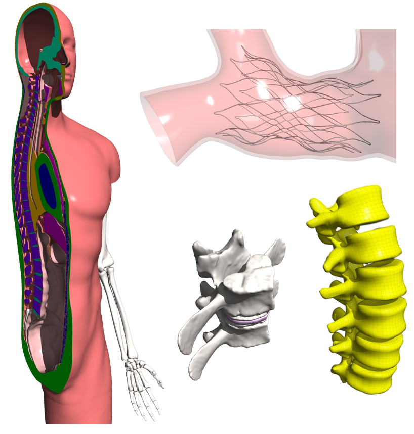

# 15.3 Using the Ray Tracer

Instead of taking a screenshot, you can also create a ray-traced rendering of the current scene. A ray-traced rendering can create higher quality, arbitrary resolution images, which may be more suited for journal articles or other high quality publications. Ray-tracing is often more suitable for rendering shadows and transparent materials.

{: style="width:50%" }

/// figure-caption

A collection of ray-traced images, generated by FEBio Studio.

///

To create a ray-traced rendering, click the ray-trace button on the main toolbar. A dialog will appear where several settings can be chosen that will affect the final resolution and image quality of the rendering.

**Width, Height** set the resolution of the final image. By default, the dimensions of the active Graphics View are entered, however users can enter any dimensions here. Note that higher resolutions will take longer to render.

**Shadows** Check this option if you want shadows to be rendered.

**Shadow Strength** Set the strength of the shadows (range 0...1 from very light to very dark)

**Multisample** Select the multi-sample level. Higher levels of multi-sampling will create better quality images but will take longer to render.

**Background** Select the background option:

**Default**, same as Graphics View

**transparent** make the background transparent

**background color** use the _background color_ setting.

**Background Color** Sets the background color. Only used when the **Background** setting is set to _background color_.
