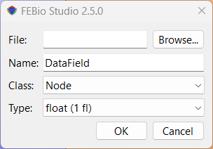

# 16.3 The Data Tab {: #subsec:mylabel13-1 }

The _Data Manager_ lists all the available data fields that are defined in the model in a table with four columns.

The _Data Field_ column gives the name of the data field. When selected, the name can be edited in the field below the data list.

The _Type_ of the field identifies the type of the data. The following types are currently defined:

- _float_: single precision floating point

- _vec3f_: a 3D vector with three float components

- _mat3fs_: a 3D symmetric matrix with six float components

The _Class_ column identifies the region type for which the data field is defined:

- NODE: data is defined at the nodes of the model

- FACE: data is defined for each facet of the model

- ELEM: data is defined for each element in the model

The _Format_ column displays the storage format for the data field. The following values are supported:

- ITEM: One value is stored for each item of the data field's region.

- NODE: One value is stored for each node of the data field's region.

- MIXED: One value is stored for each node of each item of the data field's region.

- REGION: Only one value is stored for the entire region.

In addition, new data fields can be added by clicking the Add button. A menu shows up from which the user can select from several options:

- _Standard_: select from a list of pre-defined data fields. See Appendix A for an overview of currently supported data fields.

- _From file_: load a data field from a data file.

- _Equation_: Enter a mathematical expression that will be evaluated over the mesh.

<a id="fig46"></a>



/// figure-caption

Add Data from file dialog box.

///

## Adding data from a text file

When selecting the **Add** → **From file** menu, a dialog box will be shown where you can enter the file name and additional information for parsing the file. The text file containing the data can be selected using the Browse button. The data must be formatted using a comma delimited list, each line corresponds to one item (node, element) and each value on each line corresponds to a single state. The _Name_ edit box is used to give a name to the user field, the _class_ list identifies whether the data corresponds to a node, element or face, and the _type_ list is used to define whether the data is a scalar (float), 3D vector (vec3f) or 3D matrix (mat3fs).

For example, assuming _class_ is node, and _type_ is float.

```
1, 0.1, 0.2, 0.3
2, 3.2, 3.3, 3.4
3, 1.2, 2.3, 2.4
```

This file defines for nodes 1, 2 and 3 three values, one for each state (assuming the model has three states). Another example, assuming _class_ is element, _type_ is vec3f.

```
1234, 0.1, 0.2, 0.3, 0.4, 0.5, 0.6
1235, 0.7, 0.8, 0.9, 1.0, 1.1, 1.2
1236, 1.3, 1.4, 1.5, 1.6, 1.7, 1.8
```

This file defines for three elements (elements 1234, 1235 and 1236) a vec3f value for two states: element 1234 has the value (0.1, 0.2, 0.3) for state 1 and (0.4, 0.5, 0.6) for state 2.

## Adding data via an equation

When selecting the **Add** → **Equation** menu from the data panel, a dialog box appears where the user can enter the name of the new data field and a mathematical expression that will be evaluated over the entire mesh.

Currently, this only allows the creation of scalar nodal data (Type $=$ float, Class $=$ NODE, Format $=$ ITEM).

You can use the symbols $x$, $y$, and $z$ to reference the (time dependent) nodal coordinates, and $t$ to reference time.

## Filtering data

New data fields can be defined by filtering existing data fields. Note that this currently can only be done with the data fields that were loaded from file (not with the standard data fields that FEBio Studio defines).

To create a filtered data field, select a data field in the Data panel and then click the **Filter...** button. A dialog box appears where the following information has to be entered.

- _Name_: The name of the new data field.

- _Filter_: The type of filter to apply to the original data field. (See below)

For each filter additional data needs to be entered. The following filters, and required data, are supported.

- _Scale_: The data will be scaled by multiplication by a scalar.

- _scale_: the scale factor

- _Smooth_: The data will be smoothed via a Laplace operator.

- _theta_: weight of the smoothing operator.

- _iterations_: number of times to apply the operator.

- _Arithmetic_: Apply a simple arithmetic operation.

- _operation_: select the operation to perform

- _operand_: The data set that will be used as the right operand (the filtered data field is the left operand).

- _Gradient_: Evaluate the gradient vector of a scalar data field.

## Exporting Data

Data can be exported from the Data panel. To export data, first select the field variable from the data panel that will be exported. (It doesn't matter which data field is being displayed in the Graphics View.) Then, click the Export button at the top of the Data panel. This will bring up a file-save dialog. Select the location and enter the filename of the file where the data will be stored. Click Save to continue. The next dialog shows some options that allows the content of the output file to be customized. The options are as follows:

- **Selection only**: When checked, only the data associated with the current selection will be exported. Make sure that the selection matches the data “Class”. E.g. for element data, elements should be selected; for node data, nodes should be selected. The data class of a data variable is shown in the Class column of the data panel. If this option is not checked, the data of all corresponding mesh items will be output.

- **Write all states:** Write the data for all the time steps of the simulation.

- **Write current state only**: Only export data for the currently active time step.

- **Write states from list**: Enter a comma-separated list of states (i.e. time steps) that will be exported. (e.g., 1,3,5,7. You can also use the short-hand equivalent notation 1:7:2),

After clicking OK, the data will be exported to the output file. The data is exported to a text file as a comma-separated list of values. Each row corresponds to a mesh item. E.g., for nodal data, each row will contain the data of a node of the mesh. For element data, each row contains the data for an element. The values on each row are as follows:

1. Item ID (e.g. node number, or element number)

1. The value(s) of the selected data field for that item at the first time step. The number of values depends on the value type of the field.

1. For scalar fields, there will be one value.

1. For vector fields, there will be 3 values (comma separated).

1. For mat3f fields (3x3 matrix), there are 9 values in row-first ordering (m11, m12, m13, m21, m22, m23, m31, m32, m33)

1. For mat3fs (3x3 symmetric matrix), there are six values (m11, m22, m33, m12, m23, m13)

1. The values are exported for each selected time step

For example, the output for exporting the nodal displacement vector (a vec3f variable) of node 123, for 4 time steps (vectors {0,0,0}, {0.1,0,0}, {0.2,0,0}, {0.3,0,0}) would be as follows.

```
123,0,0,0,0.1,0,0,0.2,0,0,0.3,0,0
```
