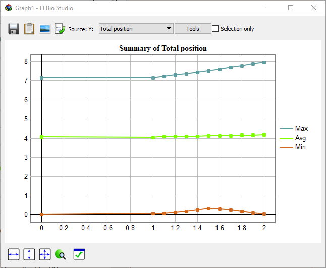
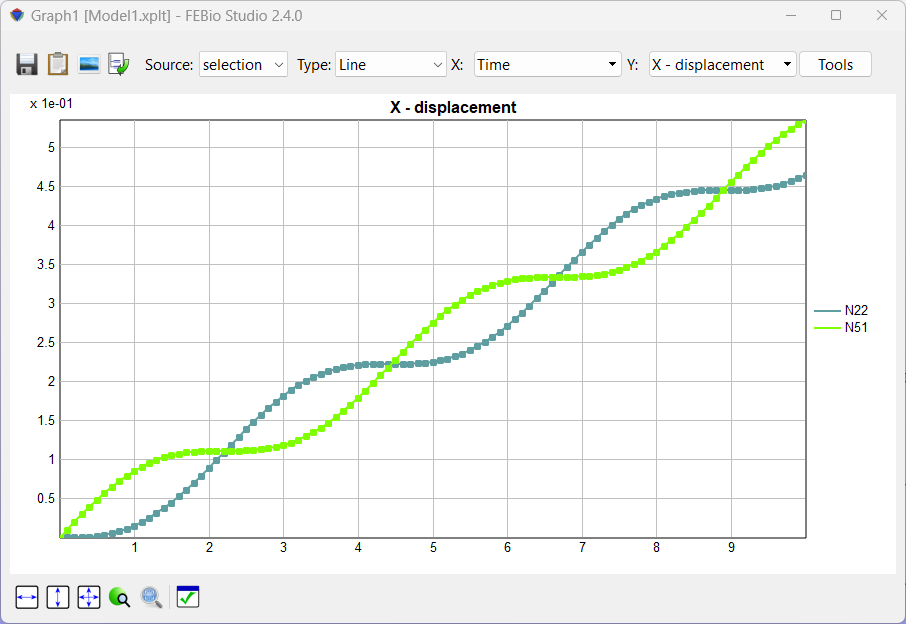
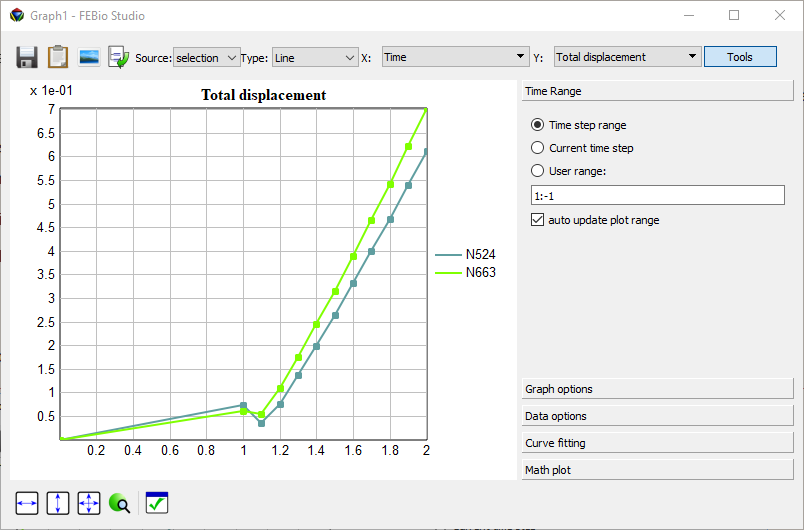
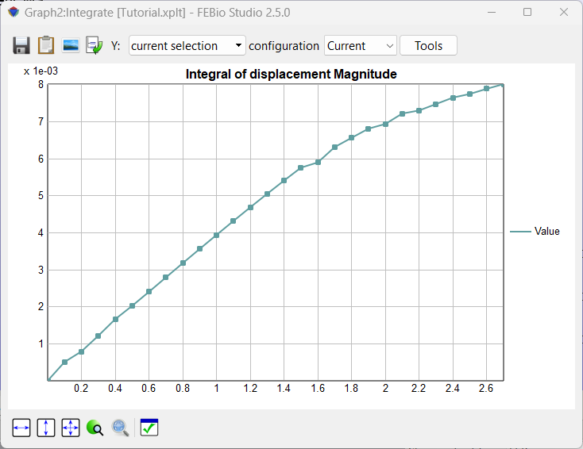

# 17.12 Additional Windows {: #sec:additional }

## Summary Window {: #subsec:summary }

The Summary Window displays a graph of the minimum, maximum, and average values as a function of time for the selected expression. This summary of values can be calculated using only selected elements or nodes, or for the entire model when no elements or nodes are selected. It can be opened by selecting the **Post** → **Summary**. Figure 9 shows the _Summary Window_.

/// figure-caption

The Summary Window can be opened from the **Post → Summary** menu.

///

To select the expression to display, click on the drop-down box in the upper left corner and select the desired expression. Each data point can be selected by clicking on it. The exact values will appear next to a selected data point.

To save the summary data to file, click the _Save_ button located at the bottom of the _Summary View_. This will open the File Save dialog box. After the user enters a filename, the data is saved to file as a simple ASCII file. The data can also be copied to the clipboard with the “Copy to Clipboard” option.

The _Options_ button shows a dialog box where the user can change some options.

The graph area can be scaled or moved by click$+$dragging the right and left mouse button respectively. The buttons in the lower left corner of the Summary window can be used to restore the x-range, y-range or both.

## Graph Window {: #subsec:graph }

The Graph window can be used to show time history plots and scatter plots for selected items. To open a _Graph window_, select the **Post** → **new Graph** menu. Multiple graph windows can be displayed simultaneously.

/// figure-caption

A Graph window displaying the time history of selected mesh items.

///

The _Graph window_ displays the selected expression for the selected mesh items (see below on how to select mesh items). On the right, the legend shows the item numbers (preceded by an 'E' for 'element', 'N' for 'node', 'F' for 'face', 'C' for edge) and they are shown in the same color as the corresponding curve.

Each Graph window has a toolbar that offers the following functionality.

- The _Save_ button will save the displayed data to a text file.

- The _Clipboard_ button can be used to store the data values on the clipboard. This data can then be pasted in other software that allows clipboard operations.

- The _Type_ selection box allows the user to select from different types of plots. The following types are currently supported:

- _Line_ - displays a curve that represents the evolution of the selected data field as a function of (pseudo-) time. For this type, the user can only select the value for the y-axis; the x-axis will show the time.

- _Scatter_ - displays an x-y plot. In this case, the user can select different data fields for both the x- and y-axis.

- _Time_-scatter: like scatter plot, but points are connected by time value

- Tools: Shows the graph tools panel, which is discussed in more detail below.

The graph area can be scaled or moved by click$+$dragging the right and left mouse button respectively. The buttons in the lower left corner of the Graph window can be used to restore the x-range, y-range or both.

## Graph Tools

Each Graph window offers a tools panel that allows access to additional features that affect what is displayed in the graph area.

/// figure-caption

A Graph window with the Tools panel expanded.

///

The following tools are currently supported.

- _Options_: Set various settings that affect what is shown and how the data is displayed.

- _Linear Regression_: Do a linear regression on the first shown curve.

- _Math plot_: Enter a mathematical expression, using _x_ as the ordinate, which will be displayed on the top of the graph.

## Selecting mesh items

 You can select nodes, edges, faces, and elements. The item that will be selected is controlled by the selection buttons in the _Toolbar_:

Switches to node-selection mode.

Switches to edge-selection mode.

Switches to face-selection mode.

Switches to element-selection-mode.

To add an item to the current selection, just shift$+$click the item. When tags are enabled, a dot followed by the item's number will appear next to the item. To enable the tags, select the corresponding button on the toolbar. To remove an item from the current selection, ctrl$+$click the node or element. You can (de-) select multiple items at the same time by dragging the mouse cursor while holding down the shift or ctrl key and the left mouse button. A colored rectangle will appear indicating what elements or nodes will be selected. Note that only _visible_ elements or nodes that fall inside this rectangle will be selected. This means that only elements or nodes on the surface of the mesh can be selected.

When no other windows are open (such as e.g. Graph windows, etc.), pressing the ESC-key will clear the selection. You can also select the **Edit** → **Clear Selection** menu to clear the entire selection.

Also note that the _Edit_ menu lists several options to manipulate the current selection, such as hiding, un-hiding, inverting, etc.

## Integration Tool

 The _Integration tool_ allows you to calculate the integral over a selected region. To use it, first select nodes, edges, faces, or elements. Then, activate the Integration tool from the **Post** → **Integrate** menu. A window appears with a graph that represents the integral of the selected region as a function of time. Depending on the selection, the graph represents different things. For nodes, it is the sum of the values all the selected nodes, for edges it is the line integral, for faces it is the surface integral of the selected surface, and for elements it is the volume integral over the volume of the selected elements. The _Save_ button saves the results to a text file and the _Clipboard_ button copies the data to the clipboard.

/// figure-caption

The Integration tool can be used to calculate the definite integral over the selected region.

///
