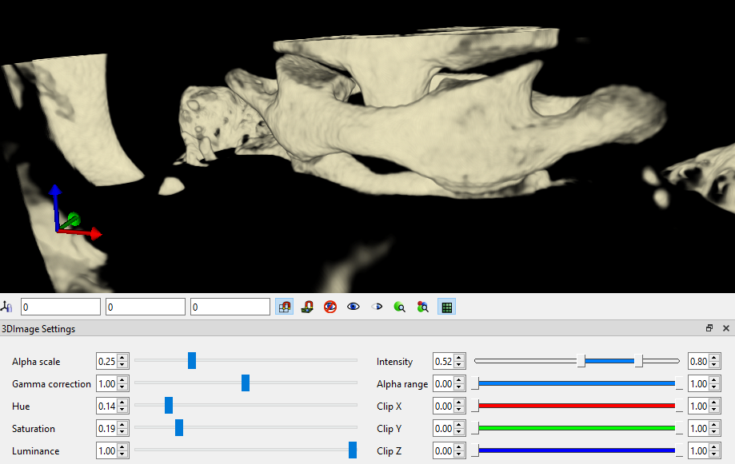

# 18.2 Image GUI Environment

FEBio Studio has various GUI elements dedicated to viewing and manipulating image data. Some of these GUI elements only appear when an image is selected from the model tree in an open model.

## Properties Box

The image properties box will appear in the Model panel when you select an image in the model tree. The box has three tabs: _Properties_, _Filters_, and _Histogram_. The Properties tab shows the physical bounds of the image in real space, and allows you to edit them. The Filters tab allows you to add, edit, and apply various filters to the images (please see the section on Filters for more information). The Histogram tab displays a histogram of the data from the selected image.

## 3D Image Settings Panel

The 3D Image Settings Panel will only be visible after an image has been selected. It allows you to customize various display settings for the current image. These display settings will be remembered for each image, and will be used across all display modes for the image. The settings include:

- **Alpha Scale:_ _**Sets the overall alpha scale, which scales the transparency of the image.

- **Gamma correction:** Sets the gamma correction factor, which applies a nonlinear scaling of the image intensity.

- **Hue/Saturation/Luminance:** Sets the hue (or color), saturation, luminance level of the primary color.

- **Intensity:** Set the minimum and maximum cutoff image intensity. Voxels with an intensity below the minimum (maximum) value will be rendered with a transparency set to the value of the minimum (maximum) value of the _alpha range_ setting.

- **Alpha Range:** Sets the minimum and maximum alpha (transparency) values.

- **Clip X/Y/Z:** Sets the min and max image clipping values for the X, Y, and Z planes. This allows users to only show a region of interest instead of the whole 3D image.

/// figure-caption

The 3D Image Settings panel can be used to modify the appearance of 3D volumetric images.

///

## Slice View

To access the Slice View, click the Slice View button on the Image Toolbar. This view shows slices of the image in each of the cardinal directions, along with a 3D render of the image which shows the corresponding location of each of the slices.

Below each of the slices, the direction of the slice is displayed along with the index of the slice in that direction and a slider. You can change which slice is displayed by either editing the slice index number, dragging the slider, or hovering over the slice and scrolling with your mouse wheel. As a given slice is moved, the corresponding slice on the 3D render will move with it.

## Slice Sequence View

To access the Slice Sequence View, click the Slice Sequence View button on the Image Toolbar. This view allows you to automatically step through the slices of your image at a fixed interval. This is particularly useful if your image data consists of 2D images taken at different times.

Below the slice, there are various controls for this view. The Play/Pause button will start or stop the animation. The Interval value is the amount of time in milliseconds that the view will pause between each slice. Its default value is 40ms, which corresponds to 25 frames per second. The Slice Direction dropdown allows you to change from which direction the slice be shown. The number and slider next to the Slice Direction dropdown show the current slice index and relative slice position. The slice index can be changed manually by editing the slice index number, dragging the slider, or hovering over the slice and scrolling with your mouse wheel. If, however, the view is currently animating, the value will be automatically advanced as soon as it is edited.
