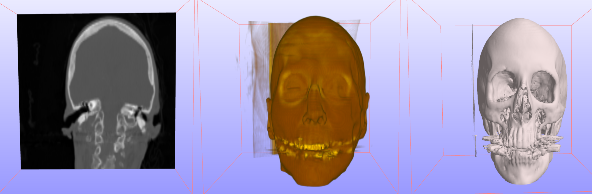

# 18.4 Other 3D Image Visualization Options

After a 3D image stack is loaded you can attach several image renderers to visualize the image data in the Graphics View. Before you add an image renderer, make sure the correct image stack is selected in the Model Viewer. In the following section, the different image renderers are described.

## Image Slicer

The image slicer shows a single slice of the 3D image stack in the Graphics View. You can select the image orientation as well as relative position in the image stack.

- _Image orientation_ - Choose the orientation of the image slice

- _Image offset_ - Choose the relative position of the image offset

- _Color map_ - Set the color map that will be used to render the slice.

## Volume Renderer

The Volume Renderer shows a volume rendering of the image stack in the Graphics View. The following options can be set.

- _alpha scale_ - Sets the overall alpha scale, which scales the transparency of the image.

- _min intensity_ - Minimum cutoff image intensity. Voxels with an intensity below this value will be rendered with a transparency set to the value of the _min alpha_ parameter.

- max intensity - Maximum cutoff image intensity. Voxels with an intensity above this value will be rendered with a transparency set to the value of the _max alpha_ parameter.

- _min alpha_ - the alpha (transparency) value used by voxels with an intensity below the _min intensity_ parameter.

- _max alpha_ - the alpha (transparency) value used by voxels with an intensity above the _max intensity_ parameter.

- _Amin, Amax_ - The alpha (transparency) range for voxels with an intensity between _min intensity_ and _max intensity_.

- _Color map_ - Color map for mapping the grayscale voxels to a color value.

- _Lighting effect_ - If Yes, the voxel color is attenuated based on local normal estimation, which simulates a lighting effect.

- _Lighting strength_ - The strength of the lighting effect, as a value between 0 and 1.

- _Ambient color_ - The ambient color added for the lighting effect.

- _Specular color_ - The specular color added for the lighting effect.

- _Light direction_ - The direction of the light used in the lighting effect.

## Image Isosurface

The image isosurface features renders an isosurface of the 3D image data. This feature has the following parameters.

- _Isosurface value_ - The image intensity value that determines the isosurface.

- _Smooth surface_ - Smooth the facet normals to create a more smooth rendering of the isosurface.

- _Surface color_ - set the color of the isosurface.

- _Close surface_ - Close the surface when it intersects with the boundaries of the image domain.

- _Invert space_ - Invert the image space.

- _Allow clipping_ - Allow this surface to be clipped by any active cutting planes.

/// figure-caption

The various 3D image renderers. From left to right, Image Slicer, Volume Renderer, and Image Isosurface. (source: cthead from Stanford Volume Dataset).

///
