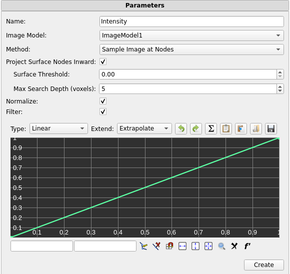
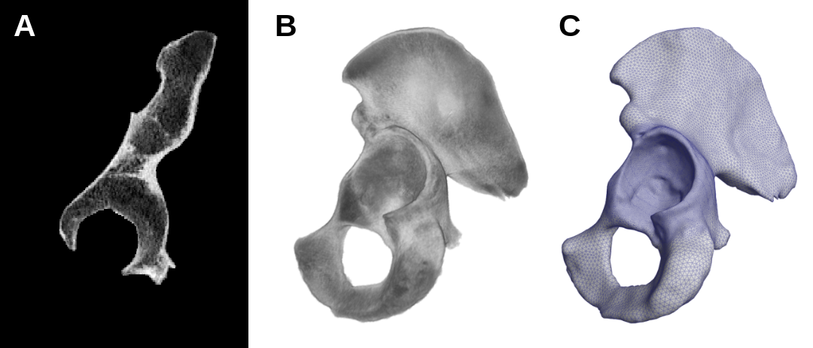
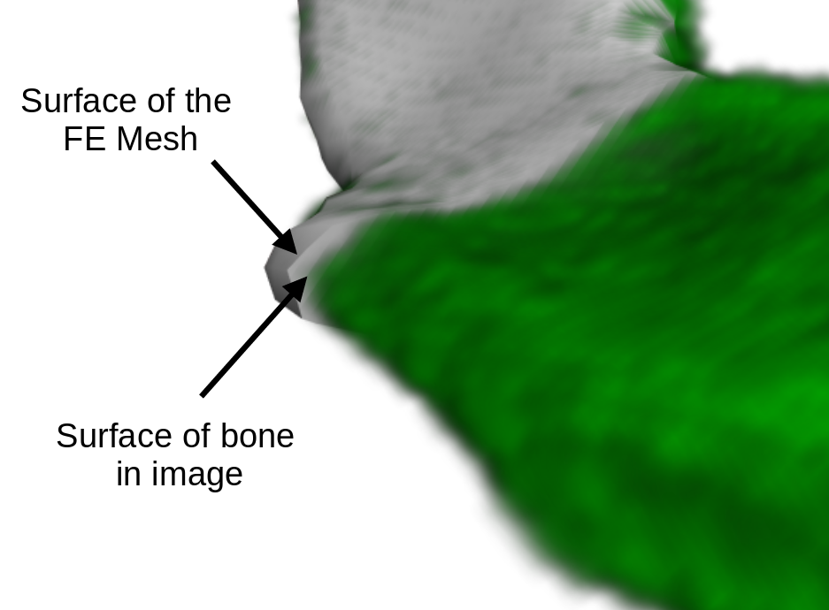
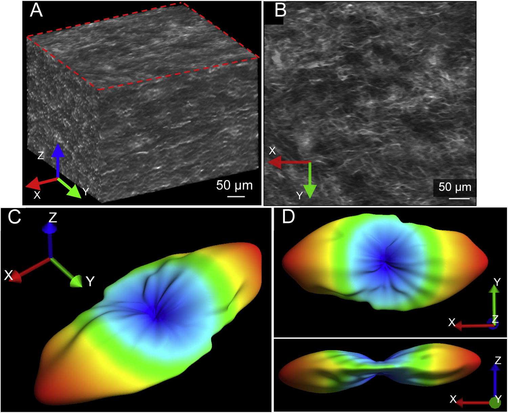
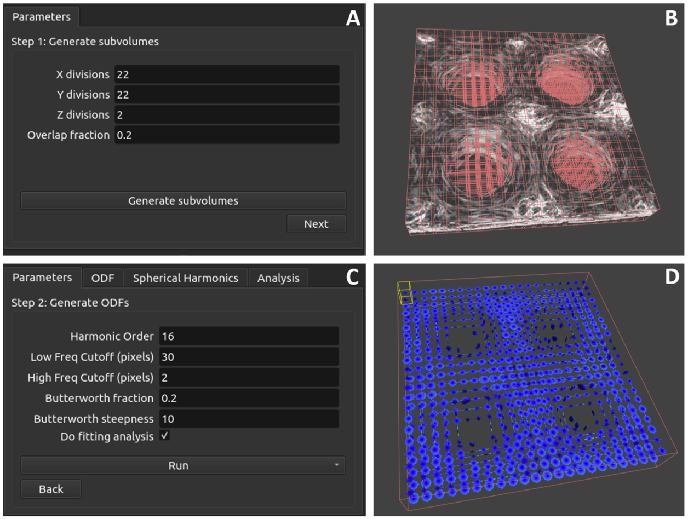
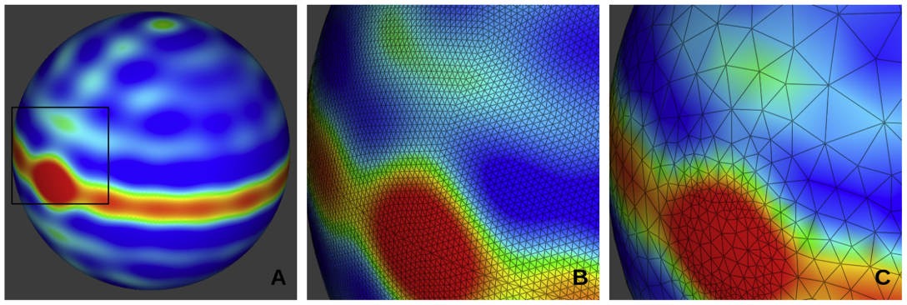

# 18.5 Other 3D Image Tools

## Image Map Tool

The Image Map Tool (found on the Tools tab of the Build Panel) is used to map intensity values from a 3D Image onto an FE mesh that exists inside the image domain. To use this tool you must first import a 3D Image, select the FE object onto which you want the intensity values to be mapped, and then run the tool. After running the tool, a new Mesh Data object will be created and added to the model tree.

The tool has the following parameters.

/// figure-caption

Parameters for the Image Map tool

///

- _Name_ - The name of the resulting data map.

- _Image Model_ - The 3D image that will be used in the image map.

- _Method_ - The method used by the algorithm to sample the image (see below for more details).

- _Project Surface Nodes Inward_ - A parameter used by the _Sample Image at Nodes_ method to help nodes on the surface of a mesh to be assigned the correct value (see below for more details).

- _Surface Threshold_ - The intensity value cutoff at which to stop projecting a surface node inward.

- _Max Search Depth_ - The maximum number of voxels to search when projecting nodes inward. The default value of _5_ is usually sufficient.

- _Normalize_ - When checked, the values of the resulting data map will always range between 0 and 1. When left unchecked, the values of the data map will be read directly from the image.

- _Filter_ - When checked, an editable graph similar to the Curve Editor (Section [The Curve Editor](../chapter3/3.12-the-curve-editor.md#subsec:mylabel19)) will be shown. This graph can be used to create a curve through which the data sampled from the image will be passed before being written to the data map. If the _Normalize_ option is checked, the normalization will occur before the data is passed to the filter.

There are three different methods that can be used for sampling the image. Each method may be useful with different combinations of mesh and voxel density. It is important to choose the correct method to ensure that the tool accurately samples your image. The _Sample Image at Nodes_ method is best in most situations, but due to its comlexity, it is dicussed last.

The _Sample at Element Centroids_ method samples the image at the location of each element's centroid and assigns the value to that element, resulting in a single value for each element. The value of the sample is linearly interpolated between voxels in the image. This method works well when the FE elements in the mesh are similar in size to the image's voxels, or smaller than the voxels. If the elements in the mesh are considerably larger than the voxels, high frequency data in the image will be lost.

The _Average Intensity Over Elements_ method loops over every element in the mesh, and finds all of the voxels in the image whose centroids lie inside the current element. It then takes the average of those voxel values, and assigns that average to the element. This method works well when the FE elements are considerably larger than the image's voxels, and tends to act as a sort of low-pass filter for the image data. This method is not recommended for use when the FE elements are of a similar size to the image's voxels, or smaller.

The _Sample Image at Nodes_ method samples the image at the location of each node in the FE mesh, and assigns the value to that node, resulting in a single value for each node in the mesh. The value of the sample is linearly interpolated between voxels in the image. This method works well when the FE elements in the mesh are similar in size to the image's voxels, or smaller than the voxels. This method also provdes the _Project Surface Nodes Inward_ parameter which can be used to help nodes on the surface of a mesh to be assigned the correct value, as explained below.

It is often the case that an FE mesh does not simply cover the entire domain of the image, but rather oulines some prominent feature in the image, such as a bone (see Figure [2](#fig:imageMapEx1)).

/// figure-caption

Part of a human pelvis shown in three views. A: a 2D slice of the image along the X axis. B: a 3D render of the image. C: an FE mesh covering the surface of the bone.

///

It is also often the case that the surface of the FE mesh does not perfectly follow the outline of the feature in question. As shown in the Figure [3](#fig:imageMapEx2), there is a gap between the surface of the FE mesh, and the surface of the pelvis in the 3D image.

/// figure-caption

The FE Mesh and 3D Image (shown in green for contrast).

///

The nodes on the surface of this FE mesh lie slightly outside the bounds of the bone in the image, and so when the Image Map Tool samples the values for these nodes, it will sample a value from the background of the image, rather than the bone. The _Project Surface Nodes Inward_ option helps to mitigate this. When this option is enabled, the Image Map tool projects each node on the surface of the FE mesh inward along its surface normal until it enounters a voxel whose value meets or exceeds a user-specified threshold, and assigns that voxel's value to the node.

In more detail, the _Project Surface Nodes Inward_ option works as follows. For each node on the surface of the FE mesh it will first check the value of the voxel at the node's location. If the value is greater than or equal to the value specified in the _Surface Threshold_ parameter, then it will assign that voxel's value to the node, and move on to the next node. However, if the value of that voxel is less than the _Surface Threshold_, then it will travel in a direction opposite of the node's surface normal, until it encounters a new voxel. It will check the value of that voxel, and if it meets or exceeds the _Surface Threshold_ then it will assign that voxel's value to the node, otherwise it will move on to the next voxel in line. This search continues until either a suitable voxel is found, or until it has searched a number of voxels equal to the value stored in the _Max Search Depth_ parameter. If the tool is unable to find a suitable voxel before that point, it assigns the node the value of the voxel closest to the node.

After running the Image Map tool, the results will be stored in a Mesh Data object in the Model Tree. To visualize the values on the mesh, select the object and open the Mesh Inspector (Section [The Mesh Inspector](../chapter3/3.13-the-mesh-inspector.md#subsec:mylabel20)). Then in the _Variable_ drop-down menu, select the name that was specified in the Image Map tool's _Name_ parameter.

## Fiber ODF Analysis

The Fiber ODF (Orientation Distribution Function) analysis feature in FEBio Studio is a tool designed to bridge the gap between experimental imaging data and finite element modeling. This analysis calculates ODFs directly from 3D image data, providing an accurate and detailed representation of the anisotropic material properties.

/// figure-caption

Type I collagen hydrogel image volume and its fibril orientation distribution function (ODF) characterized using our image analysis technique. (A) Isometric view of the image dataset, exhibiting collagen fibrils that are largely oriented along the X-direction. The dataset was acquired with a multiphoton microscope and pre-processed to correct for systematic distortions and improve contrast. (B) Top view of the first slice in the image stack, highlighted in a red dashed box in panel A. The image demonstrates the dataset is composed of fibrils that have considerable dispersion and some spatial heterogeneity. (C) Isometric view of the fiber ODF characterized over the entire volume. The ODF is visualized with the radial representation, where the probability of each direction is represented by its distance from the origin and a colormap. (D) Top and front views of the ODF. These views show the predominant orientation of the fibrils is along the X-axis and the dispersion is primarily within the XY plane.

///

The analysis removes the need to rely on idealized or parametric approximations of fiber orientation distrubutions by enabling the direct use of experimentally measured, high-resolution, non-parametric ODFs. This approach eliminates the loss of detail and accuracy that often accompanies parametric fitting, providing a more faithful representation of real-world materials. It allows users to subdivide image domains into spatial subregions, customize processing parameters, and visualize the resulting ODFs alongside the original image data. The resulting ODF information can then be copied into a constitutive model designed to utilize this orientation information in FEBio.

A full description of this algorithm is beyond the scope of this document, and users should consult the manuscript published on this topic for a more in depth explanation of the process [^18.5-1][^18.5-2]. However, a brief explanation follows. After some minimal preprocessing with a Butterworth filter, a 2D Fourier transform is applied to the volumetric image. The power spectrum is computed from the Fourier domain representation of the image. The power spectrum is then summed along the frequencies to determine the contribution to each direction in space. This results in a condensed power spectrum defined on the unit sphere. The power spectrum is then discretized on the unit sphere by dividing the surface into equal-area triangles using a tessellated icosahedron. The ODF is then obtained by applying the Q-ball algorithm to the condensed power spectra. The resulting ODF is then represented using spherical harmonics based on Legendre polynomials.

### Running a Fiber ODF Analysis

To start a Fiber ODF analysis, load the desired 3D image into FEBio Studio, then right-click the image in the _Model Tree_ and select _Fiber ODF Analysis_. A new _Fiber ODF Analysis_ item will appear in the _Model Tree_. Selecting this item opens the _Properties_ Panel and _Fiber ODF Analysis_ Panel.

/// figure-caption

Parts of the user interface that control the inputs for ODF analysis in FEBio Studio. (A) The first page of the Parameters tab in the Fiber ODF Analysis provides control how the image is divided into subdomains. (B) The graphics view in FEBio Studio, showing the image and a preview of the user-specified subdomains. (C) The second page of the Parameters tab in the Fiber ODF Analysis panel allows the user to specify parameters that control the Fiber ODF analysis. The Run button allows the user to run the analysis with the specified parameters either for every subvolume, or for an individual subdomain. (D) Visualization of the results of the ODF analysis showing radial representations of the ODFs for all subdomains based on the parameters in panel C.

///

In the _Parameters_ tab of the _Fiber ODF Analysis_ Panel, the number of image subdivisions and their percent overlap may be specified. Clicking the _Generate subvolumes_ button creates these subvolumes, and allows the _Next_ button to appear. If the image has been subdivided into more than one region, a drop-down menu will also appear, allowing the user to specify a given subvolume as the “current” subvolume. Clicking the _Next_ button shows parameters controlling the band-pass Butterworth filter, the harmonic order of the spherical harmonic representation, and a check box controlling whether or not a fitting analysis will be performed.

A Butterworth filter is applied to the image before the Fourier analysis. It removes unwanted noise by attenuating high and low frequency noise in the image. The high and low frequency cutoff values can be specified along with the Butterworth fraction and steepness. The Butterworth fraction defines the fraction of the frequency spectrum retained. A low fraction (e.g. 0.2) focuses on broad trends and removes small, sharp variations (high-frequency noise). A high fraction (e.g. 0.8) retains more detail but risks including noise. The Butterworth steepness controls how sharply the filter transitions between retaining and attenuating frequencies. A high steepness value creates a sharp cutoff, effectively eliminating unwanted frequencies but may risk distorting the signal if the cutoff is too aggressive. A low steepness value creates a smoother transition, which may allow some noise to pass but avoids abrupt changes that could distort the ODF.

In order to reduce the storage size of the resulting ODFs, they are represented using spherical harmonics based on Legendre polynomials. The user is able to choose a harmonic order for the spherical harmonic representation of the ODFs, and it is important to insure that a reasonable value is chosen for a given dataset. A higher harmonic order (e.g. 20) allows for finer angular resolution, capturing sharp directional features in the ODF, but increases computational cost and memory usage. A lower harmonic order (e.g. 10) produces a smoother, lower-resolution ODF representation, reducing computational demand, but may miss fine details. It is generally best to choose the lowest harmonic order that captures the most important features of a given ODF.

In some cases, the ODF calculated from the image data may be adequately described by either an ellipsoidal fiber distribution (EFD), or a Von-Mises distribution (VM3), rather than the full, non-parametric ODF. Using either the EFD or VM3 representations of the ODF can reduce the necessary computation time during an FE analysis. The Fiber ODF Analysis tool can also perform a fitting analysis on the calculated ODFs. If this option is enabled then, for each ODF, an optimization routine is run to calculate the parameters for both EFD and VM3 representations that most closely match the original ODF. If an EFD or VM3 representation is used in place of the full ODF, care should be taken to ensure that this approximation does not significantly alter the FE results.

Once these parameters are set, the analysis may be started by clicking the _Run_ button, and then choosing to either run the analysis for the currently selected subvolume, or for all subvolumes. When the analysis finishes, 3D graphical representations of the ODF(s) will appear in the graphics view area, and several new tabs will appear in the _Fiber ODF Analysis_ panel.

The _ODF_ tab shows a 3D rendering of the currently selected subvolume. This rendering is controlled by the visualization options described in the next section. The _Spherical Harmonics_ tab displays the spherical harmonic coefficients for the currently selected ODF. The _Analysis_ tab shows other information about the currently selected ODF such as its position, mean direction, fractional and general fractional anisotropy, and the EFD and VM3 fitting parameters if a fitting analysis was performed.

After an analysis is performed, the ODF information needs to be copied to a special _Fiber ODF_ constitutive model so that it can be used in an FE Analysis. It is important to understand how the _Fiber ODF_ constitutive model works before using it. Please see section [The Fiber ODF Constitutive Model](#subsec:Fiber-ODF-constitutive-model) for more information on this material. The _Copy to Material_ button allows the ODF information to be copied to an existing _Fiber ODF_ material in the open model. It also allows the optimized EFD parameters to be copied to an existing EFD material in the open model, if the fitting analysis was performed.

The _Save to XML_ button allows results from the analysis to be exported to an XML file so that it can be easily parsed by external tools for further analysis. The _ODFs_ option exports the full-resolution ODFs with the nodal coordinates of the ODF, the position of each ODF, and the values of each ODF at each nodal coordinate. The _Spherical Harmonics_ option exports the position and spherical harmonic coefficients of each ODF. The _Statistics_ option exports the information displayed in the _Analysis_ tab for each ODF.

### The Fiber ODF Analysis UI

The following is a breakdown of the Fiber ODF Analysis GUI elements.

**Properties Panel**

This panel controls the visualization and rendering of ODFs.

- Rendering Options:

- _Render Scale_: Adjusts the visual size of ODF plots in the graphics view.

- _Render Mesh Lines_: Toggles the visibility of the ODF mesh lines.

- _Render ODF As_: Changes how the ODF is rendered in the graphics view. Choose between:

- Full-Resolution ODF

- Remeshed ODF (see section [The Fiber ODF Constitutive Model](#subsec:Fiber-ODF-constitutive-model) for more details)

- Fitted EFD/VM Distributions

- Glyph Representations for simplified visualization.

- _Radial Mesh_: Scales radii of vectors proportional to ODF values.

- Bounding Box Options:

- _Show Bounding Boxes_: Displays the boundaries of subdomains.

- _Show Selection Box_: Highlights the active subdomain.

- Legend Options:

- _Coloring mode_: Colors the ODFs based on either the ODF values, or their fractional anisotropy.

- _Legend Divisions_: Controls the number of divisions in the legend.

- _Legend Range_: Choose between automatic and manual legend ranges.

- _Legend Min_: The minimum value on the legend.

- _Legend Max_: The maximum value on the legend.

**_Fiber ODF Analysis Panel - Parameters_ Tab**

The first tab allows users to configure the subdivision of the image domain and set parameters for ODF analysis.

- Subdivision Parameters:

- _X, Y, Z Divisions_: Specifies the number of subdomains along each axis. This is important for analyzing spatially inhomogeneous samples.

- _Overlap Percentage_: Defines the overlap between adjacent subdomains to ensure smooth transitions and consistent analysis.

- _Generate Subvolumes_: Generates and displays the subdomains in the graphics view for inspection and adjustment.

- Other Analysis Settings:

- _Harmonic Order_: Sets the maximum order of spherical harmonics for ODF representation, impacting resolution and computational cost.

- Frequency Cutoffs:

- _Low-Frequency Cutoff_: Filters out large-scale noise.

- _High-Frequency Cutoff_: Removes high-frequency noise that may obscure fine details.

- _Butterworth fraction_: Defines the fraction of the frequency spectrum retained. A smaller value keeps only the most dominant frequencies, which correspond to larger-scale structures in the image.

- _Butterworth steepness_: Controls how sharply the filter transitions between retaining and attenuating frequencies.

- _Do Fitting Analysis_: Toggles whether the software fits parametric distributions (e.g., EFD, VM) to the computed ODFs. This enables comparison between measured and idealized ODF models.

- _Run_: Click _Run_ to start the analysis and choose whether to analyze all subdomains or a selected one.

**_Fiber ODF Analysis Panel - Other_ Tabs**

The other tabs on the _Fiber ODF Analysis Panel_ appear only after the analysis has run.

- _ODF_ Tab: Shows a 3D render of the currently selected ODF.

- _Spherical Harmonics_ Tab: Displays the spherical harmonic coefficients for the currently selected ODF.

- _Analysis_ Tab: Shows other information about the currently selected ODF such as its position, mean direction, fractional and general fractional anisotropy, and the EFD and VM3 fitting parameters if a fitting analysis was performed.

### The Fiber ODF Constitutive Model {: #subsec:Fiber-ODF-constitutive-model }

The _Fiber ODF_ constitutive model is a special version of the _Continuous Fiber Distribution_ constitutive model, with its own distribution type, and a unique integration scheme. (Please see the FEBio User Manual on continuous fiber distributions for more information). The Fiber ODF material takes any number of ODFs as parameters, each with a position in space, and a list of spherical harmonic coefficients. When an FE simulation is run using this material, some preprocessing is done on the ODFs in order to reduce the computational load during the simulation. The following is a description of these preprocessing steps. For a more detailed description, please see the associated manuscript [^18.5-2].

In order to prevent sharp changes in the fiber direction between elements, a unique ODF is interpolated for each element in the mesh based on the element’s physical distance from the nearby ODFs in the discrete ODF field. This interpolation is done using a weighted-mean approach utilizing the objective distance metric afforded by the Fisher-Rao inner product space [^18.5-2]. This results in a unique ODF for each finite element in the domain of the constitutive model which smoothly transitions between ODFs defined in each of the original image's subdivisions. If only a single ODF is defined for the domain (in other words, if the image was not subdivided before the analysis) then this step is skipped and the original ODF is used for all elements in the domain.

Constitutive models using continuous fiber distributions require an efficient integration scheme over the unit sphere to compute stress contributions from the fiber family. Because there is no analytical representation of these non-parametric ODFs, this integration is performed by sampling the values of the ODFs at its defined points. To ensure faithful representation of the ODF, all ODF calculations up to this point in the process use a high resolution, pre-defined set evenly-spaced points on the unit sphere. Integrating the stress contributions across the ODFs at their full resolution proved to be prohibitively computationally expensive, as this integration must occur at every integration point in the FE mesh for each stress calculation in the analysis.

To address this issue, we developed a mechanism to reduce the number of sampling points on the ODF using an approach based on finite element remeshing technology. The gradient of each ODF is calculated, and a triangulated mesh of the ODF probability surface and its gradient is passed to the mmg remeshing library. The mmg algorithm remeshes a surface of triangular elements, adjusting the relative nodal density of the ODF mesh based on the magnitude of the gradient, resulting in a higher sampling density in areas of high curvature while reducing the overall number of sample points, thereby preserving sharp changes in orientation (Figure [6](#fig:fiberODFRmesh)). The visualization parameter _Render ODF As -> Remeshed ODF_ in the properties panel in FEBio Studio allows the user to see this remeshed version of the ODF as a 3D render.

/// figure-caption

Spherical representations of an ODF showing the results of the remeshing algorithm. (A) A full-resolution, spherical representation of an ODF. (B) An enlarged portion of the same ODF showing the area inside the black square in panel A. In this panel, the ODF’s mesh has been made visible to show the density of sampling points at the full-resolution of 40,962 points. (C) The remeshed surface of the same ODF showing the area inside the black square in panel A. The density of the ODF’s sampling points has been greatly reduced in the regions of the ODF where there is little variation in the ODF’s value, while maintaining high density in regions where there are sharp changes in value. This preserves the general shape of the ODF while significantly reducing the number of sampling points.

///

The number of integration points in the remeshed ODFs varies depending on the ODF topology, but the number points is generally reduced by about two orders of magnitude. Since the resampling of the ODFs only takes place once, at the beginning of the FE analysis, the time required for the remeshing step is small relative to the overall time involved in a FE analysis. The reduction in points dramatically increases the speed of stress computations without significantly altering the results.

After the interpolation and remeshing steps, the material initialization is complete, and the FE analysis continues normally.

[^18.5-1]: Rauff, Adam; Timmins, Lucas H.; Whitaker, Ross T.; Weiss, Jeffrey A.. "A Nonparametric Approach for Estimating Three-Dimensional Fiber Orientation Distribution Functions (ODFs) in Fibrous Materials." *IEEE Transactions on Medical Imaging*, vol. 41, pp. 446--455 (2022).
[^18.5-2]: Rauff, Adam; Herron, Michael R.; Maas, Steve A.; Weiss, Jeffrey A.. "An algorithmic and software framework to incorporate orientation distribution functions in finite element simulations for biomechanics and biophysics." *Acta Biomaterialia* (2024).
