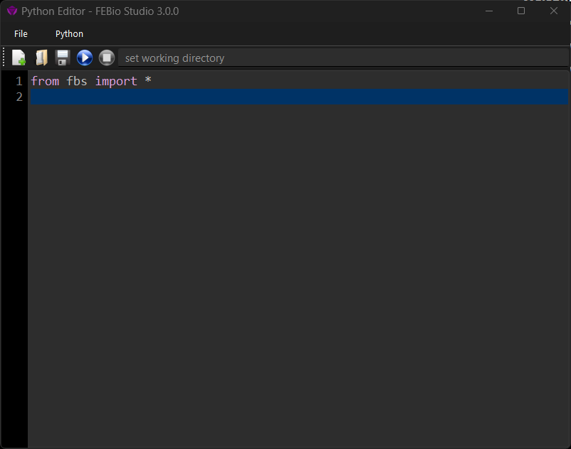

# 19.1 The Embedded Python Interpreter

FEBio Studio has a built-in Python interpreter that can be used to run simple Python scripts that interact with FEBio Studio in various ways. In addition, FEBio Studio offers an external Python module that can be used to use FEBio Studio functionality without opening FEBio Studio. Both of these options are discussed in this chapter.

To open the Python editor, select the menu **Tools** → **Python Editor**.

{: style="width:50%" }

/// figure-caption

The Plugin Repository can be used to download and install FEBio plugins.

///

The Python Editor window shows a text editor for creating simple Python scripts. Python scripts can be saved and loaded from the **File** menu. To run the Python script, click the run button on the toolbar or select the menu **Python** → **Run Script**. Before you run a script, it is advised to set the working directory on the corresponding field on the toolbar. The output of the Python script can be found on the Output panel. Make sure to select Python from the “Show output from” dropdown menu near the top of the Output panel.

Example Python scripts can be found on the Github repo <https://github.com/febiosoftware/python-tests>.

Some preliminary documentation of the Python module is available from <https://help.febio.org/docs/fbs_module/>.
