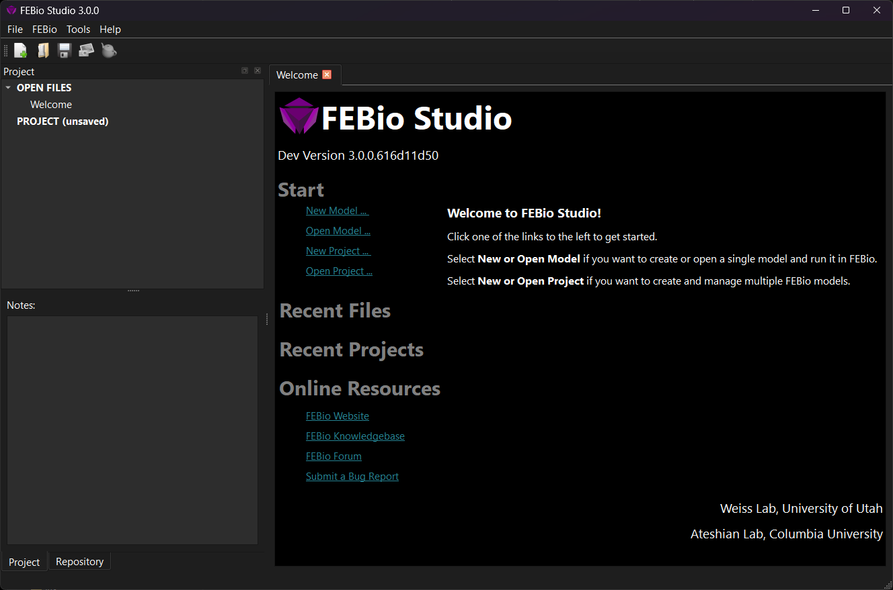

# 2.1 Starting FEBio Studio {: #subsec:welcome }

This chapter gives a brief tour of FEBio Studio. The reader will be introduced to the graphical user interface (GUI) and some of the different components of FEBio Studio.

When FEBio Studio starts, the _Welcome Page_ is shown.

/// figure-caption

The Welcome Page when FEBio Studio opens for the first time.

///

The Welcome Page displays some quick access links that allow you to get started quickly. It is divided in the following sections.

- **Start**: Shows links to several **File** menu items, including opening files or creating new models. Clicking a link here will access the corresponding menu item.

- **Recent**: This will show a list of recently created models and projects. Clicking a link here will open the corresponding model or project file.

- **Online Resources**: Some links to online FEBio resources, such as the FEBio Knowledgebase, where you can find tutorials on FEBio Studio. Clicking a link here will open the corresponding page in a web browser.
