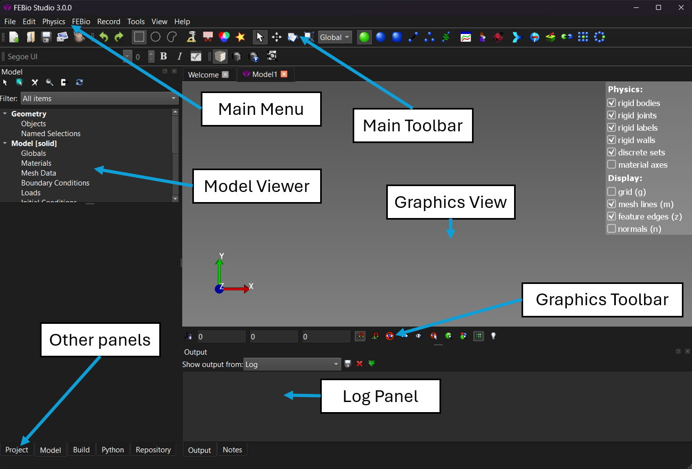

# 2.2 Creating a New Model {: #subsubsec:mylabel1 }

A new model can be started either by clicking the _New Model..._ link on the Welcome page, or selecting the **File** → **New Model_..._** menu item. A dialog box will be shown next, where you can select a model template and name. Model templates are discussed in more detail in Chapter [3](../chapter3/3.1-the-graphical-user-interface.md), but the main purpose is to configure the UI so that only relevant features are shown. For instance, if the Structural Mechanics template is chosen, the Physics menu will only show options that can be applied to a mechanics model. After selecting a template, and optionally choosing a name for the new model, click OK to close this dialog and return to FEBio Studio. The UI will look something like the figure below.

The _Main menu_ lists all the available menu items. The _Main Toolbar_, located directly below the menu, offers an alternative way to invoke some of these menu items. The _Model Viewer_ shows an overview of the components of the model. The _Graphics View_ covers the largest part of the GUI and shows a 3D view of the model. The _Graphics Toolbar_ is located below the Graphics View and displays some information regarding the Graphics View. Additional panels may be shown, such as the Log panel or the Build panel. Most panels can be detached, dragged and dropped anywhere around the main window's borders. Panels can also be stacked by dropping a panel on top of another one. A tab bar will then appear below the panel. If a panel is not visible, either click the tab below stacked panels or access it via the menu **View** → **Windows**. The various panels and other UI components are discussed in more detail in Chapter [3](../chapter3/3.1-the-graphical-user-interface.md).

/// figure-caption

The main components of the FEBioStudio GUI. The Main Menu provides access to most of FEBioStudio’s functionality. The Main toolbar offers shortcuts for some commonly used features. The Graphics View shows a 3D rendering of the model. The Build panel shows all the geometry creation and editing tools. The Model Viewer displays a hierarchical overview of the finite element model.

///
