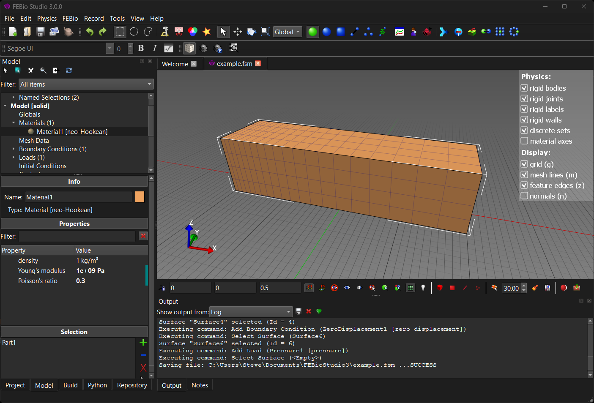

# 2.3 Opening a Model {: #subsubsec:mylabel2 }

You can open a model from the **File** → **Open Model File...** menu. You can also open recent models from the list shown on the Welcome Page. Clicking a link in the Recent section will open the model. FEBio Studio also supports drag-and-drop for some file formats. For instance, you can drag a model file from Windows Explorer and drop it on FEBio Studio to open it.

/// figure-caption

The UI after opening the example.fsm file. The Model Viewer is now populated with the model components.

///

Open the file _example.fsm_ from the _Examples_ folder of your FEBioStudio installation folder. You can do this by selecting the _**_File **→** Open Model File... **menu item. A standard file open dialog box appears. Locate the file, select it and click on _Open_. The UI will now look something like Figure [1](#fig3).
