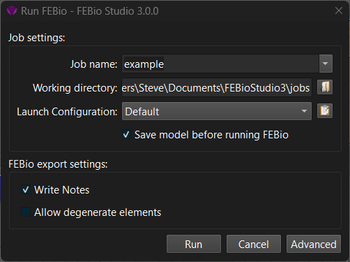

# 2.5 Solving the Model {: #subsubsec:mylabel6 }

{: style="width:50%" }

/// figure-caption

The Run FEBio dialog box, which allows you to run a model in FEBio from within FEBio Studio.

///

The installation of FEBio Studio comes with the latest version of FEBio and you can run the model in FEBio directly from the FEBio Studio UI. After you save the model, you can run it from the menu **FEBio** → **Run**..., or by clicking the corresponding icon on the main toolbar.

The Run FEBio dialog box will appear. When clicking the Run button, FEBio Studio will write the FEBio model input file (usually, this file will have the job's name with the .feb file extension) and then start FEBio, passing the input file to it. Depending on the selected launch configuration, FEBio will run in the same process (default), or in a separate process. Users can create special launch configuration that will run FEBio on a remote server. The output generated by FEBio is displayed on the Log panel. See 13 for more details on running febio models from within FEBio Studio.

When FEBio is done, the results are stored in a “plot file”. The file name is usually the job's name and the .xplt file extension.

When running an FEBio model, a new item is added to the model tree. This item will appear under Jobs and has the job's name. When the model is running in FEBio, this item will show some progress and status information. After the run is completed, the results can be loaded via this item.
