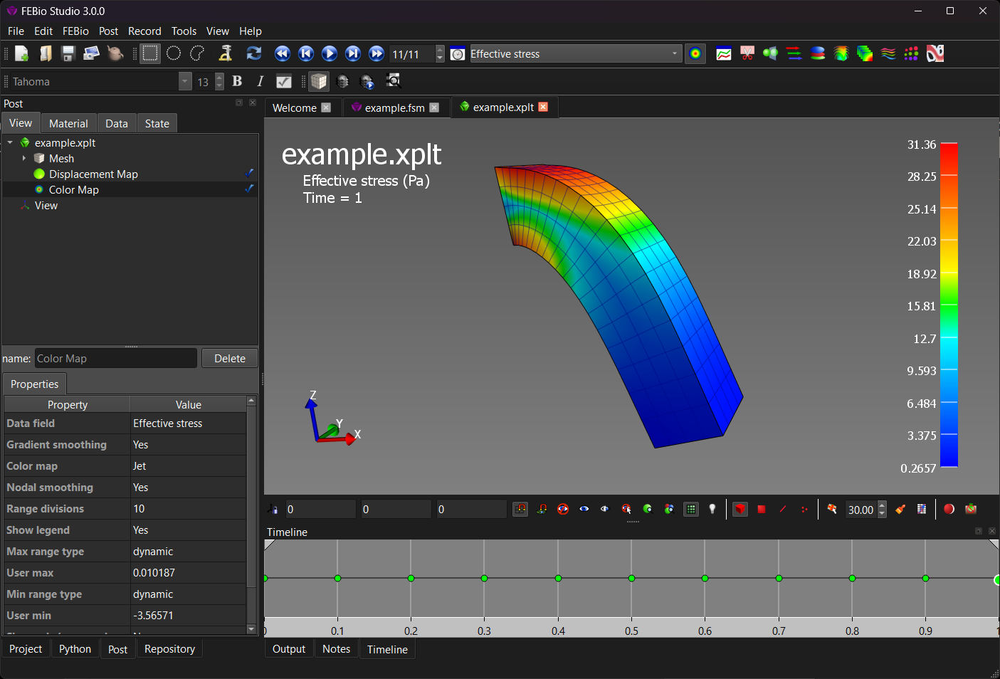

# 2.6 Loading the Results {: #subsec:mylabel2 }

When running a model in FEBio, a new item is added to the model tree with the job's name. When FEBio completed you can open the results by double-clicking the item in the model tree. This will load the job's plot file and open it in FEBio Studio.

When you open a plot file in FEBio Studio you will notice that the UI changes. The Model and Build panels will disappear and the Post panel will appear. The Build toolbar is also replaced by the Post toolbar. The Post panel has somewhat the same purpose as the Model panel and displays a tree structure of the contents of the plot file. It also contains some additional tabs that provide additional information on the results and will be discussed in more detail in Chapter [The Post Environment UI](../chapter14/14.1-the-post-environment-ui.md#subsec:postui).

/// figure-caption

FEBio Studio's UI when a plot file, the results file of an FEBio analysis, is loaded.

///
