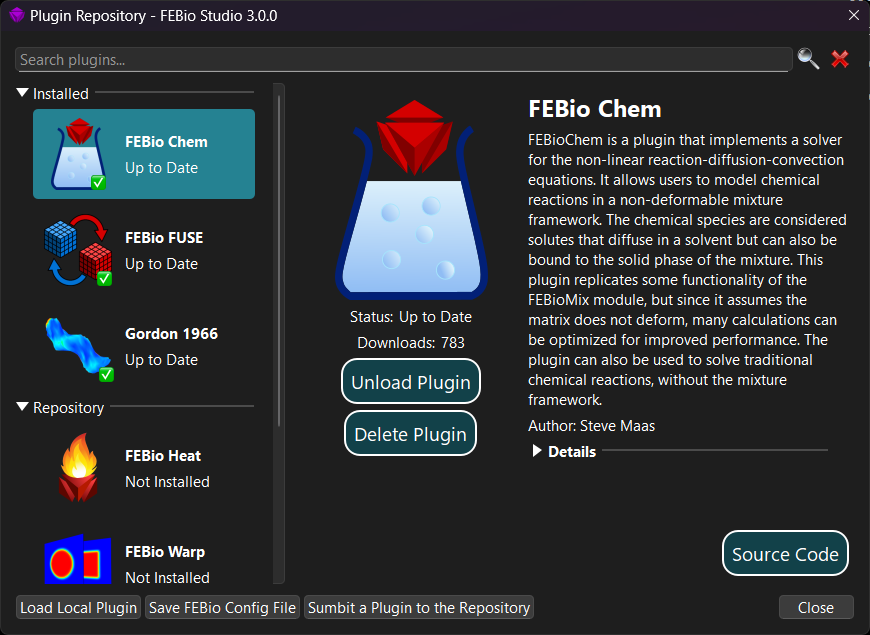

# 20.1 The Plugin Repository

FEBio supports plugins that allow users to add new features to FEBio. Plugins can be used to add new constitutive models, boundary conditions, loads, physics solvers, and much more. FEBio Studio supports these plugins and offers ways to load and integrate them seamlessly in the FEBio Studio UI. This chapter first discusses the plugin repository, which is main mechanism for downloading and installing FEBio plugins. Then, the tools are discussed that allow users to create, edit, and build plugins from within FEBio Studio.

The Plugin Repository is the standard mechanism for downloading, installing, and sharing FEBio plugins. To open the Plugin Repository select the menu **FEBio** → **Plugin Repository**.

{: style="width:50%" }

/// figure-caption

The Plugin Repository can be used to download and install FEBio plugins.

///

On the left hand side you see a panel that is divided into two sections. The top section shows all the plugins that are currently installed. The bottom section shows a list of plugins that are available from the online repository. Selecting a plugin will display additional information about the plugin on the right side of the dialog box. If the plugin is not installed, you can download it and install it. If the plugin is already installed and loaded, you can choose to unload and uninstall it. In addition, for installed plugins, the _Details_ section provides more information on the specific features that the plugin implements.

If you built a custom plugin on your system, then you can also load it into FEBio Studio using the Plugin Repository. On the bottom of the dialog box is a button labeled **Load Local Plugin**. Clicking the button brings up a standard file open dialog box where you can locate and select the plugin file.

**Important!** It is important to note that only plugins can be loaded that were build for the specific version that FEBio Studio uses. Trying to load plugins that are not compatible may cause instability or a crash.

**Important!** When loading a model file (either fsm or feb) that needs a plugin, it is important to _first_ load the plugin into FEBio Studio. Otherwise FEBio Studio will not be able to load the file.
