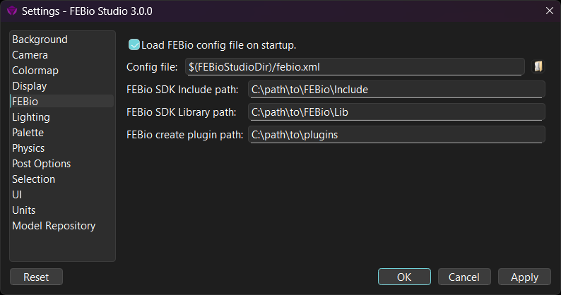
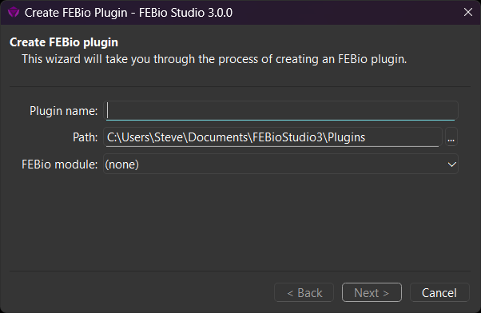
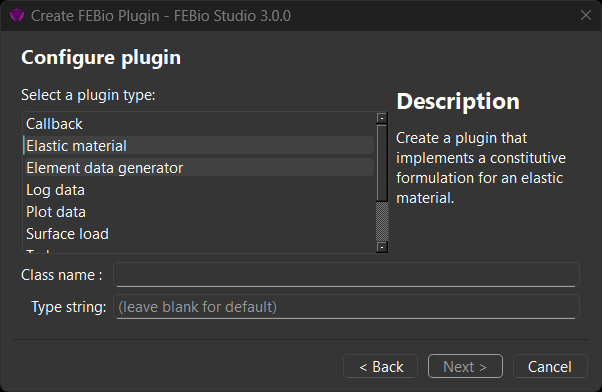
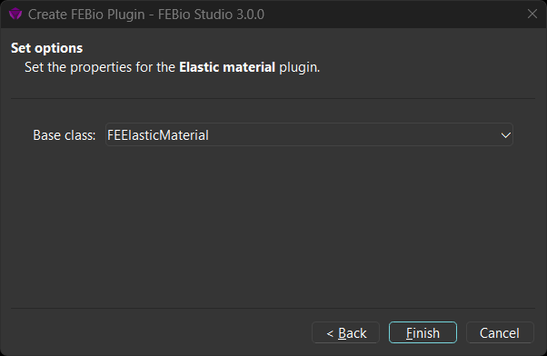
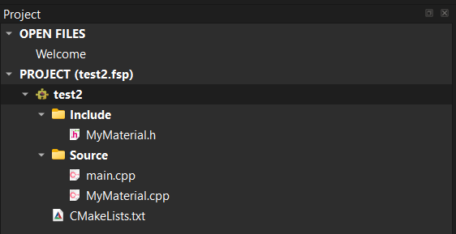

# 20.2 Creating FEBio Plugins

FEBio Studio offers the ability to create and use custom FEBio plugins. In this section we'll detail the steps needed to do this. Before you can create plugins, there are a few prerequisite steps that need to be completed.

## Prerequisites

First and foremost, you must install a development environment on your system. At the very least, you will need a C++ compiler, but it is best to use the same compiler that was used to build the FEBio Studio software itself. For Windows, we recommend using the Community Edition of Visual Studio. For Mac, we recommend using XCode, and on Linux we recommend using g++.

In addition to a c++ compiler, FEBio Studio also uses CMake (https://cmake.org/download/) to build the plugin code and thus CMake must be installed on your system as well. Make sure to configure CMake during installation so that it can be called from the command line.

Finally, you must have the FEBio SDK (Software Development Kit) installed. This is an optional component when you install FEBio Studio. If it is not installed, you may need to reinstall FEBio Studio making sure to enable that component.

After you installed a development environment, CMake, and the FEBio SDK, you must set several settings in FEBio Studio. Open the FEBio Studio Settings dialog box from the menu **Tools** → **Settings...** and select the FEBio option on the left side.

{: style="width:75%" }

/// figure-caption

The FEBio settings page is used to specify the location of the FEBio SDK.

///

Here, you need to specify three paths:

- **FEBio SDK Include path**: This is path to the include folder of the FEBio SDK (e.g.: C:\Program Files\FEBioStudio3\sdk\include)

- **FEBio SDK Library path**: This is the path to the folder that contains the library files (e.g.: C:\Program Files\FEBioStudio3\sdk\lib\Release)

- **FEBio create plugin path**: This is the path to a folder that will be used as the default location to place plugin files.

With all the necessary software installed and FEBio Studio configured, you can now move on to the next step, creating the plugin.

## The FEBio Plugin Wizard

Creating an FEBio plugin project is as simple as following the steps in the FEBio Plugin wizard. To start the wizard, select the menu **FEBio** → **Create FEBio Plugin...**.

The first page of the wizard allows you to choose a name for the plugin. Since this name will be used to generate the plugin files, make sure to use only characters that are valid in file names. In addition, you can also choose the location where FEBioStudio will generate the plugin files. Lastly, choose the FEBio module that you will expand. For instance, if you intend to add a new constitutive model for an elastic material, select the _solid_ module.

{: style="width:75%" }

/// figure-caption

The Plugin Wizard can be used to create the template code of an FEBio plugin.

///

After filling out the information, click the **Next** button to proceed to the next page.

On the second page, you can select the plugin type (e.g. Elastic Material, if you intend to implement a new constitutive model) and enter the name of the class. Make sure to use a valid C++ class name. Optionally, you can enter the type string of the plugin class. This is the string value that will be used when registering the plugin and the string that users will use as the value for the type attribute in the FEBio input file. By default, the name of the plugin class will be used.

{: style="width:75%" }

/// figure-caption

On the second page of the wizard you select the type of plugin you want to create.

///

Once this page is completed, click **Next** to continue.

The third page will list properties you can set to further configure the particular plugin you want to create. The properties that are listed will depend on the type of plugin you selected. For example, if you selected the "Elastic Material" plugin, the properties will allow you to choose the base class for the material class.

{: style="width:75%" }

/// figure-caption

On the third page of the wizard you select additional options for the specify plugin type you want to create.

///

Once the properties are set, click **Finish** to exit the wizard.

At this point, the wizard will generate all the necessary files for building the plugin. A dialog box will inform you whether FEBio Studio was able to generate the plugin files or not. If the wizard was successful, the following files should have been generated in the location that you specified on the first page of the wizard.

- **CMakeLists.txt** This is the CMake file that will generate the project files for your build environment.

- **main.cpp** This is the file that contains the required functions that FEBio needs to integrate your plugin.

- **MyPluginName.h** The header file containing the class declaration. (The actual name will use the class name you entered in the wizard.)

- **MyPluginName.cpp** The code file containing the class definition. (The actual name will use the class name you entered in the wizard.)

The next step is to build the plugin.

## Building the plugin

The wizard will generate a template code that is ready to build. Of course, the plugin may not actually do anything yet, but at this point, you can verify that the plugin builds correctly with your build environment and can be loaded in FEBio Studio.

The first step will be to build the project files for your build environment. This essentially means that you have to run CMake on the CMakeLists.txt that the wizard generated. If you are familiar with CMake, you can do this outside FEBioStudio, however, you can also do this from FEBio Studio. In fact, you can build the plugin directly from FEBio Studio.

On the Project panel, you'll notice that your plugin files are listed there under a new item that is named after your plugin. Double-clicking a file will open it up in an editor in FEBio Studio.

{: style="width:75%" }

/// figure-caption

The project panel will show the files that have been created with the Plugin Wizard.

///

To build the plugin, right-click the top-level item with the plugin's name and select the Build option. When doing this, FEBio Studio will now first call CMake to generate the project files, and then call CMake again to build the plugin with your native build environment. You can monitor the progress on the Output panel. (Make sure "Build" is selected in the show output from the dropdown list.)

If the build was successful, you can now load the plugin into FEBio Studio. To load the plugin, right-click the item with the plugin's name in the Project panel and select the Load menu option. A dialog box will inform you whether the plugin was loaded successfully or not.

## Plugin Caveats

Although FEBioStudio has the ability to generate plugin files, edit the files, and build the plugin, it is still highly recommended to familiarize yourself with your build environment since some tasks can only be done there.

One important thing to keep in mind is that FEBio Studio will only build the _Release_ configuration of the plugin, since only the _Release_ build can be loaded into FEBio Studio. For the purpose of testing your plugin code, it is more convenient to build the _Debug_ configuration. However, this can only be done from your build environment. To build your _Debug_ configuration, you can still use the wizard to generate the plugin files and build the _Release_ configuration, as this will generate all the project files for your build environment. However, after that, you'll have to open the IDE (or manually change the project files) to build and test the _Debug_ configuration of your plugin.

Further documentation on how to create FEBio plugins can be found online in the [FEBio Developer's Manual](https://help.febio.org/doxygen/febio4.10/index.html).
