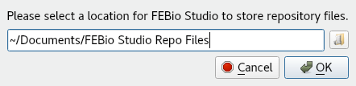
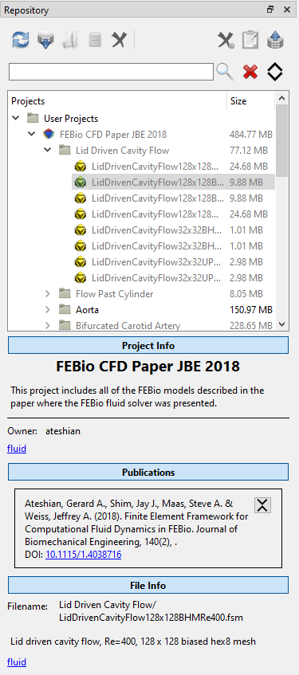
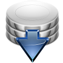
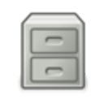
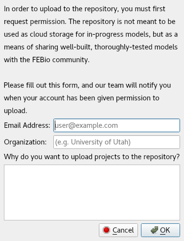
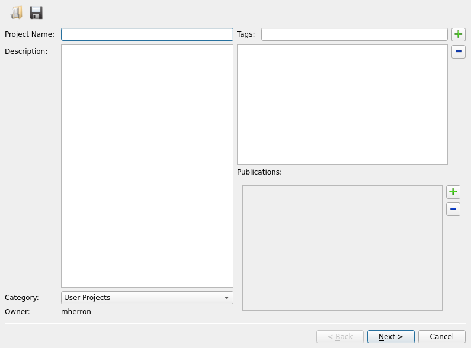
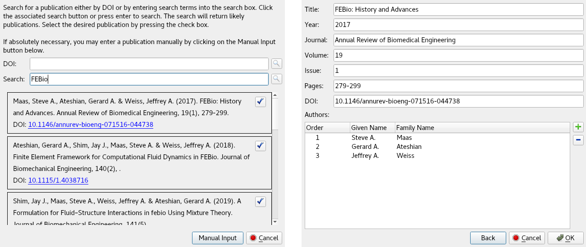
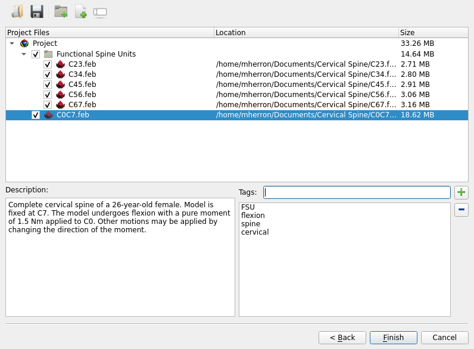
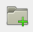
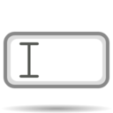

# 3.10 The Repository Panel

This panel provides access to the online FEBio model repository. This repository is a way for FEBio users to easily access models created by other users, and to share models of their own from within FEBio Studio itself. The repository is not meant to be used as cloud storage for in-progress models, but as a means of sharing well-built, thoroughly-tested models with the FEBio community.

## Connecting to the Repository

FEBio Studio does not connect to the repository automatically when launched. In order to connect to the repository, simply select the _Repository Panel_, and click the _Connect_ button. If this is your first time connecting to the repository, a dialog will appear asking you to choose a location for FEBio Studio to store repository files (Figure [1](#fig:repo)). This location will be used to store a database containing metadata about the projects stored on the repository, along with any files that you download from the repository.

{: style="width:50%" }

/// figure-caption

This dialog allows the user to set the location of the model repository files.

///

This setting can be changed at any time in the options (Section [Model Repository Settings](3.15-febio-studio-settings.md#subsec:Model-Repository-Options)).

## Browsing and Downloading

Once you have connected to the repository, you will be presented with the _Repository Panel_ as seen in Figure [2](#fig:repo-1).

{: style="width:50%" }

/// figure-caption

The Repository Panel allows you to browse and download files from the repository.

///

The _Repository Panel_ shows a list of all projects available on the repository organized into a tree structure. The top-level items are categories of projects, the second-level items are individual projects that are available for download, and all sub-items are part of a given project's file structure containing any arrangement of folders and files. If a copy of a project, file, or folder currently exists on your machine the name the item will be black, otherwise it will appear gray.

When a project is selected, information about the project will appear below the list of projects, including: the project name, the project's description, the owner of the project, and any tags associated with the project. If there are any publications associated with a project, they will be listed below the project info. Additionally, if a file from a project is selected, information about the selected file will be displayed, including: the file name, a description of the file (if available), and any tags associated with the file.

At the top of the _Repository Panel_, there are several buttons that allow for access to the panel's functions:

The _Refresh_ button will connect to the model repository server, and re-download the project tree and metadata, effectively refreshing the panel.

The _Download_ button download the currently selected item, whether that be an entire project or an individual file.

The _Open_ button will open the currently selected project or file. This button will only be enabled if the currently selected item has already been downloaded.

The _Open Containing Folder_ button will open the folder containing the currently selected item in your system's default file browser. This button will only be enabled if the currently selected item has already been downloaded.

The _Delete_ button will delete the local copy of the currently selected item from your file system. This button will only be enabled if the currently selected item has already been downloaded.

The functionality provided by these buttons can also be access by right-clicking an item in the project list, and selecting the appropriate item from the menu. Additionally, double-clicking a project or file will download the item, and automatically open the file when the download has finished. If the item has already been downloaded, double-clicking the item will open the local copy.

Below the panel's main toolbar is a second toolbar used to search the repository. To search the repository, enter one or more search terms into the text box, and either click the _Search_ button next to the bar or hit return. All items not matching your search terms will be removed from the project tree.

The _Search_ button removes all items from the project tree that do not match the search terms in the search box.

The _Clear_ button clears the search box, and restores all items to the project tree.

The _Expand_ button shows the advanced search options. When expanded, additional search fields are shown. Most of these advanced fields are drop-down boxes that allows you to select specific search terms for a particular type of model component. For example, clicking on the material field, will bring up a list of materials that you can select from. After clicking the search button, all files in the repository that use that particular material will be shown.

## Managing Your Uploads

In order to upload projects to the repository, or to manage projects that you have already uploaded, you must first log in to the repository by clicking the _Upload_ button, and entering your febio.org username and password into the dialog that appears.

If you are not currently logged in to the model repository, and you click this button, you will be prompted to log in using your febio.org username and password, in order to manage your own uploads. Once you have logged in, the repository will refresh, and a new category of projects will appear in the project list, called _My Projects_. Any projects owned by your account will now appear in this category.

If you do not have an febio.org account, you may sign up for one for free by visiting <https://febio.org/register/>.

If you currently have permission to upload projects to the repository, the _Upload_ button will open the _Upload/Modify Wizard_ (see Section [The Upload/Modify Wizard](#subsec:The-Upload/Modify-Dialog)) to allow you to upload a new project. If you do not currently have permission to upload projects, the _Upload_ button will open the _Upload Permission Request Dialog_ (see Section [The Upload Permission Request Dialog](#subsec:Upload-Permission-Request.)).

The _Delete From Repository_ button will permanently delete the currently selected project from the model repository. This cannot be undone.

The _Modify Project_ button will allow you to edit the currently selected project. It will open the _Upload/Modify Dialog_ (see Section [The Upload/Modify Wizard](#subsec:The-Upload/Modify-Dialog)).

## The Upload Permission Request Dialog {: #subsec:Upload-Permission-Request. }

{: style="width:50%" }

/// figure-caption

This dialog will allow you to request permission to upload to the repository.

///

The repository is meant to be a means whereby users may share well-built, thoroughly-tested models with the FEBio community. In order to ensure the quality of uploads to the repository, users are not given permission to upload projects by default, but must request it. If you do not currently have permission to upload, you may request permission by logging in to the repository and clicking the _Upload_ button. Doing so will cause the _Upload Permission Request Dialog_ to appear.

The fields in this dialog are meant to help our team determine if your account should be given permission to upload, so please be thorough in your responses. Once you fill out these fields and click _OK_, the request will sent to our team. You should receive an email at the specified address once you have been given permission to upload.

Please note that this is not an automated process. As such, allow for 1-2 business days for the request to be processed. If you do not receive a response in that time, please resend the request in the same manner.

## The Upload/Modify Wizard {: #subsec:The-Upload/Modify-Dialog }

The repository is meant to be a means whereby users may share well-built, thoroughly-tested models with the FEBio community. If you have a model or set of models that you believe meets these requirements, you may upload them as part of a project to the repository using this wizard.

### Adding or Editing Project Details

{: style="width:50%" }

/// figure-caption

The first page of the Upload/Modify Wizard

///

The buttons on the top of this page provide access to various functions:

The _Save_ button allows you to save all of the information in this dialog to a JSON file. This is useful when you are working on creating a large project that may need to be worked on across multiple sessions, or if you are simply worried about losing this information before the upload is complete.

The _Open_ button allows you to load a previously saved JSON file that contains information about a project that you are preparing to upload. Please note that all information currently entered in the wizard will be cleared before the wizard loads the information in the file.

Each of the fields on the first page of the wizard must be filled out with appropriate information. If you are modifying an existing project, these fields will be filled out with the current project information.

- _Project Name_: Provide a unique, descriptive name for your project.

- _Description_: Provide a description of your project as a whole (descriptions of individual files can be given on the second page of the wizard). Please be thorough, providing at least a few sentences. A user should be able to understand the purpose of your project simply by reading the description.

- _Category_: By default, users are only given permission to upload to the User Projects category. Unless you have been given special permission, this field will not be editable.

- _Owner_: Your username. This field is not editable.

- _Tags_: Provide at least one, but preferably several, tags to help categorize your project.

- To add a tag, type into the field next to the _Tag_ label, and click the plus button. This will add the tag to the box below. Suggestions for tags will appear in a drop-down menu as you begin to type.

- To remove a tag, select it from the list in the box, and click the minus button.

- _Publications_: If one or more of your models is associated with one or more published papers, you may add details about these publications to your project.

- To add a publication, click the plus button next to the box under the _Publications_ label. This will open the _Add Publication Dialog_ (see Section [The Add Publication Dialog](#subsec:Add-Publication-Dialog)). Once added, the publication will appear in the box.

- To remove a publication, check the checkbox next to the publication and click the minus button located next to the box.

### The Add Publication Dialog {: #subsec:Add-Publication-Dialog }

/// figure-caption

First and second pages of the dialog.

///

This dialog allows you to search for publications and add them to your project. You may either search by DOI (the recommended approach), or by search term. Once the dialog has found possible candidates based on your search criteria, it will display them in a list below the search boxes. To select one, click the blue checkbox button. This will take you to the second page of the dialog. On the second page you may review and edit the fields as necessary.

If absolutely necessary, you may enter all of the information of a publication manually by clicking the _Manual Input_ button at the bottom of the dialog. Doing so will take you to the second page where you can manually enter the publication information.

- To add an author, click the plus button to the right of the list of authors.

- To remove an author, select the author(s) that you wish to remove and click the minus button.

- To rename an author, double-click on either their given or family name.

- To reorder the authors, drag and drop the authors. The _Order_ field will be updated automatically.

Once all of the information on the second page looks correct, click the _OK_ button.

### Adding or Removing Files

{: style="width:50%" }

/// figure-caption

The first page of the Upload/Modify Wizard

///

The second page of the wizard is used to add or remove files, and add or edit metadata for them. If you are modifying an existing project, the project's current file structure will be displayed here.

The first column of the file tree contains name of the file or folder as it will appear in your project. The second column shows the location of the file. If the file is to be newly added to a project, its location on your system appears in this column. If the file is part of an existing project that you are modifying, its location relative to the model repository will be displayed in the this column, starting with the text “_{Repository}_”. The third column shows the size of the file or folder.

You may organize the files in your project however you would like, with any arrangement of files, folders, and subfolders. It is best practice to avoid unnecessary subfolders, and to avoid extensive subfolder trees. Please note that empty folders will not be uploaded.

The buttons on the top of this page provide access to various functions:

The _Add Folder_ button adds a new folder to your project. Upon adding a new folder, the name folder name will become editable. The folder will be added at the level of the currently selected file, or as a subfolder of the currently selected folder.

The _Add File_ button opens a system file dialog which will allow you to select any number of files from your system to include in your project. The files will be added to the file tree at the level of the currently selected file, or inside of the currently selected folder.

The _Rename_ button allows you to rename the currently selected file or folder. You can also rename a file or folder by double-clicking on the desired item.

The _Replace File_ button only appears when you are modifying an existing project. It will allow you to replace a currently selected file that is already on the repository with another one on your machine. It will copy the name, description, and tags from the currently selected file to the newly added file. The primary purpose of this button is to allow you to easily replace an existing file with a more up-to-date version of that file.

Other functions of this page are described below:

- To reorder files or folders, drag and drop the files or folders to the desired location.

- To exclude previously added files or folders from the upload, uncheck the check box to the left of the file or folder names.

- To remove a file or folder from an existing project that you are modifying, uncheck the check box to the left of the file or folder names. Please note that unchecking a folder, will uncheck its contents, and will result in their deletion. If you simply want to move files out of a folder, then you must drag them out of the folder.

- To add or edit a file's description, select one or more files and then type a description into the _Description_ box. The description of all selected files will be changed to what you type. Folders cannot be given descriptions.

- To add tags to a file, select one or more files, type a tag into the box next to the _Tag_ label, then click the plus icon. This tag will be added to all selected files. Folders cannot be assigned tags.

- To remove tags from a file, select one or more files, select the tags you wish to remove from the box below the _Tag_ label, then click the minus button. Only tags from the most recently selected file will appear in this list.

When you are happy with the state of your file structure, and your files have been given descriptions and tags, click the _Finish_ button to finalize your project and initiate the upload.
