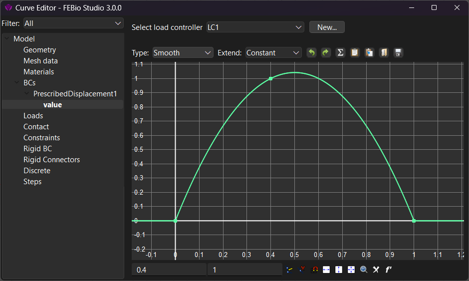
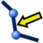
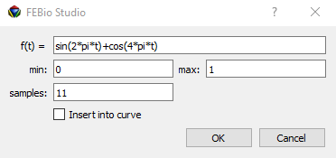

# 3.12 The Curve Editor {: #subsec:mylabel19 }

/// figure-caption

The curve editor shows all the load curves used in the model.

///

The _Curve Editor_ is accessed either from the **Tools** → **Curve Editor** menu or by pressing the corresponding button on the toolbar. It can also be accessed using the _F9_ shortcut. The _Curve Editor_ gives an overview of all the time-dependent parameters in the model. FEBioStudio allows the user to define the time dependency explicitly through the use of so-called _load controllers_. In an FEBio analysis, the load controller is evaluated at the simulated time and usually multiplies the value of the associated model parameter. The Curve Editor allows user to create load controllers, associate them with one or more model parameters, and edit the load controllers.

In the left panel, the model tree is presented, but only parameters that can be associated with a load controller will be listed here. Select a parameter here in order to see the load controller, if any, currently associated with this parameter. At the top of this panel, a Filter selection is available that allows you to show the parameters of only a specific type of model component, e.g. boundary conditions, material parameters, etc. This filter can be helpful in finding a specific parameter.

The right panel shows the current load controller associated with the parameter selected in the left panel. At the top, the load controller can be selected that will be associated with this parameter. Clicking the _New_ button allows you to add a new load controller and associate it with the parameter. Depending on the type of load controller selected, either the controller's properties or a graphical representation of the load controller will be shown in the right panel.

One particularly useful type of load controller is the _load curve_, which consists of _time,value_ pairs that will be interpolated. FEBio Studio often associates a default load curve to certain parameters of boundary conditions and loads. This default load curve ramps up the value from zero to one over the unit time interval. However, all curves can be modified using the tools available at the bottom of the Curve Editor. The curve's data points are represented as dots on the view. These data points can be selected by clicking on them with the left mouse button. They can also be moved by click$+$dragging them. The current (time, value) pair of the selected point is displayed on the toolbar at the bottom of the view. This toolbar offers the following features.

When this button is toggled, each click on the curve view will add a new node. Note that you don't to click this button to add nodes. Nodes can also be added by shift$+$click with the left mouse button on the curve view.

This button will delete the node that is currently selected in the curve view.

The snap-to-grid option will allow you to move a node on the intersections of the grid lines.

Zooms the curve view out so that all nodes are visible within the bounds of the curve view.

The toolbar at the top of the Curve Editor provides additional tools for modifying the active curve.

This will load data from a file. The file must be a simple text file with one line of data for each point. On each line, specify the time-load value pair delimited by a space. You can enter as many lines as you want.

Save the active load curve to a text file.

Copy the curve data to the clipboard. This allows the curve data to be pasted in another application that supports clipboard operations.

Store the load curve data so it can be pasted to another curve.

Paste the curve data that was copied to the active load curve.

Undo the last change to the active load curve.

Redo the last change that was undone.

Open the equation editor where load curve data can be generated via a mathematical equation (see below).

The current view can be zoomed in or out, either by using the zoom buttons at the bottom of the view, or using the mouse wheel. When you scroll the mouse wheel while hovering over one of the axes, the graph will only zoom in that axis' direction. Depressing the left mouse button while moving the mouse, pans the view.

At the top of the curve view, you can see two drop-down lists. The first list allows the user to set the curve type which defines the interpolation mode for the currently displayed curve. The choices are as follows:

- **linear**: use a linear interpolation between the curve points

- **step**: use a constant interpolation between the curve points. The value of the curve is defined by the value of the point closest and to the right of a particular ordinate.

- **smooth**: A cubic polynomial is fitted through the data points resulting in a smooth interpolation.

- **cubic spline**: A cubic spline is fitted through the data points.

- **control points**: The data points define the control points of a spline.

- **Approximate**: An approximation of the control points interpolation.

- **smooth step**: A cubic polynomial is fitted between each pairs of data points. The slope at the end points is zero.

The second list displays the _extend mode_ options. The extend mode defines the value of the curve outside its defined range. The choices are:

- **Constant**: the value is clamped to the range of the curve as defined by the first and last point.

- **Extrapolate**: the value is extrapolated from the end-points of the curve.

- **Repeat**: the curve is repeated on either end of the curve's domain

- **Repeat offset**: same as repeat, except that the curve is offset by the end-point values.

/// figure-caption

The equation editor allows user to easily generate load curve data via a mathematical expression

///

If the previous tools are not sufficient to describe the evolution of the load curve in detail, the _Equation Editor_ can be used (Figure [14](#fig97)). This tool is accessed from the toolbar and allows the user to enter a mathematical function of time. Use the symbol $t$to reference time. This function will be evaluated and discretized to generate a set of points that interpolate the function approximately.
