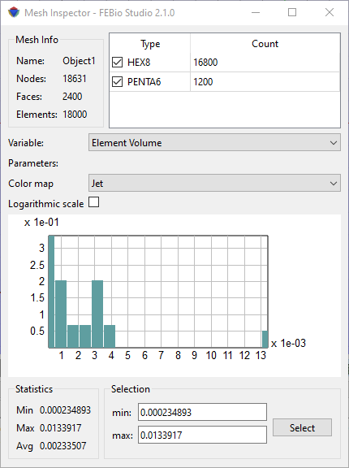

# 3.13 The Mesh Inspector {: #subsec:mylabel20 }

/// figure-caption

The Mesh Inspector tool allows the user to inspect certain quality measure of the mesh.

///

The Mesh Inspector window displays some statistics of the mesh of the currently active object (Figure [1](#fig98)). It shows, for instance, what elements the mesh is composed of and the user can inspect element metrics such as element volume, jacobian, etc.

The mesh info pane at the top lists the total number of nodes, faces, and elements in the current mesh. It also shows a list of all the different element types and their count.

The variable pane allows the user to select the quality metric that is displayed in the bar chart. To limit the plot only to a certain type of element, select the corresponding element in the element list of the mesh pane.

The statistics pane shows the min, max and average values of the selected variable. The selection pane can be used to select elements in a certain range of the currently plotted variable. This can be useful to identify and quickly select elements of interest.
