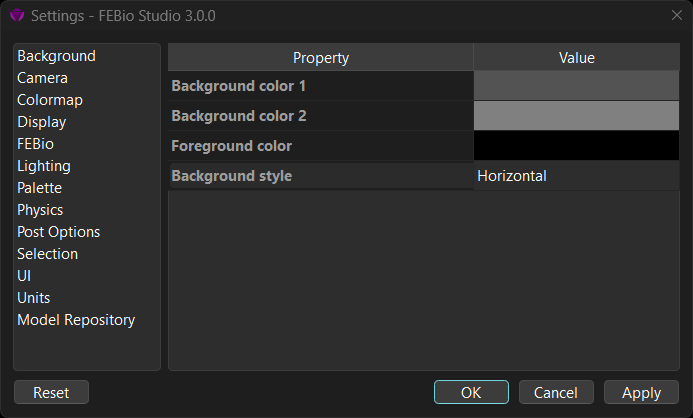
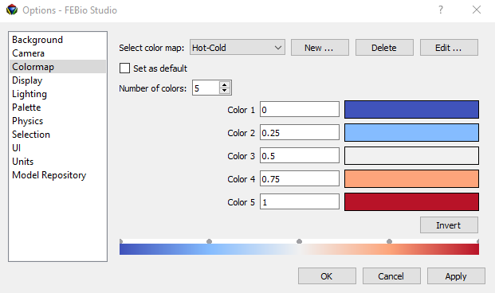

# 3.15 FEBio Studio Settings {: #subsec:preview }

The FEBio Studio Settings dialog can be opened from the **Tools** → **Settings** menu or by pressing the F12 shortcut button. Different categories can be selected by clicking the tab buttons. By selecting a category a list of options is shown on the right hand side of the dialog box. The categories are:

- _Background_: change the background settings such as color, gradient, etc.

- _Camera_: Set options that control the motion of the camera when switching between views.

- _Colormap_: Edits default color maps or create new ones.

- _Display_: Shows options that affect how objects and meshes are rendered in the Graphics View.

- _FEBio_: Sets default FEBio configuration file and the paths for generating FEBio plugins.

- _Lighting_: Set the lighting conditions for rendering the Graphics View

- _Palette:_ Set the default color palette.

- _Physics_: Allows the user to select options that draw physics related items in the Graphics View.

- _Post Options_: Set special settings only used in the Post configuration.

- _Selection:_ Options that affect the selection of nodes, elements, etc.

- _UI_: Shows options that affect how users interact with some UI components.

- _Units_: Set the unit system options.

- _Model repository_: set options that affect the interaction between FEBio Studio and the online FEBio model repository.

- _Auto update_: Options to update your installation to the latest release or development version.

/// figure-caption

The FEBio Studio Settings dialog allows users to customize many aspects of the FEBio Studio environment.

///

The buttons on the bottom of the dialog allow users to accept or reject the changes. The **Reset** button will restore all default settings. (It will not clear the recent file lists.) Click **OK** to accept all new changes and close. Click **Cancel** to close the dialog without accepting changes. Click **Apply** to apply the changes without closing the dialog box.

## Background Settings

The background settings set how the background of the Graphics View is rendered.

- **Background color 1**: Sets the Graphic's View background color 1.

- **Background color 2:** Sets the Graphic's View background color 2

- **Foreground color**: Sets the Graphic's View foreground color

- **Background style:** Sets the style of the Graphic's View background.

## Camera Settings

These settings control how to camera motion is animated when the user switches between views (e.g. when zooming in on an object)

- **Animate camera**: Chooses whether the camera should be animated when switching between views.

- **Animation speed**: Sets the speed of the camera when switching between views. The value must be between 0 and 1.

- **Animation bias**: Controls the initial acceleration and deceleration of the camera's motion. The value is between 0 and 1.

## Colormap Settings

FEBio Studio uses a palette of colormaps for rendering plots (contour plot, isosurface, slice, streamlines, etc.). This palette can be edited in this tab of the dialog. Users can modify the colormaps or create new colormaps. New colormaps are automatically saved and reloaded between FEBio Studio sessions.

/// figure-caption

The Colormap settings allow users to edit the colormaps that are used for rendering plots in the Graphics View.

///

## Display Settings

The display settings affect some of the aspects of how the model is displayed on the screen. The following options can be modified:

- **Size of nodes:** Sets the size (in pixels) of point rendering (e.g. nodes, tags).

- **Line width:** Sets the thickness (in pixels) for rendering lines.

- **Mesh color**: sets the mesh color for rendering the mesh.

- **Show normals**: Show a line on each surface facet that indicates the orientation of the local normal.

- **Normals scale factor**: Sets the scale factor that is used for rendering the normals.

- **Enable highlighting**: When enabled, geometry items are highlighted when hovering the mouse over them. The item that is highlighted depends on the current selection context.

- **Identify backfacing faces**: When enabled, the backs of surfaces are rendered in a different color then the front side. This can be useful to distinguish between the fronts and backs of surfaces, especially in models that use shells.

- **Multiview Projection**: sets the multiview projection option

- **Object transparency mode**: Selects under what conditions objects will be rendered as transparent.

- **Default Text Color Option**: Chooses how the default text color for Graphic View widgets is determined.

- **Theme**: The UI theme determines the color. For light modes, it will be black; for dark modes, it will be white.

- **Custom**: Choose a custom text color.

- **Custom Text Color**: This is the color that will be used when the user chooses the _Custom_ option for the _default text color option_ setting.

- **Tag Font Size**: Set the font size used for rendering the labels on tags in the Graphics View.

## FEBio Settings

- **Load FEBio config file on startup**: Sets whether the FEBio configuration file is loaded when FEBio Studio starts. This may be necessary for running FEBio using the default configuration.

- Config file: Set the location for the default FEBio configuration file.

- FEBio SDK Include path: Set the location of the FEBio SDK Include file path.

- FEBio SDK Library path: Set the location of the FEBio SDK Library file path

- FEBio create plugin path: Set the default location for creating FEBio plugins using the FEBio Plugin Creation Wizard.

## Lighting Settings

Lighting options affect how the model is lit in the Graphics View.

- **Enable Lighting**: toggle lighting on or off. When lighting is off, parts are rendered without any shading effects.

- **Diffuse Intensity:** The diffuse intensity of the light source.

- **Ambient Intensity:** The ambient intensity of the light source.

- **Light direction:** The direction vector that points to the light source.

- **Environment map**: Sets the location of an image file that will be used as the environment map. Images need to be either JPG or PNG, and for best results, should be high-quality HDR images, created specifically for use as an environment map. (Changing this requires a restart of FEBio Studio.)

- **Use Environment Map**: Determines whether the environment map is used when rendering objects in the Graphics View. Requires a valid environment map image to work properly.

## Palette Settings

The palette defines the default colors that are assigned to different parts. Different palettes can be chosen, as well as loaded, or saved. A custom palette can be created from the current model.

- **Current palette:** Select the palette to use for new models. Changing this does not affect the currently loaded model. To apply the selected palette to the current model, press the _Apply palette to materials_ button.

- **Load palette:** This button loads a palette from a file. The file is an xml-formatted file with _PostViewResource_ as the root tag. You can define multiple palettes, each starting with the _Palette_ tag. This tag requires a _name_ attribute. Then, define a _color_ child tag with the RGB values of the color.

- **Save palette:** Save the currently selected palette to an external file.

- **Create palette from materials:** Create a palette from the materials of the currently loaded model.

- **Apply palette to materials:** Apply the currently selected palette to the materials of the current model. If the model contains more materials than are defined in the palette, the palette colors are recycled.

## Physics Settings

The Physics options control how certain model components are displayed in the Graphics View.

- **Show rigid joints**: Sets whether or not to show glyphs representing the rigid joints in the model.

- **Show rigid wall**: Sets whether or not to show rigid walls.

- **Show material fibers**: Sets whether or not to show material fibers on the selected object.

- **Fiber scale factor**: Sets the scale factor when rendering the material fibers.

- **Show material axes**: Sets whether or not to show the material axes.

- **Show fibers/axes on hidden parts**: Whether or not to show material fibers or axes on the hidden parts of the currently selected object.

## Post Settings

These are settings that only apply to the Post environment.

- **Default colormap range**: Sets the default range option that will be used by the colormap item in the Post model tree.

## Selection Settings

The selection options affect what mesh items (elements, faces, edges) can be selected in the Graphics View.

- **Select Connected:** Sets whether connected items will be selected simultaneously when a single item is selected.

- **Tag info:** Sets what information is displayed on a selection.

- **Ignore Backfacing Items:** Sets whether items that are facing away from the user can be selected.

- **Ignore Interior Items:** Sets whether items on the inside of the mesh can be selected.

- **Respect partitions**: Sets whether “select connected” option will not cross the mesh' partitions.

## UI Settings

The UI options set various options that affect the UI.

- **Emulate apply action**: Emulates apply action

- **Clear undo stack on save**: When checked, the undo stack is cleared when saving the model.

- **Recent file list:** This button clears the recent file lists that are shown on the Welcome page and in the various _Open Recent_ File menu options.

- **Autosave interval**: The time interval (in seconds) between auto-saves of the model.

## Units Settings

The units options control how units are displayed in FEBio Studio.

- **Change for**: Selects whether the changes affect the current model, all models, or new models.

- **Unit system:** Selects the unit system that will be used. If a unit is selected, a list of the base units, as well as some derived units will be shown.

## Model Repository Settings {: #subsec:Model-Repository-Options }

The model repository options control how FEBio Studio interacts with the online FEBio model repository.

- **Repository Folder:** Sets the location where a local copy of the model repository is saved. If empty, you will be prompted to set a location upon connecting to the model repository.

## Auto Update Settings

FEBio Studio will automatically check for a software update when it is launched. This section of the options dialog will allow you to manually check for an update.

- **Update to Latest Release:** There are periodic, official releases of FEBio Studio and FEBio. This button will initiate a check to see if there are any updates available.

- **Update to Development Version:** FEBio Studio and FEBio are in almost daily development, and a new development version of the software is made available each night. This button will initiate a check to see if there are any updates available to the latest development version. Please note that while these versions contain the latest bug fixes and features, they are potentially unstable.

If a new update is available, click the “Close and Update” button on the update dialog to close FEBio Studio and launch the updater.
