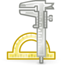
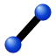
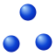
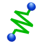

# 3.4 The Build Tool Bar

Undo the last operation

Redo the last operation

Rectangle Selection Mode

Circle Selection Mode

Freehand Selection Mode

The Measure Tool

Plane Cut tool

Enter selection mode

Enter select-and-move mode

Enter select-and-rotate mode

Enter select-and-scale mode

Set the transformation coordinate system

Select Objects

Select Parts

Select Faces

Select Edges

Select Nodes

Select Discrete Objects

Display the Material Browser

Display the Curve Editor

Activate the Mesh Inspector tool

Opens the Run FEBio dialog box.

Activates Merge tool

Activate Detach Elements tool

Active Extract Faces tool

Clone Object

Clone Grid Object

Clone Revolve Object
