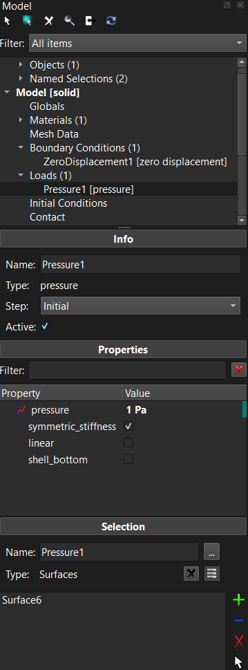
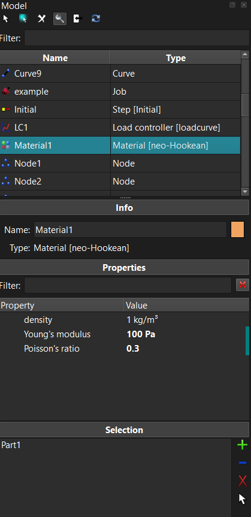
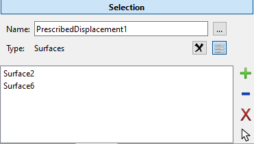
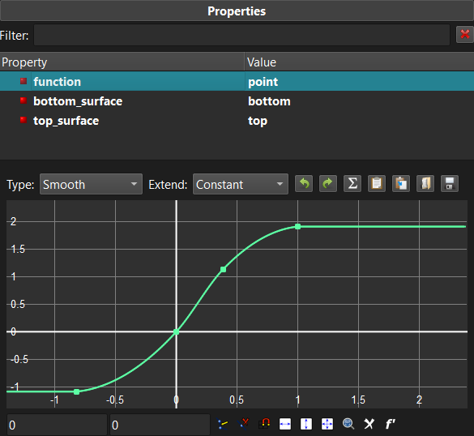
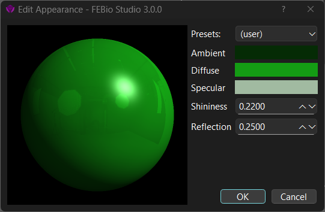

# 3.8 The Model Viewer {: #subsec:mylabel16 }

/// figure-caption

The Model Viewer shows a hierarchical overview of the model components.

///

The _Model Viewer_ shows a hierarchical overview of all the components of the model and their interdependencies. The model data is organized in separate categories, depending on the purpose of the data.

- **_Geometry_**: Contains a list of all the objects and the named selections in the model. The named selections can be used to easily refer to a collection of parts, surfaces, edges, or nodes and are used for defining boundary conditions, loads, contact interfaces and other model components that are defined on the geometry.

- **_Globals_**: Displays the global model parameters.

- **_Materials_**_:_ Lists all the materials defined for the model.

- **_Mesh Data_**: This item contains all the mesh data maps and generators.

- **_Boundary Conditions_**: Lists all the boundary conditions defined for the model and for all analysis steps.

- **_Loads_**_:_ Lists all the loads that are defined for the model and for all analysis steps.

- **_Initial Conditions_**_:_ Lists all the initial conditions for the model and for all analysis steps.

- **_Contact_**: Lists all the contact interfaces that are defined for the model and for all analysis steps.

- **_Constraints_**: Lists all the nonlinear constraints defined for the model and for all analysis steps.

- **_Rigid_**: contains a list of all the rigid body constraints, connectors, loads, and initial conditions.

- **_Discrete_**: lists all the discrete element sets (e.g. springs) defined on the model

- **_Mesh Adaptors_**: Lists all the mesh adaptors used for this model. Mesh adaptors allows the mesh to be modified as part of the solution. (e.g. adaptive mesh refinement)

- **_Steps_**: Lists all the steps that are defined for this model. Each step will be listed as a sub-item of this item. Each sub-item has additional items that list all the components that will be active only during that particular step.

- **_Load controllers_**: Lists all the load controllers in use by this model. Load controllers allows model parameter to be dependent on (simulation) time.

- **_Output_**_:_ Can be used to define the field variables that need to be output to the FEBio plot file.

Many of the FEBio Studio features can also be accessed by right-clicking on an item in the Model Editor. A popup menu will appear that lists the available options for that particular item. For example, you can add a new material by right-clicking on the Materials item and selecting **Add Material...** from the popup menu.

At the top of the Model Editor additional buttons are located that allow access to the following features.

For model components that have associated geometry items, this button selects these items in the Graphics View.

Enables automatic highlighting. When this is enabled, selecting an item in the model tree will automatically highlight the corresponding selection in the Graphics View.

Delete the currently selected items in the Model Viewer.

Activate the Search panel, which provides an alternative method for selecting items in the Model Viewer.

Clicking this button will synchronize the selection between the Graphics View and the Model Viewer. This only works for geometry items.

Clicking this button will refresh the contents of the model tree, making sure all selections are up-to-date and all components are validated.

## The Search Panel

The Search panel is an alternative method for inspecting model components. When active, users can enter a search filter at the top. All items with a name that contains the filter will be displayed in the box below the filter. Users can select items here and the properties will be displayed below. Users can also right-click on items and select an option from the popup menu. Double-clicking on an item will toggle back to the tree view with that item selected.

/// figure-caption

The Model Viewer with the Search Panel active.

///

## The Model Viewer Panes {: #subsec:mylabel17 }

Below the Model Viewer you will see several panes that provide information about the item that is active in the Model Viewer's tree view. The particular panes that are shown depend on the selected item.

- _Object_: Shows the name and type of the active item. For physics components this also shows the step in which that component is active.

- _Properties_: This panel displays the editable parameters of the item that is selected in the Model Viewer.

- _Selection_: This panel is shown for all components that can have a selection assigned to it, such as materials, named selections, boundary conditions, and loads. Contact interfaces will have two selection panels, one for the primary and one for the secondary surface. Detailed instructions on how to edit the selection can be found in section [Editing Selections](#subsubsec:editing).

/// figure-caption

The selection pane allows users to edit the geometry selections assigned to certain model components.

///

Most properties can be edited directly from the properties panel. However, some properties cannot be edited that way. In that case, clicking on the property name may bring up an additional widget that provides the controls to edit the property. This is the case, for instance, for properties that represent parameterized or discretized curves. (e.g. force-displacement curve for nonlinear springs.) Clicking the property name will then bring up a widget that allows users to customize the curve.

/// figure-caption

Sometimes selecting the property's name may bring up an additional widget that allows users to customize the property. For instance, in the image above a curve is created using a special curve-editing widget.

///

## Editing Selections {: #subsubsec:editing }

Some components of the model, such as materials, named selections, and boundary conditions, need to be applied to a selection of the geometry. These components will have a selection box in the Model Viewer to which items of the model can be assigned to. For instance, for materials, it will show the parts of the model to which the material is assigned.

The list that is displayed in the selection box can be edited using the buttons located on the right side of the selection box. Note that you can select the items in the selection box.

This button adds the current selection in the Graphics View to the list. Note that if the list was not empty, then the selection will be added if it has the same type as the items already in the list. For instance, if you applied a boundary condition to a surface, you can only add (or remove) surfaces from its list.

This button will remove the current selection in the Graphics View from the list.

This button removes the items selected in the list from the box.

This button selects the items that are selected in the box also selected in the Graphics View.

## The Appearance Editor

In FEBio Studio, the user can change the visual appearance of objects and parts. The main tool to do this is the **Appearance Editor**. The Appearance Editor is opened by clicking the appearance editor button. This button is shown in the properties list of model tree items for which the appearance can be set. At the moment, this is shown when an object or a material in the model tree is selected. The button itself shows a small colored sphere that reflects the appearance of the corresponding model tree item.

{: style="width:50%" }

/// figure-caption

Using the Appearance Editor, the user can change the visual appearance of objects and parts.

///

Using the Appearance Editor, the user can change several settings that affect the visual appearance of objects and parts in the model.

The shading model that is used to color items in FEBio Studio is the classical Phong shading model. This model composes the color as the sum of three separate color contributions:

\[ \mathrm{color=0.2\times ambient+diffuse\times\mathit{cos}\left(N,L\right)+specular}\times\left(cos\left(H,L\right)\right)^{n} \]

The _ambient_ color is a constant color that is added to the final color. The _diffuse_ color is the main color and is weighted by the direction cosine between the light's direction (L) and the local normal (N). Areas where the normal is directed towards the light will be bright, and areas that are pointing away from the light will be darker. The _specular_ color adds a highlight, i.e. a very bright area, to the overall color, and is weighted by the direction cosine between the halfway vector (H), a vector between the light and the view direction, and the light's direction (L). To control the size of the specular highlight, the direction cosine is exponentiated to the power _n_, often called the specular exponent, and the higher the exponent, the smaller the highlight. It typically ranges between 0 and 128. In FEBio Studio, however, the specular exponent cannot be set directly. Instead, the _shininess_ parameter is used and ranges between 0 and 1.

In addition, users can set the _reflection_ parameter to add a reflective effect to the appearance. This will only work if the environment map is set and enabled, which can be done in the FEBio Studio Settings dialog (under the Lighting settings.)

In summary, the following parameters can be set in the Appearance Editor.

**Presets** Choose from a list of common materials, such as various metals, plastics, and biological materials.

**Ambient** Sets the constant ambient color of the material.

**Diffuse** Sets the diffuse color of the material

**Specular** Sets the specular color of the material.

**Shininess** Sets the specular exponent of the specular highlight indirectly and ranges between 0 and 1.

**Reflection** Sets how much the material reflects the environment map and ranges between 0 and 1. (Requires enabling the environment map.)
