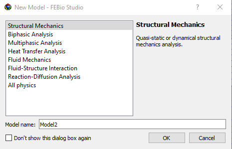

# 4.1 Starting a new model {: #subsec:starting }

/// figure-caption

The New Model dialog allows users to choose a model template.

///

A new model can be started from the **File** → **New Model...** menu or by clicking the corresponding toolbar button. This will open the New Model dialog box. This dialog presents the model templates that are available. A model template is a collection of modules that will be activated in a model. A module corresponds to certain physics modeling features or UI components. Model templates and modules greatly simplify the process of creating a FE model by presenting only relevant features to the user.

Choosing Cancel on this dialog will activate all modules and expose all the physics features and modeling capabilities. You can also change the active modules after starting a new model from the menu **Physics** → **Edit Physics Modules**.
