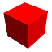
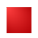
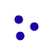
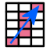

# 5.4 Creating and Editing a Mesh {: #subsec:mylabel22 }

The _Mesh panel_ gives access to FEBio Studio's meshing capabilities. As noted before, FEBioStudio was not designed to be a powerful mesh generator, but regardless, it has some simple mesh generation and editing features.

## Meshing Primitives

When the object is a primitive, that is, created with one of the geometry creation tools, the command window will list the mesh creation parameters for that particular object. Most primitives will be meshed with a so-called _butterfly mesh_. These primitives have a simple rectangular box as center. The rest of the mesh is a projection from this box to the respective geometry. For instance, for the sphere the surface of the inner box is projected onto a sphere. This projection is segmented to create several layers of elements. Note that all solid primitives are composed of 8-noded hexahedral elements and all shell primitives are composed of 4-noded quadrilateral elements, although some primitives may offer different element options. After you change the mesh parameters simply press the _Apply_ button to create the new mesh. To show the mesh in the Graphics View select the **View** → **Toggle Mesh lines** menu or use the '$m$' shortcut.

## Meshing CAD Geometry

CAD objects are meshed with the NetGen library. The NetGen mesher is a multi-pass mesh generator. It generates a base mesh and then tries to improve the mesh over several iterations. The following parameters control the mesh generation process.

- **Mesh Granularity:** set level of detail. This sets several internal parameters that affect the final element density.

- **Use local mesh modifiers:** Check to use local mesh modifiers.

- **Grading**: Set grading level (range is $0<\text{grading}\le1$). This global parameter describes how fast the mesh-size decreases. (Warning: Picking a very small value, e.g., $<0.01$, could cause Netgen to crash.)

- **Max element size:** Set the largest allowed element size.

- **Min element size:** Set the smallest allowed element size.

- **Nr. 2D optimization steps**: Set the number of passes to improve surface mesh.

- **Nr. 3D optimization steps**: Set the number of passes to improve volume mesh.

- **Second order tets**: When checked, NetGen will generate tet10 elements.

- **Elements per edge**: Number of elements to generate per edge of the geometry.

- **Elements per curve**: Elements to generate per curvature radius.

- **Quad dominant shell mesh**: For surface geometries, produce a quad-dominant mesh.

Click Apply to generate the mesh.

## Meshing Editable Surfaces {: #subsec:Meshing-Editable-Surfaces }

An _editable surface_ is an object that is defined via a surface mesh. The surface mesh can be edited via the tools on the Edit panel. If the mesh is closed and composed of triangles, the object can be meshed using [Tetgen](https://www.wias-berlin.de/software/index.jsp?id=TetGen&lang=1), available from the Mesh panel. This tool will generate a tetrahedral mesh. The following options can be set.

- **Element size:** the desired size of the elements.

- **Quality:** the desired quality of the elements. The quality of the element is defined as the ratio of the radius of the circumscribed sphere over the shortest edge length. The theoretical minimum is $\sqrt{6}/4\approx0.621$. Note that this is a suggestion to TetGen, and in general TetGen cannot guarantee that all elements will satisfy this criterion. In fact, setting it too low may cause TetGen to fail.

- **Element type:** Set the desired element type. Note that TetGen only generates 4-node tetrahedral elements (TET4), however, FEBioStudio can modify the element type after TetGen completes.

- **Split Faces**: Allow TetGen to split surface facets if it can improve the mesh quality. For curved surfaces this option should not be used, since TetGen does not try to maintain the curvature while splitting facets.

- **Hole:** To hollow out a part of the mesh, check this box and set the coordinates of a point inside the hole.

Click Apply to generate the mesh.

Editable surfaces can also be converted to shells. This is the only option available for surface meshes that are not closed.

## Editable Meshes

If the object is a so-called _editable mesh_ the Mesh panel will list some mesh editing tools. Editable meshes don't have a geometry object associated with it so the mesh, or at least its surface, defines the geometry implicitly. This has some important consequences related to applying boundary conditions to an editable mesh. Any change to the mesh may also change the corresponding geometry and as a consequence any data that was associated with the previous geometry may become invalid.

**Important Note.** _It is best to first make the necessary modifications to an editable mesh before you apply any boundary conditions or loads. Any modifications to an editable mesh may invalidate the selections assigned to boundary conditions and loads._

Editable meshes can be edited on several levels, namely the _object level_, the _element level_, the _face level,_ the _edge level,_ and the _node level_. The element, face, edge, and node level are also referred to as the sub-object levels. When an object is an _editable mesh_ (or editable surface), the Graphics control bar, will show additional buttons that allow you to select mesh items.

Enter the _element level_.

Enter the _face level_.

Enter the _edge level._

Enter the _node level_.

When none of the sub-object levels are active, the _object level_ is automatically active. If you are in one of the sub-object levels, you can return to the object level by deselecting the selected button on the selection tab or pressing the Esc button.

The Graphics control bar also provides several options that affect the way mesh items can be selected.

-  _Select connected_: select all items that are connected to the selection. An angle criterion is used in addition to a connectivity criteria. The angle for this criterion can be set in the edit field next to this button.

- _Select via closest path_: This will select all items via a closest-path criterion between two selected points.

- _Select backfacing_: ignore items that are on the back of the mesh (and therefore not visible from the current viewing position).

To edit the geometry select the _Mesh_ panel. Several tools will be displayed that allow you to modify the mesh. Most of these tools require a specific mesh selection mode to be active.

### Add Node

Adds a node to the mesh. Enter the position of the node and press Apply. Note that the node will not be connected to the rest of the mesh.

This tool can be useful to create an anchor for a spring that is connected to a node on the mesh.

### Align

This tool flattens and aligns the selection to be on the same plane.

### Auto Partition

Partitions the surface, edges, and nodes of the mesh based on an angle criterion. If the Repartition elements is checked, the elements will be partitioned based on their connectivity.

### Boundary Layer

For certain types of analyses (e.g. biphasic or computational fluid dynamics), it may be important to refine the mesh near the boundary to capture rapid boundary layer effects. The Boundary Layer tool can be used to generate a thin layer of refined elements. The tool requires a facet selection. It then finds the layer of solid elements adjacent to the selected faces, and then subdivides these elements, using the given control parameters:

- **bias**: Sets the refinement gradation level. If equal to one, all elements will have the same size. If larger than one, elements will shrink as they get closer to the surface.

- **segments**: Sets the number of divisions each boundary element will be divided in.

Note that this tool may introduce different types of elements. For instance, when applied to a tetrahedral mesh, the boundary layer may contain tetrahedral, wedge, and hexahedral elements. The quality of the elements in the boundary layer may also be degraded.

If a tetrahedral mesh was generated with TetGen (Section [Meshing Editable Surfaces](#subsec:Meshing-Editable-Surfaces)), the boundary layer tool may fail. In that case, remesh it with MMG (Section [MMG Remesh](#subsec:MMG-Remesh-3D)) and try the boundary layer tool again.

### Convert Mesh

Convert the element type to a different type.

When converting between linear and quadratic elements, nodes are inserted in (or removed from) edges and faces. The number of elements is not affected.

When converting between linear element types, elements may be split and the total number of elements will increase.

### Create shells from faces

This tool creates a layer of shells from a face selection. The shells will lie on top of the adjacent solid element.

### Detach Elements

This tool detaches the element selection from the rest of the mesh. The detached elements will be assigned to their own part.

### Discard Mesh

This discards the volume mesh and only retains the surface as a shell mesh.

### Extrude Faces

The selected faces are extruded. New solid elements are inserted. Triangular faces will extrude into wedge elements and quad faces will extrude into hex elements.

### Fix Mesh

This tool offers several options for repairing common problems in volume meshes.

### Inflate

Create a biased mesh in an existing tetrahedral mesh, by extruding the selected surface inward, producing pentahedral elements, then remeshing the inner domain with TetGen. This can be useful for analyzing boundary layer responses in the vicinity of the selected surface.

To use this tool, select the faces adjacent to the elements that will be inflated.

- **distance**: Sets the inflation distance. The element size normal to the facet selection will grow to this value. This value also determines the mesh size for the remeshing of the inner domain.

- **segments**: The top layer elements will be divided into this many segments.

- **mesh bias**: Sets the gradation level of the inserted elements.

- **symmetric mesh bias**: Applies a symmetric mesh bias to the inserted elements.

- **weld tolerance**: The inner domain is welded to the inflated mesh domain using this tolerance.

- **crease angle**: The two domains are rebuilt into a single domain (as described in the section [Rebuild Mesh](#subsec:Rebuild-Mesh) below), using the selected crease angle.

### Invert

This tool can be used to invert the selected elements. Elements that are inverted (i.e. turned inside-out) have negative volumes and cannot be used in an FE simulation. This can happen when the mesh was generated with a tool that assumes a different element nodal connectivity. This tool can be used to fix this problem.

### Mirror

This tool mirrors the mesh with respect to the selected mirror plane and center.

### MMG Remesh {: #subsec:MMG-Remesh-3D }

The MMG remesh tool can be used to re-create the mesh or apply a local mesh refinement or coarsening on a tetrahedral mesh. The following parameters can be set.

- **Element size**: Desired element size.

- **Min element size**: The minimum element size allowed. MMG cannot always guarantee that this criterion is met.

- **Global Hausdorff value**: Sets the maximum allowed distance from the surface mesh to the locally interpolated quadratic surface. Setting this to a smaller value creates a refined mesh in areas of large curvature. Note that this is a distance, so the units are length.

- **Gradation**: Sets the rate of transition between a refined and coarser area. A value close to one creates a very wide transition area. Larger values allow for narrower transition areas.

- **Only remesh selection**: If checked (and a current selection is active), only the selection will be remeshed.

This tool can be used for global remeshing, or for doing a local mesh refinement or coarsening. To perform a local mesh refinement/coarsening, select the elements that should be refined, and make sure to check the “only remesh selection” option.

### Partition

The Partition tool creates a partition from the current node, edge, face, or element selection.

This tool is useful when the auto-partition tool did not create a desirable partitioning of the mesh.

### Rebuild Mesh {: #subsec:Rebuild-Mesh }

This tool can be used to fix any issues related to mesh connectivity. It rebuilds the internal mesh data structures. Note that this tool may affect the mesh partitioning.

This tool should not be used often. It should only be used if any other mesh operation leaves the mesh with an invalid internal data structure. Before applying this tool, you can use the Mesh Diagnostic tool to check if there are problems with the mesh.

### Refine Mesh

Refines the triangular shell mesh uniformly by dividing each triangular face into 4 smaller triangles. In this method, a new node is added at the center of each edge of the triangle and new triangles are created using these new nodes.

### Revolve Faces

Similar to the Face Extrude tool, but the selected faces are extruded by revolving them around an axis.

**axis** Sets the axis orientation

**center** Sets the center of rotation

**angle** Angle of rotation

**pitch** displacement along axis

**segments** divisions during rotation

### Rezone

This tool can be used to locally rezone a mesh. This is useful for refining or coarsening a mesh near a boundary, without the need to remesh the area. This tool simply moves nodes around in order to obtain the desired zoning.

### Set Axis

This tools can be used to generate local material axes on each element. Different algorithms can be chosen using the _generator_ option.

**vector** The first option for generating material axes is _vector_. This option allows you to specify the same set of material axes for all elements of the mesh. In general, this option is useful if the desired material axes are not aligned with the global XYZ coordinate system. For this option you are prompted to enter the$\mathbf{a}$ and $\mathbf{d}$ vectors that uniquely define the XYZ axes triad. The vector $\mathbf{a}$ represents the local X-direction, and the vector $\mathbf{d}$ is used to produce the local Z-direction from the cross product $\mathbf{c}=\mathbf{a}\times\mathbf{d}$. Then, the Y-direction is obtained form the right-hand rule from the cross-product $\mathbf{b}=\mathbf{c}\times\mathbf{a}$. FEBioStudio automatically normalizes the vectors.

**angles** This option is similar to the vector option described in the previous section. It produces a uniform set of material axes using the azimuthal angle theta (°) and declination angle phi (°) of a spherical coordinate system as shown in the FEBio User's Manual.

**node-numbering** This option is generally useful only when the mesh consists of hexahedral elements, such as hex8, hex20 and hex27 elements, created in a regular pattern. Users need to specify three nodes, n0, n1 and n2, which must have values between 1 and 8, representing the 8 corner nodes of a hexahedral element. FEBioStudio treats the line segment between nodes n0 and n1 as the vector $\mathbf{a}$, and the line segment from n0 to n2 as the vector $\mathbf{d}$, from which it produces local XYZ axes as explained in vector above.

**cylindrical** The last option under the generator pull-down menu of Set Axes is the cylindrical option.This option may be used to produce local material axes that are aligned with a cylindrical coordinate system whose long axis (the local Z-direction) is along the user-specified vector $\mathbf{a}$ and whose radial direction (the local X-direction) is along the user-specified$\mathbf{d}$ vector.

### Set Axis from curvature

There are many geometries for which the options described in the Set Axes section for generating material axes may not be suitable. For example, consider a torus geometry that includes two families of fibers, each oriented along one of the two principal radii of the Torus. Thus we may wish to generate local material axes that are aligned along the principal directions of curvature of the toroidal surface. The following options can be set.

To use this tool, first make a face selection.

**generator** This option determines who to approximate the local surface in order to estimate the principal axes of curvature. For general surface, choose _spline_, but if the surface is a quadric surface (e.g. cone, cylinder, ellipsoid), the _quadric_ option may perform better.

**whole_part** The box labeled Whole part ensures that local material axes are assigned to all elements inside the geometry, not just the ones right underneath the selected faces.

This tool may be particularly useful with meshes that represent anatomical features, as typically acquired from medical images.

### Set Fibers

This tools can be used to generate local material fibers on each element. Different algorithms can be chosen using the _generator_ option.

**vector** The first option for generating fibers is _vector_. This option allows you to specify the same fiber vector for all elements of the mesh. For this option you are prompted to enter the fiber vector directly. FEBioStudio automatically normalizes the vector.

**node-numbering** This option is generally useful only when the mesh consists of hexahedral elements, such as hex8, hex20 and hex27 elements, created in a regular pattern. Users need to specify two nodes, n0 and n1, which must have values between 1 and 8, representing the 8 corner nodes of a hexahedral element. FEBioStudio treats the line segment between nodes n0 and n1 as the fiber vector.

### Shell Thickness

Set the shell thickness for the selected shell elements.

### Smooth

This option works only for triangular shell meshes. It smooths the mesh by iteratively moving points towards their neighbors and often results in better-shaped triangles and more evenly distributed nodes.

- _Iterations_: Number of iterations to apply the smoothing

- _lambda_: weight factor for scaling

- _Preserve shape_: tries to preserver the overall shape of the object.

- _Project_: project the smoothed nodes back to the original mesh

### TetGen

This tool applies the TetGen mesher to a tetrahedral mesh. It can be used to recreate or remesh a tet4 mesh locally.

- **minimum radius-edge ratio**: sets the desired quality measure for the tet mesh.

- **element size**: sets the desired element size.

- **split facets**: allows TetGen to split surface facets if necessary.

- **feather**: sets the number of element layers of the transition zone between the locally remeshed part and the rest of the mesh.

### Weld Nodes

Weld the selected nodes together that are within a distance specified by the _threshold_ edit field. Welding is useful to connect touching parts together. However, be aware that you might create unexpected errors in your geometry this way since the effects of welding are not always visible.
