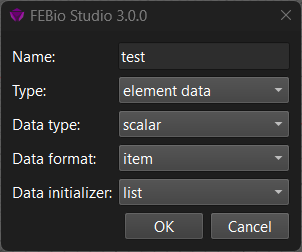
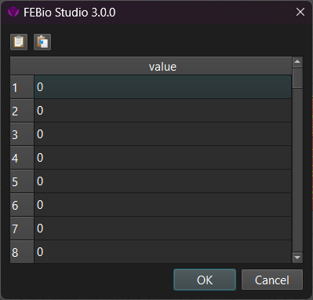

# 6.1 Adding Mesh Data

FEBio allows the use of mesh data maps in a model, i.e. values assigned to individual nodes or elements of a mesh that can be used in various contexts. For instance, it can be used to assign a different material parameter value to each element, or prescribe a different nodal value for each node of a prescribed displacement boundary condition. FEBio offers two mechanisms for defining mesh data: The data can be defined explicitly via a map, i.e. a single value defined for each element or node, or it can be defined implicitly through _mesh data generators_. The latter are procedural approaches that generate the actual mesh data map when FEBio starts. FEBio Studio supports both types of mesh data and in addition offers several tools for generating, editing, and visualizing mesh data[^6.1-fn1]. This chapter describes the ways that FEBio Studio offers users to generate and edit mesh data.

To add a mesh data map to the model first select an object in the Graphics View, right-click on the **Mesh Data** item in the model tree, and select **Add mesh data map** from the popup menu. A dialog box appears that allows users to select the type of map, the data type (i.e. scalar, vector, tensor), the data format, and how to initialize the data map.

/// figure-caption

This figure shows the dialog box that can be used to add a mesh data map to a model.

///

The following properties can be set.

**name** Specify the name of the mesh data map[^6.1-fn2].

**type** Select whether the map represents nodal, element, or surface data. This choice affects how the data can be used. For instance, nodal data will typically be used in boundary conditions, and element data will often be used to define heterogeneous material parameters.

**data type** Select the data type of the map, i.e. scalar, vector, or tensor.

**data format** (Only relevant for element and surface data.) The 'item' option will assign a single value to the element. The 'node' option will assign a unique value to each node of the domain. For instance, for element data, the data is assigned to the (shared) nodes of the elements. The mesh data therefore represents a continuous datafield over the domain. The 'mult' option assigns a unique value for each node of each element. Neighboring elements may have different values for each node they share. The resulting datafield may be discontinuous across element boundaries.

**data initializer:** Specifies how FEBio Studio will generate the data for the mesh data map. The 'list' option will generate a value for each item of the map and is typically what you want. The 'constant' option will not generate a value for each item, but instead will assign a single constant value to the entire map. This is only useful for very specific applications.

Once all properties are set, click OK to add the mesh data map to the model. At this point, although the map is visible in the model tree, it has not yet been assigned to any part of the mesh. The next step is to select nodes, elements, or surface facets, depending on the type of the map, and assign it to the map via the selection pane. After a selection is assigned to the map, the actual data is generated and can be edited. By default, the data values will all be set to zero. To change these values, right-click on the map in the model tree and select **Edit** from the popup menu. This will bring up a new dialog box that lists the current values for each item in the map.

/// figure-caption

The Edit Data Map dialog can be used to modify the data values directly.

///

Users can now edit the individual values of the map, or paste them from the clipboard. The data can also be copied onto the clipboard.

Although the Edit Data Map dialog allows fine grain control over the map's values, usually it is not the most convenient way to generate map data. The following sections describe other tools for generating mesh data.

[^6.1-fn1]: Note that FEBio Studio does not currently visualize the data generated by mesh data generators as this data is only generated by FEBio when the model is run.
[^6.1-fn2]: In general, it is best to avoid giving the mesh data map the same name as the model's variable to which it will be assigned. For instance, if the map is to be used for a material parameter named 'E', don't name the map 'E' as well. Instead, name it for instance 'E_map'.
