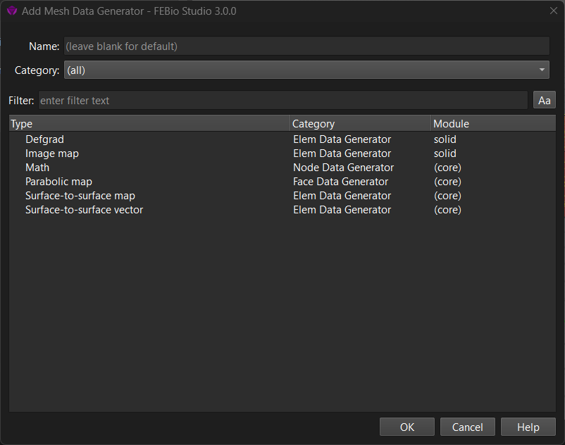

# 6.2 FEBio Mesh Data Generators

As described above, FEBio offers an alternative way for generating mesh data maps, namely using _mesh data generators_. These are procedural (i.e. algorithmic) approaches for generating mesh data. A mesh data generator is added by right-clicking the _Mesh Data_ item in the model tree, and selecting **Add mesh data generator** from the popup menu.

{: style="width:50%" }

/// figure-caption

The Add Mesh Data Generator dialog box allows users to add an FEBio mesh data generator item to the model.

///

The dialog presents a list of the available mesh data generators. Note that the category column shows the type of mesh items the data generator can be assigned to. This is important as the type defines how the map can be used in the model. Consult the FEBio manual for more details on the specific options and how to use them in a model.
