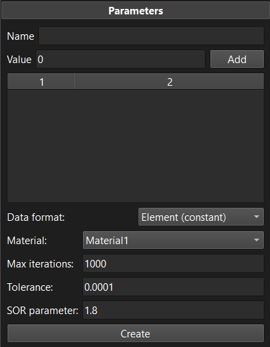

# 6.3 The Scalar Field Tool {: #sec:scalar_field_tool }

The **scalar field tool** is used to generate scalar data maps on a mesh. These maps can then be used for defining heterogeneous material parameters or other spatially varying model parameters.

The tool can be found on the _Tools_ tab of the _Build_ panel.

/// figure-caption

The scalar field tool can be used to generate a mesh data map.

///

To use the tool, first enter a name for the resulting mesh data map in the _Name_ field. Next, you can assign values to mesh selections. For example, if certain values are desired on specific surfaces, edges, or nodes, then the following steps will accomplish that goal: make a selection on the mesh, enter the desired value in the _value_ field, click the **Add** button. A new entry will be added in the table. The values assigned to the selections can still be edited by double-clicking the value in the table and entering a new value. This procedure can be repeated as many times as needed to assign different values to selections. Note that it is not necessary to assign values to every item (i.e. node or element) of the mesh. Instead, only values on some boundary surfaces or edges are needed. The values for the interior of the mesh are calculated by the tool. It accomplishes this by solving a Poisson problem on the mesh, using the provided values as boundary conditions on the corresponding mesh selections.

The following parameters further specify the data map that will be generated.

**Data format** Set how the tool will output the values, i.e. as nodal data or element data. This choice may affect how the data map can be used in the model.

**Material** Currently, data is only generated for the parts to which a particular material is assigned. This option allows you to select the material, and the corresponding parts on which data is generated.

The tool uses an iterative method for solving the Poisson problem. The remainder of the parameters control the solution process.

**Max iterations** Set the maximum number of iterations that can be used by the iterative solver. Setting this value too low may result in an unconverged solution to the Poisson problem. The default value of 1000 will be sufficient for most problems, but models with large meshes my need to increase this value.

**Tolerance** The convergence tolerance for the iterative method.

**SOR parameter** Sets the SOR (Successive Over Relaxation) parameter, which may significantly decrease the number of iterations necessary for convergence. The default value will likely work well for most applications.

To run the tool, click the **Create** Button. This will solve for the nodal or element values, given the boundary conditions to the Poisson problem, create the mesh data map, assign the values, and add it to the model.
