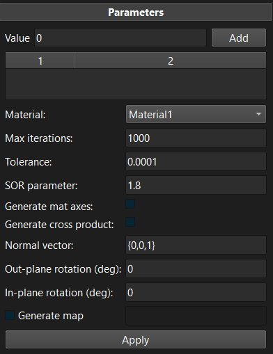

# 6.4 The Fiber Generator Tool {: #sec:fiber_generator_tool }

Despite the specific reference to “fiber”, this tool can be used to generate a vector field on a mesh. The vector field can be stored in a data map, which can then be used to define e.g. material fiber orientations.

/// figure-caption

The scalar field tool can be used to generate a mesh data map.

///

The tool works very similarly to the scalar field tool. First, users assign (scalar) values to specific mesh selections. It then solves a Poisson problem on the mesh using the provided values as prescribed boundary conditions on the selections. This results in a scalar field. The tool then proceeds by numerically evaluating the gradient of this scalar field. This defines the initial vector field. Additional parameters allow further modifications of this vector field.

- **Generate mat axes**: Generate material axes instead of vectors and assign these to the element local coordinate system.

- **Generate cross product**: The final vector field will be the cross product of the initial vector field and the user-defined “normal vector”.

- **Normal vector**: The vector that will be used to generate the cross product vector field.

- **Out-plane rotation (deg)**: Specifies the additional rotation angle (in degrees) to apply to the vector field that rotates it out of the plane that is perpendicular to the normal vector.

- **In-plane rotation (deg)**: Specifies an additional rotation angle (in degrees) to apply to the vector field that rotates the vector in the plane that is perpendicular to the normal vector.

- **Generate map**: Generate a map and define the map's name. (If not checked, the vectors are assigned to the element's fiber property, but this will be deprecated in the future.)

Note that unlike the scalar field tool, the values assigned to mesh selections don't matter that much, but are simply chosen to guide the generation of the vector field.
