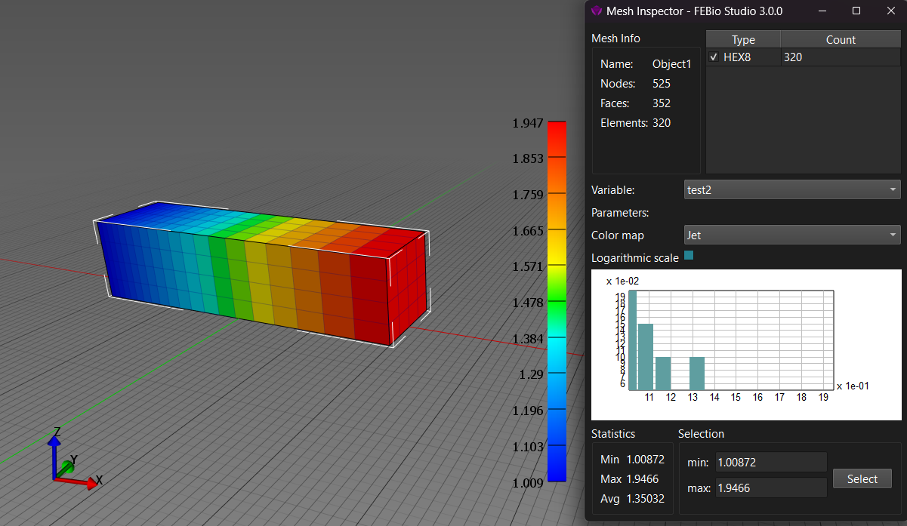

# 6.5 Visualizing Mesh Data

Mesh data maps can be visualized in FEBio Studio[^6.5-fn1] using the Mesh Inspector. This tool can be accessed from the menu **Tools** → **Mesh Inspector** or from the corresponding icon on the main toolbar. The _variable_ option will list all the datafields that can be visualized and includes, near the bottom, the scalar mesh data maps. Simply select the name of the mesh data map to visualize the data in the Graphics View.

{: style="width:50%" }

/// figure-caption

Mesh data can be visualized using the Mesh Inspector.

///

[^6.5-fn1]: The data maps generated by FEBio mesh data generators can currently not be visualized in FEBio Studio since this data is not generated until FEBio runs.
