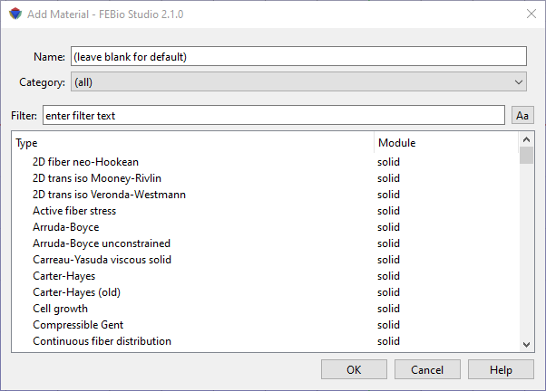

# 7.1 Adding materials {: #subsec:adding }

Materials are used to define the constitutive properties and behavior of the various parts in the model. This chapter explains how to add, edit, and assign materials to the different parts of your model.

/// figure-caption

The Material Browser is used to add materials to the model.

///

Materials are added using the _Material Browser_. The Material Browser is accessed from the **Physics** → **Add Material** menu, using the _Ctrl_$+M$ shortcut or by right-clicking on the _Materials_ item in the Model Editor and selecting _Add Material_ from the popup menu. The Material browser is displayed in Figure [1](#fig107). The Material Browser allows you to select a material and optionally provide a name for the material. If no name is given, FEBio Studio will generate a default one. The name of a material can also be changed later. After you selected the material, click OK to create the material and add it to the model. The material will become selected in the Model Viewer.
