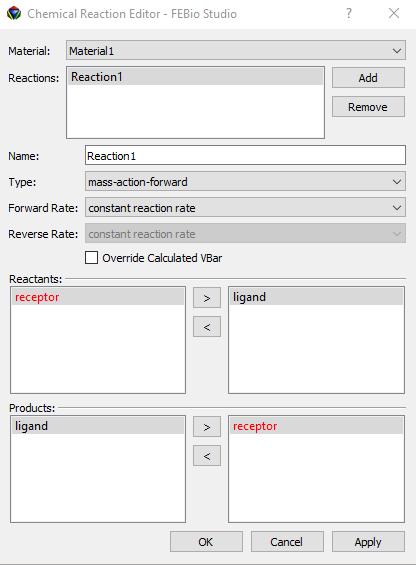

# 7.6 Adding Chemical Reactions {: #subsec:mylabel25 }

Chemical reactions may be included in some types of analysis (e.g. multiphasic analysis). Chemical reactions can only be added to previously created multiphasic materials as described in Section [7](7.1-adding-materials.md). Chemical reactions are defined between solutes (Section [Creating a Solute Table](7.4-creating-a-solute-table.md#subsec:mylabel23)) or solid-bound molecules (Section [Creating a Solid-Bound Molecule Table](7.5-creating-a-solid-bound-molecule-table.md#subsec:mylabel24)). Only solutes and SBMs that have been included in the parent multiphasic material may be involved in a chemical reaction.

To create a chemical reaction, select the **Physics** → **Chemical Reaction Table** menu. The Chemical Reaction Editor will appear (Figure [1](#fig110)). First select the multiphasic material to which a chemical reaction will be added. Then, press the Add button, next to the reactions table. A new reaction will be added. The name of the reaction can be altered in the Name field. Select the type of reaction and choose the forward and reverse rates (the latter only if applicable.)

Under _Reactants_ you will see two panels. The left panel shows all the solutes and sbms available in the model. The materials in red are not defined in the multiphasic material and should not be used to create a chemical reaction for this material. To include a species in the reaction move it to the right panel by pressing the > button between the two panels. You can remove a species from the reaction by pressing the < button. Repeat for all reactants of the chemical reaction. The _Products_ panels work identically.

/// figure-caption

The Chemical Reaction Editor allows users to create and edit chemical reactions used in multiphasic analysis.

///

To create the chemical reaction and add it to the multiphasic material, simply press the OK button. Once a chemical reaction has been created, its material parameters may be set in the Model Viewer as described in Section [Setting material parameters](7.2-setting-material-parameters.md#subsec:setting). Multiple chemical reactions may be defined within the same multiphasic material. The Chemical Reactions Editor can also be used to modify or remove reactions from a material.
