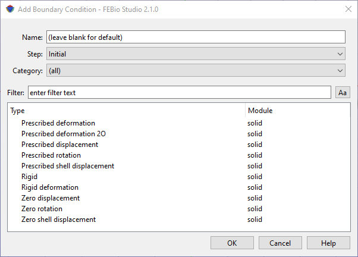

# 8.1 Boundary Conditions {: #subsec:boundary }

This chapter describes the various boundary conditions and loads that can be applied with FEBioStudio. These include fixed constraints, prescribed constraints, prescribed surface loads and tractions, body forces, etc.

Boundary conditions are used to constrain the solution on parts of the boundary. For example, in structural mechanics problems a boundary condition can be used to fix nodes from moving.

To apply a boundary condition, select the **Physics** → **Add Nodal BC** menu or the **Physics** → **Add Surface BC**. Most of the boundary conditions will be under the Nodal BC option. Nodal boundary conditions can be applied to nodes, surfaces, edges, or parts. Some special boundary conditions that can only be assigned to surfaces are found under the Surface BC menu option. In either case, a dialog box appears that shows a list of available boundary conditions.

/// figure-caption

The Add Boundary Condition dialog box.

///

At the top of the dialog box the name of the boundary condition can be entered. Alternatively, this field can be left blank to accept a default name. The name can also be changed later. Next, a drop-down list displays all the steps for which you can define a boundary condition. If you choose the _initial_ step, the step will be applied in the initialization phase of the analysis and will remain active for all subsequent analysis steps. If you choose any other step, the boundary condition will only remain active during that step.

After you selected the step and the type of boundary condition, simply press OK to add the boundary condition to the model and edit the parameters in the Model Viewer.

In general, there are two types of boundary conditions. There are the _fixed constraints_ and the _prescribed constraints_. For a fixed constraint (e.g. zero displacement), the corresponding degree of freedom is kept zero throughout the entire analysis. For a prescribed constraint (e.g. prescribed displacement), the value of the corresponding degree of freedom is defined by the user. You may wonder why the fixed constraints are available, since you can achieve the same result by defining a zero value for a prescribed constraint. The reason is that the degrees of freedom for fixed constraints are removed from the linear system of equations, reducing the computational time to solve the linear system. On the other hand, since the equations are removed, no reaction loads are calculated for fixed constraints. If you need to know for instance the reaction force on a boundary, you need to use a prescribed displacement even if the displacement is zero.

It is important to know that with most prescribed constraints a default load curve will be associated. The actual value for the constraint at any given time is the product of the scale factor which you will enter in the properties dialog for the boundary condition and the value of the load curve at that time. Since by default the load curve will ramp from zero to one, the constraint value will ramp from zero to the specified value in a linear way. If you wish to modify the default curve you can edit it in the Curve Editor. See section [The Curve Editor](../chapter3/3.12-the-curve-editor.md#subsec:mylabel19) on details of dealing with load curves and the Curve Editor.

For details on the specific types of boundary conditions, please consult the FEBio User's Manual. The easiest way to access it, is to select a boundary condition and click the Help button in the dialog box. That should open the relevant page in a browser window.
