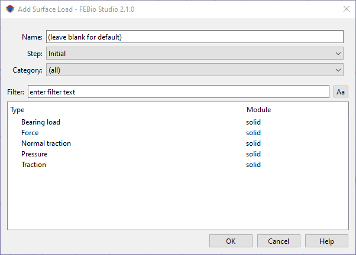

# 8.2 Surface Loads {: #subsec:surface }

Surface loads are applied in a similar way as boundary conditions. First select the items to which you wish to apply the load. Then, select the **Physics** → **Add Surface Load** from the menu bar. This opens up a dialog box from which you can select the available loads (Figure [1](#fig112)).

First, enter a name for the new surface load or leave the field empty to accept the default value. Then, select the step to which you wish to apply the load. Remember that applying a load to the initial step will cause the load to propagate through all the other steps. If you select an analysis step, on the other hand, the load will only remain active during that step.

Next, select the type of load you wish to add from the list and click the OK button to confirm your choice. The load parameters can be entered in the properties rollout on the Model Viewer. For details on the specific types of surface loads, please consult the FEBio User's Manual. The easiest way to access it, is to select a load and click the Help button in the dialog box. That should open the relevant page in a browser window.

/// figure-caption

The Add Surface Load dialog box.

///
