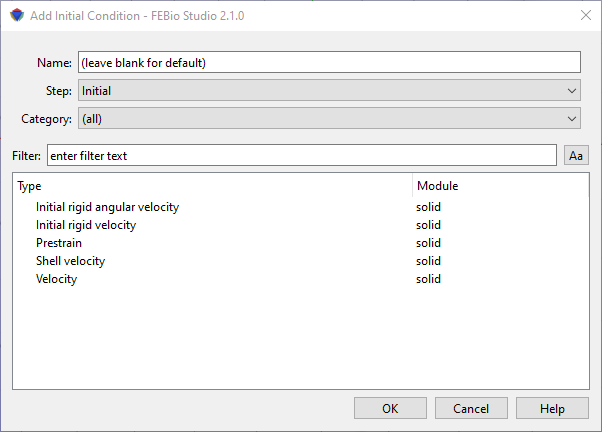

# 8.3 Initial Conditions {: #subsec:initial }

For dynamic problems, the user can define initial conditions in a similar way as boundary conditions. First, select the part, surface, edge or node to which you want to apply the initial condition. Then, from the Physics menu, select “Initial Conditions” to open the _Initial Conditions_ dialog box. This dialog box presents a list of available initial conditions that can be applied to the current selection.

First, enter a name for the initial condition or accept the default. Then, select the step to which this initial condition needs to be applied. Next, select the initial condition from the list of available choices. For details on the specific types of initial conditions, please consult the FEBio User's Manual. The easiest way to access it, is to select an initial condition and click the Help button in the dialog box. That should open the relevant page in a browser window.

/// figure-caption

The Add Initial Condition dialog box allows users to create initial conditions for transient and dynamic analyses.

///
