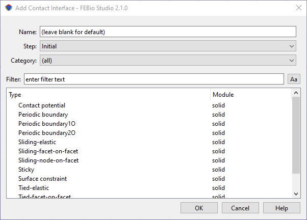

# 9.1 Contact {: #subsec:contact }

In many cases, different parts of a model can come into contact with each other. Once parts make contact, there are many different ways in which their motion can be constrained. Parts can slide across each other, stick to one another, etc. All these different contact behaviors can be modeled via contact definitions.

Most contact definitions can be divided into one of two categories.

**tied** Two, nonconforming, surfaces can be “glued” together with a tied interface. This is most commonly used when two parts are connected to each other at an interface, but their meshes are not conforming.

**sliding** A sliding interface allows two opposing surfaces to come into contact, and then slide across each other.

To add a contact definition, select the **Physics** → **Add Contact** menu. A dialog box shows up that allows you to select the step for which the contact definition is to be active (or select _Initial_ if the definition is to be active during all steps). To add a particular contact condition, select an option from the list and click on the _Add_ button.

/// figure-caption

The Add Contact dialog box allows users to create initial conditions for transient and dynamic analyses.

///

In FEBio, contact constraints are enforced using an _Augmented Lagrangian_ approach. This implies that the Lagrange multipliers are only approximated to a user-specified tolerance. The following parameters will appear in nearly all contact interfaces.

- **augmented Lagrangian**: Turn the augmented Lagrangian method on or off. When off, a penalty method is used for constraint enforcement.

- **augmentation tolerance**: Set the convergence tolerance for the Lagrange multipliers.

- **Penalty factor:** The penalty factor controls the rate of convergence. A high penalty factor will try to reach the tolerance quickly, but if chosen too high might introduce instability into the system. If it is too low, convergence to within the specified tolerance might not be reached.

For sliding interfaces, there will usually be an option for _two-pass_ option. In a usual contact implementation, the required integrations are only performed over one of the surfaces, usually referred to as the _primary_ surface. If the contacting surfaces are perfectly smooth, it does not matter which surface acts as the primary or secondary surface. However, in an FE simulation the surfaces are discretized and are most likely non-conforming. Thus, the choice of primary and secondary surfaces is important and will introduce bias in the solution. It is usually advisable to select the more finely meshed surface as the primary. In the _two pass algorithm_, an attempt is made to reduce the bias by performing the contact calculations twice, with the roles of primary and secondary surface switched for the second pass. Although it may appear that the two pass algorithm is always the best choice, this is not always so. Certain contact applications perform better using a single pass. See the _FEBio Theory Manual_ for a more detailed description of the contact model.

After the contact parameters are entered the user needs to define the _primary_ and _secondary_ contacting surfaces. To do this, first close the contact interface dialog and select the contact interface in the Model Editor. In the Model Editor you will now notice two selection boxes, one for the primary surface and one for the secondary surface. The boxes work similarly as for boundary conditions. For instance, to add a surface of your model to the primary surface, select the surface in the Graphics View and press the '$+$' button in the primary's surface selection box.

For detailed descriptions of the different contact definitions follows, please consult the FEBio User's Manual.
