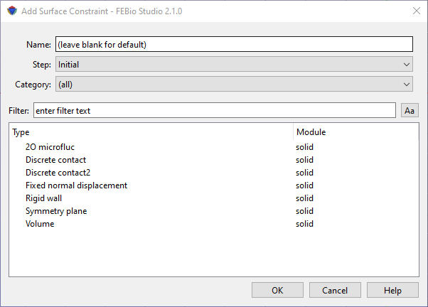

# 9.2 Nonlinear constraints

Aside from contact, FEBio offers several types of nonlinear constraints that in some way constrain the solution of the finite element problem. In FEBio Studio, these constraints are differentiated based on whether they apply to surfaces or to volumetric bodies. Constraints that don't quite fit in either category are referred to as general constraints.

Similar to contact, these nonlinear constraints are enforced using an Augmented Lagrangian method.

## Surface Constraints

A _surface constraint_ constrains the solution of the finite element problem (e.g. displacement for a structural mechanics problem) at a surface. To add a surface constraint, go to the menu **Physics** → **Add Surface Constraint**_,_ or right-click on the _Constraints_ item in the model tree and select _Add Surface Constraint_.

/// figure-caption

The Add Surface Constraint dialog box allows users to add nonlinear constraints on surfaces of the model.

///

For detailed descriptions of the surface constraints, please consult the FEBio User's Manual. You can press the Help button to take you directly to the relevant page in the FEBio User Manual in an separate web browser window.

## Body Constraints

A _body constraint_ constrains the solution of the finite element problem (e.g. displacement for a structural mechanics problem) on all the nodes of a volumetric body part. To add a body constraint, go to the menu **Physics** → **Add Body Constraint**_,_ or right-click on the _Constraints_ item in the model tree and select _Add Body Constraint_.

For detailed descriptions of the body constraints, please consult the FEBio User's Manual. You can press the Help button to take you directly to the relevant page in the FEBio User Manual in an separate web browser window.

## General Constraints

A _general constraint_ constrains the solution of the finite element problem in some special way. To add a general constraint, go to the menu **Physics** → **Add Body Constraint**_,_ or right-click on the _Constraints_ item in the model tree and select _Add General Constraint_.

For detailed descriptions of the general constraints, please consult the FEBio User's Manual. You can press the Help button to take you directly to the relevant page in the FEBio User Manual in an separate web browser window.
