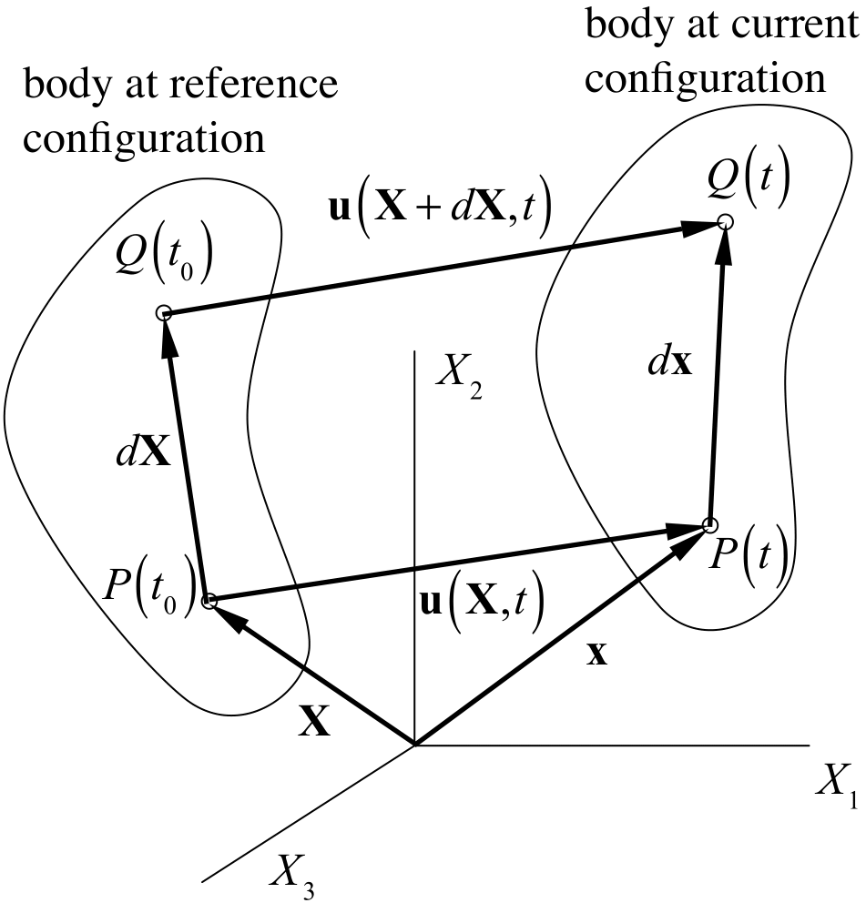
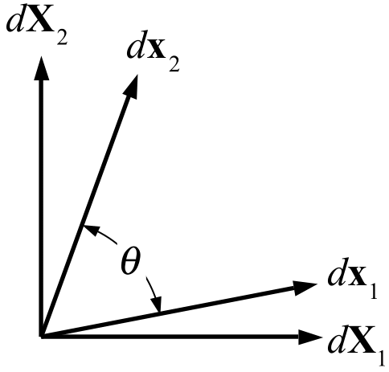
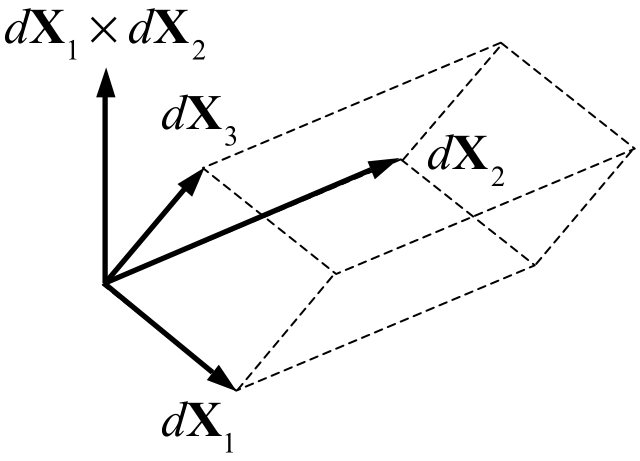

# 2.5 Kinematics of the Continuum {: #sec:Kinematics-of-Continuum }

## Motion and Path Lines

At any instant of time $t$, the _motion_ of a material particle $P$ in the continuum is given by the function

{: style="width:50%" }

/// figure-caption

Kinematics of the continuum.

///

\[ \begin{equation} \mathbf{x}=\boldsymbol{\chi}\left(\mathbf{X},t\right)\label{eq:motion-chi} \end{equation} \]

where $\mathbf{X}$ is the reference position, at some reference time $t_{0}$, of the material particle $P$ currently located at the spatial location $\mathbf{x}$. This motion describes the _path line_ of the particle that starts at $\mathbf{X}$ at $t=t_{0}$ and passes through $\mathbf{x}$ at time $t$. At a subsequent time $t^{\prime}$, the material particle passing through $\mathbf{x}$ would have originated at a different location $\mathbf{X}^{\prime}$ at $t_{0}$, so that $\mathbf{x}=\boldsymbol{\chi}\left(\mathbf{X}^{\prime},t^{\prime}\right)=\boldsymbol{\chi}\left(\mathbf{X},t\right)$. The material particle $P$ is uniquely identified by its position $\mathbf{X}$ in the reference configuration. Therefore, any function $f$ associated with each material point $\mathbf{X}$, such as density, temperature, velocity, etc., may be expressed as $f=\hat{f}\left(\mathbf{X},t\right)$ in the _material_ (or _Lagrangian_) frame. Alternatively, the same function may be expressed in terms of the spatial position $\mathbf{x}$ through which the material particle originating at $\mathbf{X}$ passes at time $t$. In that case, $f=\tilde{f}\left(\mathbf{x},t\right)$ expresses this function in the _spatial_ (or _Eulerian_) frame. Importantly, since the function $f$ is associated with the material, its time rate of change as the material moves is called the _material time derivative_ of $f$. The material time derivative of $f$ in the material frame is given by

\[ \begin{equation} \dot{f}=\frac{\partial\hat{f}\left(\mathbf{X},t\right)}{\partial t}\,.\label{eq:material-deriv-material} \end{equation} \]

Therefore, the velocity $\mathbf{v}\left(\mathbf{X},t\right)$ of the particle $P$ is defined in the material frame as the material time derivative $\dot{\boldsymbol{\chi}}\left(\mathbf{X},t\right)$ of the motion,

\[ \begin{equation} \mathbf{v}\left(\mathbf{X},t\right)=\frac{\partial\boldsymbol{\chi}\left(\mathbf{X},t\right)}{\partial t}\,.\label{eq75} \end{equation} \]

The material time derivative of $f$ in the spatial frame may be evaluated by using the chain rule on $f=\tilde{f}\left(\mathbf{x},t\right)\equiv f\left(\boldsymbol{\chi}\left(\mathbf{X},t\right),t\right)$, thus

\[ \dot{f}=\frac{\partial\tilde{f}\left(\boldsymbol{\chi},t\right)}{\partial t}+\frac{\partial\tilde{f}\left(\boldsymbol{\chi},t\right)}{\partial\boldsymbol{\chi}}\cdot\frac{\partial\boldsymbol{\chi}}{\partial t}\,. \]

Using Eq.\eqref{eq75} and recognizing that $\partial\tilde{f}/\partial\boldsymbol{\chi}\equiv\partial\tilde{f}/\partial\mathbf{x}=\grad\tilde{f}$, this expression may be rewritten as

\[ \begin{equation} \dot{f}=\frac{\partial\tilde{f}}{\partial t}+\grad\tilde{f}\cdot\mathbf{v}\equiv\frac{D\tilde{f}\left(\mathbf{x},t\right)}{Dt}\,.\label{eq77} \end{equation} \]

We used the operator $D\left(\cdot\right)/Dt$ to emphasize that this expression represents the material time derivative of $f$ in the spatial frame.

For a given particle $P$, the actual value of the function $f$ must be the same in the material and spatial frames, thus $f=\hat{f}\left(\mathbf{X},t\right)=\tilde{f}\left(\mathbf{x},t\right)$. Similarly, its material time derivative must have the same value in either frame, $\dot{f}=\frac{\partial\hat{f}}{\partial t}=\frac{D\tilde{f}}{Dt}$. For notational convenience, we drop the caret and tilde symbols and assume from the context that $f\left(\mathbf{X},t\right)\equiv\hat{f}\left(\mathbf{X},t\right)$ and $f\left(\mathbf{x},t\right)\equiv\tilde{f}\left(\mathbf{x},t\right)$.

## Deformation Gradient

For a continuum, the increment in motion between the neigboring points $\mathbf{X}$ and $\mathbf{X}+d\mathbf{X}$ at a given time $t$ is given by

\[ \begin{equation} d\mathbf{x}=\boldsymbol{\chi}\left(\mathbf{X}+d\mathbf{X},t\right)-\boldsymbol{\chi}\left(\mathbf{X},t\right)=\left(\Grad\boldsymbol{\chi}\right)\cdot d\mathbf{X}\,.\label{eq:motion-gradient} \end{equation} \]

Since the differentiation of $\boldsymbol{\chi}\left(\mathbf{X},t\right)$ is performed with respect to $\mathbf{X}$, we denote this gradient as $\Grad\equiv\partial\left(\cdot\right)/\partial\mathbf{X}$. In particular,

\[ \begin{equation} \mathbf{F}\equiv\frac{\partial\boldsymbol{\chi}}{\partial\mathbf{X}}=\Grad\boldsymbol{\chi}\label{eq:deformation-gradient} \end{equation} \]

is known as the _deformation gradient_. It follows from this relationship that a material element $d\mathbf{X}$ of solid constituent deforms into the material element $d\mathbf{x}$ at the current time $t$ such that $d\mathbf{x}=\mathbf{F}\cdot d\mathbf{X}$.

The length of the element, $ds$, is given by

\[ \begin{equation} ds^{2}=d\mathbf{x}\cdot d\mathbf{x}=\left(\mathbf{F}\cdot d\mathbf{X}\right)\cdot\left(\mathbf{F}\cdot d\mathbf{X}\right)=d\mathbf{X}\cdot\left(\mathbf{F}^{T}\cdot\mathbf{F}\right)\cdot d\mathbf{X}\equiv d\mathbf{X}\cdot\mathbf{C}\cdot d\mathbf{X}\label{eq82} \end{equation} \]

where

\[ \begin{equation} \mathbf{C}=\mathbf{F}^{T}\cdot\mathbf{F}\label{eq83} \end{equation} \]

is the _right Cauchy-Green deformation tensor_. Note that $\mathbf{C}^{T}=\left(\mathbf{F}^{T}\cdot\mathbf{F}\right)^{T}=\mathbf{F}^{T}\cdot\mathbf{F}=\mathbf{C}$, thus $\mathbf{C}$ is symmetric.

Let the material element $d\mathbf{X}$ be of length $dS$ and directed along the unit normal $\mathbf{n}_{r}$, $d\mathbf{X}=dS\mathbf{n}_{r}$. Upon deformation, we have $d\mathbf{x}=\mathbf{F}\cdot d\mathbf{X}=dS\mathbf{F}\cdot\mathbf{n}_{r}$ and the length of the element in this deformed configuration is given by $ds$ where

\[ \begin{equation} ds^{2}=d\mathbf{x}\cdot d\mathbf{x}=\left(dS\mathbf{F}\cdot\mathbf{n}_{r}\right)\cdot\left(dS\mathbf{F}\cdot\mathbf{n}_{r}\right)=dS^{2}\mathbf{n}_{r}\cdot\left(\mathbf{F}^{T}\cdot\mathbf{F}\right)\cdot\mathbf{n}_{r}=dS^{2}\mathbf{n}_{r}\cdot\mathbf{C}\cdot\mathbf{n}_{r}\label{eq84} \end{equation} \]

The length of the element in the current configuration relative to its length in the reference configuration is given by

\[ \begin{equation} \frac{ds}{dS}=\sqrt{\mathbf{n}_{r}\cdot\mathbf{C}\cdot\mathbf{n}_{r}}\equiv\lambda_{n}\label{eq85} \end{equation} \]

where $\lambda_{n}$ is the relative change in length of the material element $d\mathbf{X}$ which is oriented along $\mathbf{n}$. $\lambda_{n}$ is known as the _stretch ratio_ along $\mathbf{n}$. Note that $\lambda_{n}^{2}=\mathbf{n}_{r}\cdot\mathbf{C}\cdot\mathbf{n}_{r}$ is the normal component of $\mathbf{C}$ along $\mathbf{n}_{r}$. If we let $d\mathbf{x}=ds\,\mathbf{n}$, it follows from $d\mathbf{x}=\mathbf{F}\cdot d\mathbf{X}$ that

\[ \begin{equation} \lambda_{n}\mathbf{n}=\mathbf{F}\cdot\mathbf{n}_{r}\label{eq85a} \end{equation} \]

Now consider two material elements $d\mathbf{X}_{m}=dS_{m}\mathbf{m}_{r}$ and $d\mathbf{X}_{n}=dS_{n}\mathbf{n}_{r}$. They each transform according to $d\mathbf{x}_{m}=\mathbf{F}\cdot d\mathbf{X}_{m}$ and $d\mathbf{x}_{n}=\mathbf{F}\cdot d\mathbf{X}_{n}$ and their dot product produces

\[ \begin{equation} d\mathbf{x}_{m}\cdot d\mathbf{x}_{n}=\left(\mathbf{F}\cdot d\mathbf{X}_{m}\right)\cdot\left(\mathbf{F}\cdot d\mathbf{X}_{n}\right)=d\mathbf{X}_{n}\cdot\mathbf{C}\cdot d\mathbf{X}_{m}\label{eq85b} \end{equation} \]

or equivalently,

\[ \begin{equation} \lambda_{m}\lambda_{n}\mathbf{m}\cdot\mathbf{n}=\mathbf{n}_{r}\cdot\mathbf{C}\cdot\mathbf{m}_{r}\,,\quad\lambda_{m}=\frac{ds_{m}}{dS_{m}},\,\lambda_{n}=\frac{ds_{n}}{dS_{n}}\label{eq85c} \end{equation} \]

where $d\mathbf{x}_{m}=ds_{m}\mathbf{m}$ and $d\mathbf{x}_{n}=ds_{n}\mathbf{n}$. Note that we may write $\mathbf{m}\cdot\mathbf{n}=\cos\theta=\sin\gamma$, where $\theta$ is the angle between $d\mathbf{x}_{m}$ and $d\mathbf{x}_{n}$ and $\gamma=\frac{\pi}{2}-\theta$ is its complementary angle (Figure [Figure (2.5)](#fig17)), so that

\[ \begin{equation} \mathbf{n}_{r}\cdot\mathbf{C}\cdot\mathbf{m}_{r}=\lambda_{m}\lambda_{n}\sin\gamma\,.\label{eq85d} \end{equation} \]

Now consider the case where $\mathbf{m}_{r}\cdot\mathbf{n}_{r}=0$, i.e., the material elements $d\mathbf{X}_{m}$ and $d\mathbf{X}_{n}$ are orthogonal, so that $\mathbf{n}_{r}\cdot\mathbf{C}\cdot\mathbf{m}_{r}=C_{mn}$ where $C_{mn}$ is a shear component of $\mathbf{C}$. It follows from this result that $C_{mn}$ represents a combined measure of the change in angle between $\mathbf{m}_{r}$ and $\mathbf{n}_{r}$, as well as the stretching of elements $d\mathbf{X}_{m}$ and $d\mathbf{X}_{n}$. The angle $\gamma$, which represents the change in angle between initially orthogonal line elements along $\mathbf{m}_{r}$ and $\mathbf{n}_{r}$, is called the _engineering shear strain_. In particular, in the range of small strains and rotations, $\lambda_{m}\approx1$, $\lambda_{n}\approx1$ and $\sin\gamma\approx\gamma$, so that $C_{mn}\approx\gamma$.

{: style="width:50%" }

/// figure-caption

Change of angle between filaments.

///

According to the _polar decomposition theorem_, the deformation gradient may be decomposed uniquely into

\[ \begin{equation} \mathbf{F}=\mathbf{R}\cdot\mathbf{U}=\mathbf{V}\cdot\mathbf{R}\label{eq:polar-decomposition-RU} \end{equation} \]

where $\mathbf{R}$ is a proper orthogonal transformation (a rotation, with $\det\mathbf{R}=+1$), $\mathbf{U}$ is a symmetric tensor called the _right_ (or _material_) _stretch tensor_, and $\mathbf{V}$ is a symmetric tensor called the _left stretch tensor_. It follows from this decomposition that $d\mathbf{x}=\mathbf{F}\cdot d\mathbf{X}=\mathbf{R}\cdot\left(\mathbf{U}\cdot d\mathbf{X}\right)$ may be viewed as a stretching of $d\mathbf{X}$ by $\mathbf{U}$ followed by a rotation by $\mathbf{R}$, whereas $d\mathbf{x}=\mathbf{V}\cdot\left(\mathbf{R}\cdot d\mathbf{X}\right)$ is the rotation of $d\mathbf{X}$, followed by stretching by $\mathbf{V}$. Since $\mathbf{C}=\mathbf{F}^{T}\cdot\mathbf{F}=\mathbf{U}^{2}$, it follows that the eigenvalues of $\mathbf{C}$ are the square of the eigenvalues of $\mathbf{U}$. Thus, these eigenvalues provide a measure of the stretch, not a measure of the rotation. $\mathbf{C}$ and $\mathbf{U}$ also share the same eigenvectors. Thus, if $\mathbf{C}$ is given by its spectral representation,

\[ \begin{equation} \mathbf{C}=\lambda_{1}^{2}\mathbf{u}_{1}\otimes\mathbf{u}_{1}+\lambda_{2}^{2}\mathbf{u}_{2}\otimes\mathbf{u}_{2}+\lambda_{3}^{2}\mathbf{u}_{3}\otimes\mathbf{u}_{3}\label{eq:85-2} \end{equation} \]

where $\mathbf{u}_{i}$'s are its eigenvectors, then $\mathbf{U}$ may be evaluated from

\[ \begin{equation} \mathbf{U}=\lambda_{1}\mathbf{u}_{1}\otimes\mathbf{u}_{1}+\lambda_{2}\mathbf{u}_{2}\otimes\mathbf{u}_{2}+\lambda_{3}\mathbf{u}_{3}\otimes\mathbf{u}_{3}\label{eq:85-3} \end{equation} \]

and $\mathbf{R}=\mathbf{F}\cdot\mathbf{U}^{-1}$, where $\mathbf{U}^{-1}=\lambda_{1}^{-1}\mathbf{u}_{1}\otimes\mathbf{u}_{1}+\lambda_{2}^{-1}\mathbf{u}_{2}\otimes\mathbf{u}_{2}+\lambda_{3}^{-1}\mathbf{u}_{3}\otimes\mathbf{u}_{3}$.

The motion can also be conveniently represented in terms of a _displacement_ function $\mathbf{u}$ in a material frame of reference such that

\[ \begin{equation} \mathbf{x}=\mathbf{X}+\mathbf{u}\left(\mathbf{X},t\right)\label{eq78} \end{equation} \]

Then the deformation gradient for this motion is given by

\[ \begin{equation} \mathbf{F}=\frac{\partial\mathbf{x}}{\partial\mathbf{X}}=\Grad\mathbf{x}=\mathbf{I}+\Grad\mathbf{u}\label{eq81} \end{equation} \]

and

\[ \begin{equation} \begin{array}{cl} \mathbf{C} & =\mathbf{F}^{T}\cdot\mathbf{F}=\left(\mathbf{I}+\Grad\mathbf{u}\right)^{T}\cdot\left(\mathbf{I}+\Grad\mathbf{u}\right)\\ & =\mathbf{I}+\Grad\mathbf{u}+\Grad^{T}\mathbf{u}+\left(\Grad^{T}\mathbf{u}\right)\cdot\left(\Grad\mathbf{u}\right) \end{array}\label{eq83-1} \end{equation} \]

Finally, we can also define the _Lagrangian strain tensor_ $\mathbf{E}$ (also known as the _Green-Lagrange_ strain) from the above relation such that $\mathbf{C}=\mathbf{I}+2\mathbf{E}$, or

\[ \begin{equation} \mathbf{E}=\frac{1}{2}\left(\mathbf{C}-\mathbf{I}\right)=\frac{1}{2}\left[\Grad\mathbf{u}+\Grad^{T}\mathbf{u}+\left(\Grad^{T}\mathbf{u}\right)\cdot\left(\Grad\mathbf{u}\right)\right]\label{eq:E-C-relation} \end{equation} \]

In the case of rigid body motion (translation and/or rotation, $\mathbf{C}=\mathbf{I}$), the Lagrangian strain tensor is equal to the null tensor. Just as in the case of the stress tensor, the strain tensors $\mathbf{C}$ and $\mathbf{E}$ also have strain invariants, principal normal strains and principal directions of normal strain, maximum shear strains and directions of maximum shear strain. If $\lambda^{2}$ is an eigenvalue of $\mathbf{C}$, and $\mathbf{v}$ is its associated eigenvector, then $\mathbf{v}$ is also an eigenvector of $\mathbf{E}$ since

\[ \begin{equation} \mathbf{E}\cdot\mathbf{v}=\frac{1}{2}\left(\mathbf{C}-\mathbf{I}\right)\cdot\mathbf{v}=\frac{1}{2}\left(\mathbf{C}\cdot\mathbf{v}-\mathbf{v}\right)=\frac{1}{2}\left(\lambda^{2}-1\right)\mathbf{v}\label{eq84-1} \end{equation} \]

Therefore the corresponding eigenvalue of $\mathbf{E}$ is $\left(\lambda^{2}-1\right)/2$, which also established the relation between the normal components of $\mathbf{E}$ and $\mathbf{C}$. The shear components of $\mathbf{E}$ may be related to those of $\mathbf{C}$ according to

\[ E_{mn}=\mathbf{m}\cdot\mathbf{E}\cdot\mathbf{n}=\frac{1}{2}\mathbf{m}\cdot\mathbf{C}\cdot\mathbf{n}=\frac{1}{2}C_{mn} \]

where $\mathbf{m}$ and $\mathbf{n}$ are orthogonal unit vectors. Therefore, the interpretation of $E_{mn}$ is similar to that of $C_{mn}$, with a factor of $1/2$.

In the limit of small displacement gradients (small strains and rotations, $\left\Vert \Grad\mathbf{u}\right\Vert \ll1$), the expression for the Lagrangian strain tensor in eq.\eqref{eq:E-C-relation} reduces to the _infinitesimal strain tensor_,

\[ \begin{equation} \boldsymbol{\varepsilon}=\frac{1}{2}\left(\grad\mathbf{u}+\grad^{T}\mathbf{u}\right)\,.\label{eq46} \end{equation} \]

Note that this strain tensor is also the linearization of the Lagrangian strain tensor,

\[ \begin{equation} D\mathbf{E}\left[\mathbf{u}\right]=\mathbf{F}^{T}\cdot\boldsymbol{\varepsilon}\cdot\mathbf{F}\,.\label{eq47} \end{equation} \]

## Rate of Deformation {: #sec:Rate-of-Deformation }

The material time derivative of the deformation gradient may be denoted by $\dot{\mathbf{F}}$. Since $\mathbf{F}=\Grad\boldsymbol{\chi}$, it follows that $\dot{\mathbf{F}}=\Grad\dot{\boldsymbol{\chi}}=\Grad\mathbf{v}$. Using the chain rule,

\[ \begin{equation} \dot{\mathbf{F}}=\frac{\partial\mathbf{v}}{\partial\mathbf{X}}=\frac{\partial\mathbf{v}}{\partial\mathbf{x}}\cdot\frac{\partial\mathbf{x}}{\partial\mathbf{X}}=\grad\mathbf{v}\cdot\mathbf{F}\label{eq85e} \end{equation} \]

or simply

\[ \begin{equation} \dot{\mathbf{F}}=\mathbf{L}\cdot\mathbf{F}\label{eq85f} \end{equation} \]

Differentiating $\mathbf{C}=\mathbf{F}^{T}\cdot\mathbf{F}$ with respect to time, and making use of eq.\eqref{eq85e} produces

\[ \begin{equation} \mbox{\dot{\mathbf{C}}}=\dot{\mathbf{F}}^{T}\cdot\mathbf{F}+\mathbf{F}^{T}\cdot\dot{\mathbf{F}}=\mathbf{F}^{T}\cdot\left(\mathbf{L}^{T}+\mathbf{L}\right)\cdot\mathbf{F}\label{eq85g} \end{equation} \]

or equivalently,

\[ \begin{equation} \dot{\mathbf{C}}=2\mathbf{F}^{T}\cdot\mathbf{D}\cdot\mathbf{F}\label{eq85h} \end{equation} \]

where $\mathbf{D}$ is the rate of deformation tensor. This result may now be used in the time differentiation of eq.\eqref{eq85d},

\[ \begin{equation} \mathbf{n}_{r}\cdot\dot{\mathbf{C}}\cdot\mathbf{m}_{r}=\left(\dot{\lambda}_{m}\lambda_{n}+\lambda_{m}\dot{\lambda}_{n}\right)\sin\gamma+\lambda_{m}\lambda_{n}\dot{\gamma}\cos\gamma\label{eq85i} \end{equation} \]

where the left-hand-side reduces to $\mathbf{n}_{r}\cdot\dot{\mathbf{C}}\cdot\mathbf{m}_{r}=2\left(\mathbf{F}\cdot\mathbf{m}_{r}\right)\cdot\mathbf{D}\cdot\left(\mathbf{F}\cdot\mathbf{n}_{r}\right)=2\lambda_{m}\lambda_{n}\mathbf{m}\cdot\mathbf{D}\cdot\mathbf{n}$. Substituting this result above produces

\[ \begin{equation} \mathbf{m}\cdot\mathbf{D}\cdot\mathbf{n}=\frac{1}{2}\left(\frac{\dot{\lambda}_{m}}{\lambda_{m}}+\frac{\dot{\lambda}_{n}}{\lambda_{n}}\right)\sin\gamma+\frac{\dot{\gamma}}{2}\cos\gamma\label{eq85j} \end{equation} \]

We now consider two cases: When $\mathbf{m}=\mathbf{n}$, it follows that $\gamma=\pi/2$, so that \eqref{eq85j} reduces to

\[ \begin{equation} D_{nn}\equiv\mathbf{n}\cdot\mathbf{D}\cdot\mathbf{n}=\frac{\dot{\lambda}_{n}}{\lambda_{n}}\,.\label{eq:D-normal} \end{equation} \]

In other words, the normal component of the rate of deformation tensor along $\mathbf{n}$ is the rate of stretch per stretch of a differential line element along $\mathbf{n}$.

When $\mathbf{m}\cdot\mathbf{n}=0$, it follows that $\gamma=0$, so that \eqref{eq85j} reduces to

\[ \begin{equation} D_{mn}\equiv\mathbf{m}\cdot\mathbf{D}\cdot\mathbf{n}=\frac{\dot{\gamma}}{2}\,.\label{eq:D-shear} \end{equation} \]

Thus, the shear component of $\mathbf{D}$ in the plane containing $\mathbf{m}$ and $\mathbf{n}$ is equal to half the rate at which the angle between those line elements changes with the deformation. The quantity $\dot{\gamma}$ is called the _engineering shear rate_, or simply the _shear rate_.

Finally, we note from eqs.\eqref{eq:E-C-relation} and \eqref{eq85h} that the material time derivative of the Lagrangian strain is related to the rate of deformation via

\[ \begin{equation} \dot{\mathbf{E}}=\mathbf{F}^{T}\cdot\mathbf{D}\cdot\mathbf{F}\,.\label{eq:Edot-D-relation} \end{equation} \]

## Volume Deformation {: #sec:Volume-Deformation }

Let us show that the deformation of a volume of material $dV_{r}$ is given by

\[ \begin{equation} dV=J\,dV_{r},\quad J=\det\mathbf{F}=\left(\det\mathbf{C}\right)^{1/2}\label{eq87} \end{equation} \]

{: style="width:50%" }

/// figure-caption

Elemental volume.

///

Note that $\det\mathbf{C}=\det\left(\mathbf{F}^{T}\cdot\mathbf{F}\right)=\det\mathbf{F}^{T}\det\mathbf{F}=\left(\det\mathbf{F}\right)^{2}$, thus $\det\mathbf{F}=\left(\det\mathbf{C}\right)^{1/2}$, which proves the second equation above. To prove the first equation, let us define three non-collinear material elements in the undeformed reference state, $d\mathbf{X}_{1}$, $d\mathbf{X}_{2}$, and $d\mathbf{X}_{3}$. The elemental volume defined by these three elements has the magnitude

\[ dV_{r}=\left(d\mathbf{X}_{1}\times d\mathbf{X}_{2}\right)\cdot d\mathbf{X}_{3}\tag{a} \]

in the reference state, and the magnitude

\[ dV=\left(d\mathbf{x}_{1}\times d\mathbf{x}_{2}\right)\cdot d\mathbf{x}_{3}=\left(\mathbf{F}\cdot d\mathbf{X}_{1}\times\mathbf{F}\cdot d\mathbf{X}_{2}\right)\cdot\mathbf{F}\cdot d\mathbf{X}_{3}\tag{b} \]

in the deformed state. Let the elements $d\mathbf{X}_{1}$, $d\mathbf{X}_{2}$, and $d\mathbf{X}_{3}$ be aligned with the orthogonal coordinate axes such that

\[ d\mathbf{X}_{1}=dS_{1}\mathbf{e}_{1}\quad d\mathbf{X}_{2}=dS_{2}\mathbf{e}_{2}\quad d\mathbf{X}_{3}=dS_{3}\mathbf{e}_{3}\tag{c} \]

where $\mathbf{e}_{i}\cdot\mathbf{e}_{j}=\delta_{ij}$, then we find from (a) that $dV_{r}=dS_{1}dS_{2}dS_{3}$. From (b) we get that

\[ dV=\left(\mathbf{F}\cdot\mathbf{e}_{1}\times\mathbf{F}\cdot\mathbf{e}_{2}\right)\cdot\mathbf{F}\cdot\mathbf{e}_{3}\,dS_{1}dS_{2}dS_{3}=\det\mathbf{F}\,dV_{r}\tag{d} \]

according to the definition of the determinant given in Section [subsubsec:determinant](#subsubsec-determinant).

In a compressible material, the density will change with changes in volume. If an elemental volume of mass $dm$ occupies a volume $dV_{r}$ in some _reference configuration_, then the density in the current configuration is given by

\[ \begin{equation} \rho=\frac{dm}{dV}=\frac{dm}{dV_{r}}\frac{dV_{r}}{dV}=\frac{\rho_{r}}{J}\label{eq88} \end{equation} \]

Here, $\rho_{r}$ represents the density of the material in the reference configuration, which is a constant. The result of eq.\eqref{eq88} is the solution to the axiom of mass balance. To prove that point, we use the kinematic identity

\[ \begin{equation} \frac{\partial J}{\partial\mathbf{F}}=J\mathbf{F}^{-T}\label{eq89-1} \end{equation} \]

to express the material time derivative of $J$ as

\[ \begin{equation} \dot{J}=\frac{\partial J}{\partial\mathbf{F}}:\dot{\mathbf{F}}\label{eq90-1} \end{equation} \]

Recalling that $\dot{\mathbf{F}}=\mathbf{L}\cdot\mathbf{F}$, it follows that

\[ \begin{equation} \dot{J}=J\mathbf{F}^{-T}:\mathbf{L}\cdot\mathbf{F}=J\mathbf{I}:\mathbf{L}=J\tr\mathbf{L}=J\divg\mathbf{v}\label{eq91-1} \end{equation} \]

or

\[ \begin{equation} \divg\mathbf{v}=\frac{\dot{J}}{J}\label{eq92-1} \end{equation} \]

Now, the axiom of mass balance in eq.[(2.4-2)](2.4-axioms-of-conservation.md#mjx-eqn:eq:mass-balance-redux) may be rewritten as

\[ \begin{equation} \frac{D\rho}{Dt}+\rho\divg\mathbf{v}=\dot{\rho}+\frac{\rho}{J}\dot{J}=0\label{eq93} \end{equation} \]

Multiplying this equation across by $J$, we find that the resulting expression is equivalent to

\[ \begin{equation} \frac{D\left(\rho J\right)}{Dt}=0\label{eq93b} \end{equation} \]

Integrating this expression produces $\rho J=\rho_{r}$, where $\rho_{r}$ is the value of $\rho$ when $J=1$. This result reproduces \eqref{eq88}.

Finally, since we know that $\mathbf{F}=\mathbf{R}\cdot\mathbf{U}$ according to \eqref{eq:polar-decomposition-RU}, it follows that

\[ J=\det\mathbf{F}=\left(\det\mathbf{R}\right)\left(\det\mathbf{U}\right)=\det\mathbf{U}=\lambda_{1}\lambda_{2}\lambda_{3}\,, \]

where $\lambda_{i}$ are the principal stretches of $\mathbf{U}$.

## Area Deformation {: #subsec:Area-Deformation }

In general, we can express the position of a material point $\mathbf{X}$ as a function of parametric coordinates $\eta^{i}$ (i=1,2,3), thus $\mathbf{X}=\mathbf{X}\left(\eta^{i}\right)$. Then, a line element in the reference configuration is given by

\[ \begin{equation} d\mathbf{X}=\frac{\partial\mathbf{X}}{\partial\eta^{i}}d\eta^{i}\equiv\mathbf{G}_{i}d\eta^{i}\,,\label{eq:covariant-basis-material} \end{equation} \]

where we use the implicit (Einstein) summation convention of indicial notation. Here, the vectors $\mathbf{G}_{i}$ are called the covariant basis vectors of $\mathbf{X}\left(\eta^{i}\right)$, in the material frame. We may also express the motion in eq.\eqref{eq:motion-chi} as a function of the same parametric coordinates, such that the corresponding line element in the spatial frame is

\[ \begin{equation} d\mathbf{x}=\frac{\partial\boldsymbol{\chi}}{\partial\eta^{i}}d\eta^{i}\equiv\mathbf{g}_{i}d\eta^{i}\,,\label{eq:covariant-basis-spatial} \end{equation} \]

where $\mathbf{g}_{i}$'s represent the covariant basis vector at $\mathbf{x}=\boldsymbol{\chi}\left(\mathbf{X},t\right)$ in the spatial frame. Since $d\mathbf{x}$ is related to $d\mathbf{X}$ by the deformation gradient as per eq.\eqref{eq:motion-gradient}, or $d\mathbf{x}=\mathbf{F}\cdot d\mathbf{X}$, it can be shown that the deformation gradient is given by

\[ \begin{equation} \mathbf{F}=\mathbf{g}_{i}\otimes\mathbf{G}^{i}\,,\label{eq:defgrad-cov-cont} \end{equation} \]

where $\mathbf{G}^{i}$'s represent the contravariant basis vector of $\mathbf{X}\left(\eta^{i}\right)$, in the material frame. Covariant and contravariant basis vectors satisfy $\mathbf{G}_{i}\cdot\mathbf{G}^{j}=\mathbf{G}^{i}\cdot\mathbf{G}_{j}=\delta_{j}^{i}$, where $\delta_{j}^{i}$ is the Kronecker delta. The same is true in the spatial frame. The expression for $\mathbf{F}$ in eq.\eqref{eq:defgrad-cov-cont} emphasizes that $\mathbf{F}$ is a _two-point tensor_: It has one leg in the material frame ($\mathbf{G}^{i}$) and the other in the spatial frame ($\mathbf{g}_{i}$). It follows from eq.\eqref{eq:defgrad-cov-cont} that covariant basis vectors in the material and spatial frames are related by

\[ \begin{equation} \mathbf{F}\cdot\mathbf{G}_{j}=\mathbf{g}_{j}\,.\label{eq:cov-basis-xformation} \end{equation} \]

Now consider that an elemental volume $dV_{r}$ in the reference configuration can be evaluated from

\[ dV_{r}=\left(\mathbf{G}_{1}d\eta^{1}\times\mathbf{G}_{2}d\eta^{2}\right)\cdot\mathbf{G}_{3}d\eta^{3}\equiv d\mathbf{A}\cdot\mathbf{G}_{3}d\eta^{3}\,, \]

where $d\mathbf{A}$ is the vectorial representation of the elemental directed area $\mathbf{G}_{1}d\eta^{1}\times\mathbf{G}_{2}d\eta^{2}$. Similarly, the elemental volume $dV$ in the current configuration is given by

\[ dV=\left(\mathbf{g}_{1}d\eta^{1}\times\mathbf{g}_{2}d\eta^{2}\right)\cdot\mathbf{g}_{3}d\eta^{3}\equiv d\mathbf{a}\cdot\mathbf{g}_{3}d\eta^{3}\,. \]

Using eqs.\eqref{eq87} and \eqref{eq:cov-basis-xformation}, we may rewrite this expression as

\[ dV=d\mathbf{a}\cdot\mathbf{F}\cdot\mathbf{G}_{3}d\eta^{3}=JdV_{r}=Jd\mathbf{A}\cdot\mathbf{G}_{3}d\eta^{3}\,. \]

From this general expression, we can find the relation between $d\mathbf{a}$ and $d\mathbf{A}$,

\[ \begin{equation} d\mathbf{a}=J\mathbf{F}^{-T}\cdot d\mathbf{A}\,,\label{eq:Nanson-formula} \end{equation} \]

which is known as Nanson's formula [^2.5-1]. It relates the change in surface area, and the reorientation of the surface normal, between the referential area $d\mathbf{A}$ and its corresponding area $d\mathbf{a}$ in the current configuration.

Using the general expression for the deformation gradient in eq.\eqref{eq:defgrad-cov-cont}, it follows that the right Cauchy-Green tensor is given by

\[ \mathbf{C}=\mathbf{F}^{T}\cdot\mathbf{F}=g_{ij}\mathbf{G}^{i}\otimes\mathbf{G}^{j} \]

where $g_{ij}=\mathbf{g}_{i}\cdot\mathbf{g}_{j}$ is called the covariant metric tensor in the spatial frame.

[^2.5-1]: Bonet, Javier; Wood, Richard D.. "Nonlinear continuum mechanics for finite element analysis." *Cambridge University Press* (1997).
