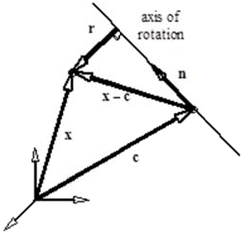

# 3.1 Weak formulation for Solid Materials {: #sec:Solid-weak-formulation }

Generally, the finite element formulation is established in terms of a weak form of the differential equations under consideration. In the context of solid mechanics this implies the use of the virtual work equation:

\[ \begin{equation} \delta W=\int\limits_{v}\boldsymbol{\sigma}:\delta\mathbf{d}\,dv-\int\limits_{v}\mathbf{f}\cdot\delta\mathbf{v}\,dv-\int\limits_{\partial v}\mathbf{t}\cdot\delta\mathbf{v}\,da=0\,.\label{eq171} \end{equation} \]

Here, $\delta\mathbf{v}$ is a virtual velocity and $\delta\mathbf{d}$ is the virtual rate of deformation tensor. This equation is known as the _spatial virtual work equation_ since it is formulated using spatial quantities only. We can also define the _material virtual work equation_ by expressing the principle of virtual work using only material quantities.

\[ \begin{equation} \delta W=\int\limits_{V}\mathbf{S}:\delta\mathbf{\dot{E}}\,dV-\int\limits_{V}\mathbf{f}_{0}\cdot\delta\mathbf{v}\,dV-\int\limits_{\partial V}\mathbf{t}_{0}\cdot\delta\mathbf{v}\,dA=0\,.\label{eq172} \end{equation} \]

Here, $\mathbf{f}_{0}=J\mathbf{f}$ is the body force per unit undeformed volume and $\mathbf{t}_{0}=\mathbf{t}\left(da/dA\right)$ is the traction vector per unit initial area.

## Linearization {: #subsec:Solid-linearization }

Equation \eqref{eq171} is the starting point for the nonlinear finite element method. It is highly nonlinear and any method attempting to solve this equation, such as the Newton-Raphson method, necessarily has to be iterative.

To linearize the finite element equations, the directional derivative of the virtual work in eq.\eqref{eq171} must be calculated. In an iterative procedure, the quantity $\boldsymbol{\phi}$ will be approximated by a trial solution $\boldsymbol{\phi}_{k}$. Linearization of the virtual work equation around this trial solution gives

\[ \begin{equation} \delta W\left(\boldsymbol{\phi}_{k},\delta\mathbf{v}\right)+D\delta W\left(\boldsymbol{\phi}_{k},\delta\mathbf{v}\right)\left[\mathbf{u}\right]=0\,.\label{eq173} \end{equation} \]

The directional derivative of the virtual work will eventually lead to the definition of the stiffness matrix. In order to proceed, it is convenient to split the virtual work into an internal and external virtual work component:

\[ \begin{equation} D\delta W\left(\boldsymbol{\phi},\delta\mathbf{v}\right)\left[\mathbf{u}\right]=D\delta W_{int}\left(\boldsymbol{\phi},\delta\mathbf{v}\right)\left[\mathbf{u}\right]-D\delta W_{ext}\left(\boldsymbol{\phi},\delta\mathbf{v}\right)\left[\mathbf{u}\right],\label{eq174} \end{equation} \]

where

\[ \begin{equation} \delta W_{int}\left(\boldsymbol{\phi},\delta\mathbf{v}\right)=\int\limits_{v}\boldsymbol{\sigma}:\delta\mathbf{d}\,dv\,,\label{eq175} \end{equation} \]

and

\[ \begin{equation} \delta W_{ext}\left(\boldsymbol{\phi},\delta\mathbf{v}\right)=\int\limits_{v}\mathbf{f}\cdot\delta\mathbf{v}\,dv+\int\limits_{\partial v}\mathbf{t}\cdot\delta\mathbf{v}\,da\,.\label{eq176} \end{equation} \]

The result is listed here without details of the derivation – see [^3.1-1] for details. The linearization of the internal virtual work is given by

\[ \begin{equation} D\delta W_{int}\left(\boldsymbol{\phi},\delta\mathbf{v}\right)\left[\mathbf{u}\right]=\int\limits_{v}\delta\mathbf{d}:\boldsymbol{\mathcal{C}}:\boldsymbol{\varepsilon}\,dv+\int\limits_{v}\boldsymbol{\sigma}:\left[\left(\nabla\mathbf{u}\right)^{T}\cdot\nabla\delta\mathbf{v}\right]\,dv\,.\label{eq177} \end{equation} \]

Notice that this equation is symmetric in $\delta\mathbf{v}$ and $\mathbf{u}$. This symmetry will, upon discretization, yield a symmetric tangent matrix.

The external virtual work has contributions from both body forces and surface tractions. The precise form of the linearized external virtual work depends on the form of these forces. For surface tractions, normal pressure forces may be represented in FEBio. The linearized external work for this type of traction is given by

\[ \begin{equation} \begin{aligned}D\delta W_{ext}^{p}\left(\boldsymbol{\phi},\delta\mathbf{v}\right)\left[\mathbf{u}\right] & =\frac{1}{2}\int\limits_{A_{\xi}}p\frac{\partial\mathbf{x}}{\partial\xi}\cdot\left[\left(\frac{\partial\mathbf{u}}{\partial\eta}\times\delta\mathbf{v}\right)+\left(\frac{\partial\delta\mathbf{v}}{\partial\eta}\times\mathbf{u}\right)\right]d\xi\,d\eta\\ & -\frac{1}{2}\int\limits_{A_{\xi}}p\frac{\partial\mathbf{x}}{\partial\eta}\cdot\left[\left(\frac{\partial\mathbf{u}}{\partial\xi}\times\delta\mathbf{v}\right)+\left(\frac{\partial\delta\mathbf{v}}{\partial\xi}\times\mathbf{u}\right)\right]d\xi\,d\eta\,. \end{aligned} \label{eq178} \end{equation} \]

Discretization of this equation will also lead to a symmetric component of the tangent matrix.

FEBio currently supports gravity as a body force, $\mathbf{f}=\rho\mathbf{g}$. Since this force is independent of the geometry, the contribution to the linearized external work is zero. Another type of body force implemented in FEBio is the centrifugal force. For a body rotating with a constant angular speed $\omega$, about an axis passing through the point $\mathbf{c}$ and directed along the unit vector $\mathbf{n}$, the body force is given by $\mathbf{f}=\rho\omega^{2}\mathbf{r}$, where $\mathbf{r}$ is the vector distance from a point $\mathbf{x}$ to the axis of rotation,

\[ \begin{equation} \mathbf{r}=\left(\mathbf{I}-\mathbf{n}\otimes\mathbf{n}\right)\cdot\left(\mathbf{x}-\mathbf{c}\right)\,.\label{eq179} \end{equation} \]

The resulting linearized external work is given by

\[ \begin{equation} D\delta W_{ext}^{f}\left(\boldsymbol{\phi},\delta\mathbf{v}\right)\left[\mathbf{u}\right]=\int\limits_{v}\rho\omega^{2}\delta\mathbf{v}\cdot\left(\mathbf{I}-\mathbf{n}\otimes\mathbf{n}\right)\cdot\mathbf{u}\,dv,\label{eq180} \end{equation} \]

which produces a symmetric expression that will yield a symmetric matrix.

## Discretization {: #subsec:Solid-discretization }

The basis of the finite element method is that the domain of the problem (that is, the volume of the object under consideration) is divided into smaller subunits, called _finite elements_. In the case of _isoparametric elements_ it is further assumed that each element has a local coordinate system, named the _natural coordinates_, and the coordinates and shape of the element are discretized using the same functions. The discretization process is established by interpolating the geometry in terms of the coordinates $\mathbf{X}_{a}$ of the _nodes_ that define the geometry of a finite element, and the _shape functions_:

\[ \begin{equation} \mathbf{X}=\sum\limits_{a=1}^{n}N_{a}\left(\xi_{1},\xi_{2},\xi_{3}\right)\mathbf{X}_{a}\,,\label{eq181} \end{equation} \]

where $n$ is the number of nodes and $\xi_{i}$ are the natural coordinates. Similarly, the motion is described in terms of the current position $\mathbf{x}_{a}\left(t\right)$ of the _same_ particles:

\[ \begin{equation} \mathbf{x}\left(t\right)=\sum\limits_{a=1}^{n}N_{a}\mathbf{x}_{a}\left(t\right)\,.\label{eq182} \end{equation} \]

Quantities such as displacement, velocity and virtual velocity can be discretized in a similar way.

In deriving the discretized equilibrium equations, the integrations performed over the entire volume can be written as a sum of integrations constrained to the volume of an element. For this reason, the discretized equations are defined in terms of integrations over a particular element $e$. The discretized equilibrium equations for this particular element per node is given by

\[ \begin{equation} \delta W^{\left(e\right)}\left(\boldsymbol{\phi},N_{a}\delta\mathbf{v}\right)=\delta\mathbf{v}_{a}\cdot\left(\mathbf{T}_{a}^{\left(e\right)}-\mathbf{F}_{a}^{\left(e\right)}\right)\,,\label{eq183} \end{equation} \]

where

\[ \begin{equation} \begin{aligned}T_{a}^{\left(e\right)} & =\int\limits_{v^{\left(e\right)}}\boldsymbol{\sigma}\cdot\nabla N_{a}\,dv\,,\\ F_{a}^{\left(e\right)} & =\int\limits_{v^{\left(e\right)}}N_{a}\mathbf{f}\,dv+\int\limits_{\partial v^{\left(e\right)}}N_{a}\mathbf{t}\,da\,. \end{aligned} \label{eq184} \end{equation} \]

The linearization of the internal virtual work can be split into a _material_ and an _initial stress_ component [^3.1-1]:

\[ \begin{equation} \begin{aligned}D\delta W_{int}^{\left(e\right)}\left(\boldsymbol{\phi},\delta\mathbf{v}\right)\left[\mathbf{u}\right] & =\int\limits_{v^{\left(e\right)}}\delta\mathbf{d}:\boldsymbol{\mathcal{C}}:\boldsymbol{\varepsilon}\,dv+\int\limits_{v^{\left(e\right)}}\boldsymbol{\sigma}:\left[\left(\nabla\mathbf{u}\right)^{T}\cdot\nabla\delta\mathbf{v}\right]\,dv\\ & =D\delta W_{c}^{\left(e\right)}\left(\boldsymbol{\phi},\delta\mathbf{v}\right)\left[\mathbf{u}\right]+D\delta W_{\sigma}^{\left(e\right)}\left(\boldsymbol{\phi},\delta\mathbf{v}\right)\left[\mathbf{u}\right]\,. \end{aligned} \label{eq185} \end{equation} \]

The constitutive component can be discretized as follows:

\[ \begin{equation} D\delta W_{c}^{\left(e\right)}\left(\boldsymbol{\phi},\delta\mathbf{v}\right)\left[\mathbf{u}\right]=\delta\mathbf{v}_{a}\cdot\left(\int\limits_{v^{\left(e\right)}}\mathbf{B}_{a}^{T}\mathbf{D}\mathbf{B}_{b}\,dv\right)\mathbf{u}_{b}\,.\label{eq186} \end{equation} \]

The term in parentheses defines the constitutive component of the tangent matrix relating node $a$ to node $b$ in element $e$:

\[ \begin{equation} \mathbf{K}_{c,ab}^{\left(e\right)}=\int\limits_{v^{\left(e\right)}}\mathbf{B}_{a}^{T}\mathbf{DB}_{b}\,dv\,.\label{eq187} \end{equation} \]

Here, the linear strain-displacement matrix **$\mathbf{B}$** relates the displacements to the small-strain tensor in Voigt Notation:

\[ \begin{equation} \boldsymbol{\varepsilon}=\sum\limits_{a=1}^{n}\mathbf{B}_{a}\mathbf{u}_{a}\,.\label{eq188} \end{equation} \]

Or, written out completely,

\[ \begin{equation} \mathbf{B}_{a}=\left[\begin{array}{ccc} \partial N_{a}/\partial x & 0 & 0\\ 0 & \partial N_{a}/\partial y & 0\\ 0 & 0 & \partial N_{a}/\partial z\\ \partial N_{a}/\partial y & \partial N_{a}/\partial x & 0\\ 0 & \partial N_{a}/\partial z & \partial N_{a}/\partial y\\ \partial N_{a}/\partial z & 0 & \partial N_{a}/\partial z \end{array}\right]\,.\label{eq189} \end{equation} \]

The spatial constitutive matrix **$\mathbf{D}$** is constructed from the components of the fourth-order tensor $\boldsymbol{\mathcal{C}}$ using the following table; $D_{IJ}=\mathcal{C}_{ijkl}$ where

| **I/J** | **i/k** | **j/l** |
|---|---|---|
| 1 | 1 | 1 |
| 2 | 2 | 2 |
| 3 | 3 | 3 |
| 4 | 1 | 2 |
| 5 | 2 | 3 |
| 6 | 1 | 3 |

The initial stress component can be written as follows:

\[ \begin{equation} D\delta W_{\sigma}^{\left(e\right)}\left(\boldsymbol{\phi},N_{a}\delta\mathbf{v}\right)\left[N_{b}\mathbf{u}_{b}\right]=\int\limits_{v^{\left(e\right)}}\left(\nabla N_{a}\cdot\boldsymbol{\sigma}\cdot\nabla N_{b}\right)\mathbf{I}\,dv.\label{eq190} \end{equation} \]

For the pressure component of the external virtual work, we find

\[ \begin{equation} D\delta W_{p}^{\left(e\right)}\left(\boldsymbol{\phi},N_{a}\delta\mathbf{v}_{a}\right)\left[N_{b}\mathbf{u}_{b}\right]=\delta\mathbf{v}_{a}\cdot\mathbf{K}_{p,ab}^{\left(e\right)}\cdot\mathbf{u}_{b}\,,\label{eq191} \end{equation} \]

where,

\[ \begin{equation} \begin{aligned}\mathbf{K}_{p,ab}^{\left(e\right)} & =\mathcal{E}\mathbf{k}_{p,ab}^{\left(e\right)},\\ \mathbf{k}_{p,ab}^{\left(e\right)} & =\frac{1}{2}\int_{A_{\xi}}p\frac{\partial\mathbf{x}}{\partial\xi}\left(\frac{\partial N_{a}}{\partial\eta}N_{b}-\frac{\partial N_{b}}{\partial\eta}N_{a}\right)d\xi\,d\eta\\ & +\frac{1}{2}\int_{A_{\xi}}p\frac{\partial\mathbf{x}}{\partial\eta}\left(\frac{\partial N_{a}}{\partial\xi}N_{b}-\frac{\partial N_{b}}{\partial\xi}N_{a}\right)d\xi\,d\eta\,. \end{aligned} \label{eq192} \end{equation} \]

[^3.1-1]: Bonet, Javier; Wood, Richard D.. "Nonlinear continuum mechanics for finite element analysis." *Cambridge University Press* (1997).
