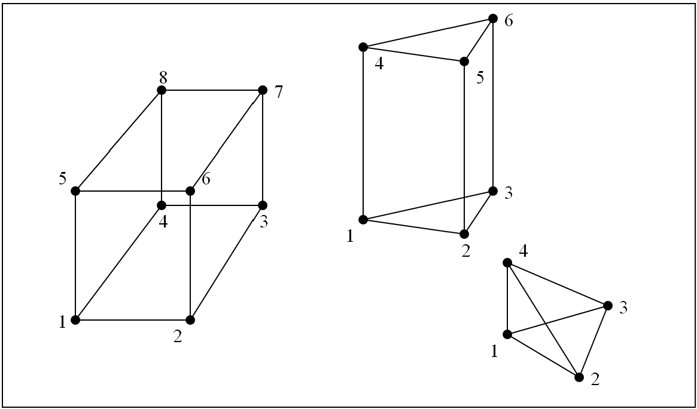
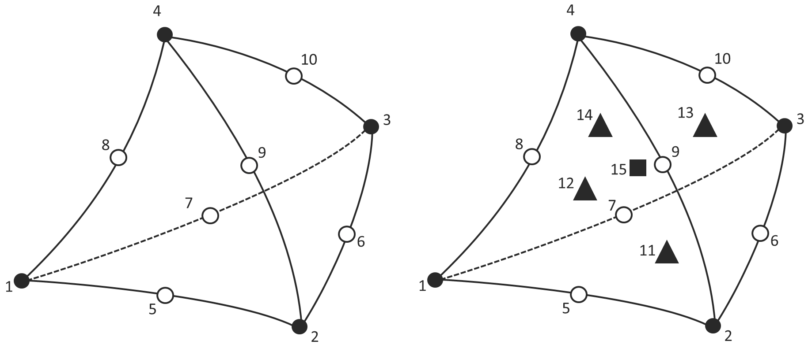

# 4.1 Solid Elements {: #sec:Solid-elements }

FEBio provides several element types for finite element discretization. This chapter describes these elements in more detail.

The 3D solid elements available in FEBio are _isoparametric elements_. All of the solid elements are formulated in a global Cartesian coordinate system. For all these elements, a local coordinate system (so-called _isoparametric coordinates_) is defined as well. The global position vector **$\mathbf{x}$** can be written as a function of the isoparametric coordinates in the following sense:

\[ \begin{equation} \mathbf{x}\left(r,s,t\right)=\sum\limits_{i=1}^{n}N_{i}\left(r,s,t\right)\mathbf{x}_{i}.\label{eq373} \end{equation} \]

Here, $n$ is the number of nodes, $r$, $s$ and $t$ are the isoparametric coordinates, $N_{i}$ are the element shape functions and $\mathbf{x}_{i}$ are the spatial coordinates of the element nodes. The same parametric interpolation is used for the interpolation of other scalar and vector quantities.

All elements in FEBio are integrated numerically. This implies that integrals over the volume of the element $v^{e}$ are approximated by a sum:

\[ \begin{equation} \int\limits_{v^{e}}f\left(\mathbf{x}\right)\,dv=\int\limits_{\Square^{e}}f\left({\mathbf{r}}\right)J(\mathbf{r})d\Square\,\cong\sum\limits_{i=1}^{m}f\left(\mathbf{r}_{i}\right)J_{i}w_{i}\,.\label{eq374} \end{equation} \]

Here, $\Square$ is the biunit cube, $m$ is the number of integration points, $\mathbf{r}_{i}$are the location of the integration points in isoparametric coordinates, $J$ is the Jacobian of the transformation $\mathbf{x}=\mathbf{x}\left(r,s,t\right)$, and $w_{i}$ is a weight associated with the integration point. The integration is performed over the element's volume in the natural coordinate system.

Most fully integrated solid elements are unsuitable for the analysis of (nearly-) incompressible material behavior. To deal with this type of deformation, a three-field element implementation is available in FEBio [^4.1-1].

## Hexahedral Elements {: #subsec:Hexahedral-Elements }

FEBio implements an 8-node trilinear hexahedral element. This element is also known as a _brick_ element. The shape functions for these elements are defined in function of the isoparametric coordinates $r$, $s$ and $t,$ and are given below.

\[ \begin{equation} \begin{aligned}N_{1} & =\frac{1}{8}\left(1-r\right)\left(1-s\right)\left(1-t\right)\\ N_{2} & =\frac{1}{8}\left(1+r\right)\left(1-s\right)\left(1-t\right)\\ N_{3} & =\frac{1}{8}\left(1+r\right)\left(1+s\right)\left(1-t\right)\\ N_{4} & =\frac{1}{8}\left(1-r\right)\left(1+s\right)\left(1-t\right)\\ N_{5} & =\frac{1}{8}\left(1-r\right)\left(1-s\right)\left(1+t\right)\\ N_{6} & =\frac{1}{8}\left(1+r\right)\left(1-s\right)\left(1+t\right)\\ N_{7} & =\frac{1}{8}\left(1+r\right)\left(1+s\right)\left(1+t\right)\\ N_{8} & =\frac{1}{8}\left(1-r\right)\left(1+s\right)\left(1+t\right) \end{aligned} \,.\label{eq375} \end{equation} \]

The following integration rule is implemented for this element type.

| **8-point Gauss rule** | | | |
|---|---|---|---|
| **r** | **s** | **t** | **w** |
| -0.577350269 | -0.577350269 | -0.577350269 | 1 |
| 0.577350269 | -0.577350269 | -0.577350269 | 1 |
| 0.577350269 | 0.577350269 | -0.577350269 | 1 |
| -0.577350269 | 0.577350269 | -0.577350269 | 1 |
| -0.577350269 | -0.577350269 | 0.577350269 | 1 |
| 0.577350269 | -0.577350269 | 0.577350269 | 1 |
| 0.577350269 | 0.577350269 | 0.577350269 | 1 |
| -0.577350269 | 0.577350269 | 0.577350269 | 1 |

## Pentahedral Elements {: #subsec:Pentahedral-Elements }

Pentahedral elements (also knows as “wedge” elements) consist of six nodes and five faces. Their shape functions are defined in function of the isoparametric coordinates $r$, $s$ and $t$ and are given as follows.

\[ \begin{equation} \begin{aligned}N_{1} & =\frac{1}{2}\left(1-r-s\right)\left(1-t\right)\\ N_{2} & =\frac{1}{2}r\left(1-t\right)\\ N_{3} & =\frac{1}{2}s\left(1-t\right)\\ N_{4} & =\frac{1}{2}\left(1-r-s\right)\left(1+t\right)\\ N_{5} & =\frac{1}{2}r\left(1+t\right)\\ N_{6} & =\frac{1}{2}s\left(1+t\right) \end{aligned} \,.\label{eq376} \end{equation} \]

The following integration rule is implemented for this element type.

| **6-point Gauss rule** | | | |
|---|---|---|---|
| **r** | **s** | **t** | **w** |
| 0.166666667 | 0.166666667 | -0.577350269 | 0.166666667 |
| 0.666666667 | 0.166666667 | -0.577350269 | 0.166666667 |
| 0.166666667 | 0.666666667 | -0.577350269 | 0.166666667 |
| 0.166666667 | 0.166666667 | 0.577350269 | 0.166666667 |
| 0.666666667 | 0.166666667 | 0.577350269 | 0.166666667 |
| 0.166666667 | 0.666666667 | 0.577350269 | 0.166666667 |

## Tetrahedral Elements {: #subsec:Tetrahedral-Elements }

Linear 4-node tetrahedral elements are also available in FEBio. Their shape functions are defined in function of the isoparametric coordinates $r$, $s$ and $t$.

\[ \begin{equation} \begin{aligned}N_{1} & =1-r-s-t\\ N_{2} & =r\\ N_{3} & =s\\ N_{4} & =t \end{aligned} \,.\label{eq377} \end{equation} \]

The following integration rules are implemented for this element type.

| **1-point Gauss rule** | | | |
|---|---|---|---|
| **r** | **s** | **t** | **w** |
| 0.25 | 0.25 | 0.25 | 0.166666667 |

| **4-point Gauss rule** | | | |
|---|---|---|---|
| **r** | **s** | **t** | **w** |
| 0.13819660 | 0.13819660 | 0.13819660 | 0.041666667 |
| 0.58541020 | 0.13819660 | 0.13819660 | 0.041666667 |
| 0.13819660 | 0.58541020 | 0.13819660 | 0.041666667 |
| 0.13819660 | 0.13819660 | 0.58541020 | 0.041666667 |

{: style="display:block; margin-left:auto; margin-right:auto;" }**Different solid element types that are available in FEBio**

## Quadratic Tetrahedral Elements {: #subsec:Quadratic-Tetrahedral-Elements }

FEBio implements a 10-node quadratic tetrahedral element. It has four corner nodes and six nodes located at the midpoint of the edges. The shape functions in terms area coordinates are given below. The area coordinates relate to the isoparametric coordinates as follows.

\[ \begin{equation} \begin{aligned}t_{1} & =1-r-s-t\\ t_{2} & =r\\ t_{3} & =s\\ t_{4} & =t \end{aligned} \,.\label{eq378} \end{equation} \]

The shape functions follow.

\[ \begin{equation} \begin{aligned}H_{i} & =t_{i}\left(2t_{i}-1\right),\,i=1\cdots4\\ H_{5} & =4t_{1}t_{2}\\ H_{6} & =4t_{2}t_{3}\\ H_{7} & =4t_{3}t_{1}\\ H_{8} & =4t_{1}t_{4}\\ H_{9} & =4t_{2}t_{4}\\ H_{10} & =4t_{3}t_{4} \end{aligned} \,.\label{eq379} \end{equation} \]

The following integration rules are implemented for this element type.

| **4-point Gauss rule** | | | |
|---|---|---|---|
| **r** | **s** | **t** | **w** |
| 0.58541020 | 0.13819660 | 0.13819660 | 0.041666667 |
| 0.13819660 | 0.58541020 | 0.13819660 | 0.041666667 |
| 0.13819660 | 0.13819660 | 0.58541020 | 0.041666667 |
| 0.13819660 | 0.13819660 | 0.13819660 | 0.041666667 |

| **8-point Gauss rule** | | | |
|---|---|---|---|
| **r** | **s** | **t** | **w** |
| 0.01583591 | 0.328054697 | 0.328054697 | 0.023087995 |
| 0.328054697 | 0.01583591 | 0.328054697 | 0.023087995 |
| 0.328054697 | 0.328054697 | 0.01583591 | 0.023087995 |
| 0.328054697 | 0.328054697 | 0.328054697 | 0.023087995 |
| 0.679143178 | 0.106952274 | 0.106952274 | 0.018578672 |
| 0.106952274 | 0.679143178 | 0.106952274 | 0.018578672 |
| 0.106952274 | 0.106952274 | 0.679143178 | 0.018578672 |
| 0.106952274 | 0.106952274 | 0.106952274 | 0.018578672 |

| **11-point Gauss-Lobatto rule** | | | |
|---|---|---|---|
| **r** | **s** | **t** | **w** |
| 0 | 0 | 0 | 0.002777778 |
| 1 | 0 | 0 | 0.002777778 |
| 0 | 1 | 0 | 0.002777778 |
| 0 | 0 | 1 | 0.002777778 |
| 0.5 | 0 | 0 | 0.011111111 |
| 0.5 | 0.5 | 0 | 0.011111111 |
| 0 | 0.5 | 0 | 0.011111111 |
| 0 | 0 | 0.5 | 0.011111111 |
| 0.5 | 0 | 0.5 | 0.011111111 |
| 0 | 0.5 | 0.5 | 0.011111111 |
| 0.25 | 0.25 | 0.25 | 0.088888889 |

FEBio also implements a 15-node quadratic tetrahedral element.

{: style="display:block; margin-left:auto; margin-right:auto;" }**Quadratic tetrahedral elements available in FEBio. Left, a 10-node quadratic tet. Right, a 15-node quadratic tet.**

The following integration rules are implemented for this element type.

| **8-point Gauss rule**[^4.1-fn1] | | | |
|---|---|---|---|
| **r** | **s** | **t** | **w** |
| 0.0158359099 | 0.3280546970 | 0.3280546970 | 0.138527967 |
| 0.3280546970 | 0.0158359099 | 0.3280546970 | 0.138527967 |
| 0.3280546970 | 0.3280546970 | 0.0158359099 | 0.138527967 |
| 0.3280546970 | 0.3280546970 | 0.3280546970 | 0.138527967 |
| 0.6791431780 | 0.1069522740 | 0.1069522740 | 0.111472033 |
| 0.1069522740 | 0.6791431780 | 0.1069522740 | 0.111472033 |
| 0.1069522740 | 0.1069522740 | 0.6791431780 | 0.111472033 |
| 0.1069522740 | 0.1069522740 | 0.1069522740 | 0.111472033 |

| **11-point Gauss rule** | | | |
|---|---|---|---|
| **r** | **s** | **t** | **w** |
| 0.25 | 0.25 | 0.25 | -0.01315555556 |
| 0.071428571428571 | 0.071428571428571 | 0.071428571428571 | 0.007622222222 |
| 0.785714285714286 | 0.071428571428571 | 0.071428571428571 | 0.007622222222 |
| 0.071428571428571 | 0.785714285714286 | 0.071428571428571 | 0.007622222222 |
| 0.071428571428571 | 0.071428571428571 | 0.785714285714286 | 0.007622222222 |
| 0.399403576166799 | 0.100596423833201 | 0.100596423833201 | 0.024888888889 |
| 0.100596423833201 | 0.399403576166799 | 0.100596423833201 | 0.024888888889 |
| 0.100596423833201 | 0.100596423833201 | 0.399403576166799 | 0.024888888889 |
| 0.399403576166799 | 0.399403576166799 | 0.100596423833201 | 0.024888888889 |
| 0.399403576166799 | 0.100596423833201 | 0.399403576166799 | 0.024888888889 |
| 0.100596423833201 | 0.399403576166799 | 0.399403576166799 | 0.024888888889 |

| **15-point Gauss rule** | | | |
|---|---|---|---|
| **r** | **s** | **t** | **w** |
| 0.25 | 0.25 | 0.25 | 0.030283678097089 |
| 0.333333333333333 | 0.333333333333333 | 0.333333333333333 | 0.006026785714286 |
| 0.000000000000000 | 0.333333333333333 | 0.333333333333333 | 0.006026785714286 |
| 0.333333333333333 | 0.000000000000000 | 0.333333333333333 | 0.006026785714286 |
| 0.333333333333333 | 0.333333333333333 | 0.000000000000000 | 0.006026785714286 |
| 0.090909090909091 | 0.090909090909091 | 0.090909090909091 | 0.011645249086029 |
| 0.727272727272727 | 0.090909090909091 | 0.090909090909091 | 0.011645249086029 |
| 0.090909090909091 | 0.727272727272727 | 0.090909090909091 | 0.011645249086029 |
| 0.090909090909091 | 0.090909090909091 | 0.727272727272727 | 0.011645249086029 |
| 0.433449846426336 | 0.066550153573664 | 0.066550153573664 | 0.010949141561386 |
| 0.066550153573664 | 0.433449846426336 | 0.066550153573664 | 0.010949141561386 |
| 0.066550153573664 | 0.066550153573664 | 0.433449846426336 | 0.010949141561386 |
| 0.066550153573664 | 0.433449846426336 | 0.433449846426336 | 0.010949141561386 |
| 0.433449846426336 | 0.066550153573664 | 0.433449846426336 | 0.010949141561386 |
| 0.433449846426336 | 0.433449846426336 | 0.066550153573664 | 0.010949141561386 |

[^4.1-1]: Simo, J.C.; Taylor, R.L.. "Quasi-incompressible finite elasticity in principal stretches: Continuum basis and numerical algorithms." *Computer Methods in Applied Mechanics and Engineering*, vol. 85, pp. 273-310 (1991).
[^4.1-fn1]: Note that weights sum up to one and not to the volume of the tet in the natural coordinate system (i.e. 1/6).
